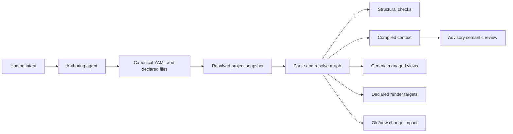

# Architecture

**Status:** This describes the current source model. Check [GitHub Releases](https://github.com/Glacius-Labs/Markitect/releases) for available distributions; [the roadmap](implementation-plan.md) owns current source and planned-work status. [Usage](usage.md) owns the Project and CLI contract.

## Purpose

Markitect makes AI-facing engineering resources explicit enough to validate, connect, and review. Humans and agents choose intent and meaning; the deterministic Go application parses YAML, resolves dependencies, compiles context, measures change impact, verifies declared commands, and produces managed views. Core authoring guidance is part of Markitect and uses the same model as project content.

## Project artifact boundary

Markitect models AI-facing engineering knowledge: typed resources, their ownership, and their explicitly declared relationships. An adopting project may also declare exact ordinary UTF-8 files as inputs to a resource. Source code, schemas, configuration, infrastructure definitions, CI files, and documentation use the same `spec.files` mechanism. These project artifacts are opaque with respect to their domain-specific meaning: Markitect checks their paths and access, includes their bytes in fixed-snapshot context, and uses changes to conservatively identify affected resources and invalidate review-evidence reuse. The current input contract does not accept arbitrary binary files or globs; see [Project artifact inputs](documentation.md).

A committed `ContextRun` manifest can select additional exact UTF-8 project artifacts under its `sources` field for one fixed task. Those bytes affect that run's context and digest. The selection adds no resource-graph edge; ordinary `impact` still follows declared resource inputs and its conservative rule for unknown files. The field name does not give source code special treatment.

Markitect does not parse an adopting project's programming-language structure, infer symbols, call graphs, dependencies or business meaning from its files, or generate documentation from source code. A changed input can establish that dependent knowledge needs review; it cannot establish that the knowledge is wrong or that revised prose is correct. The declared resource graph is not a graph inferred from the internal structure of project artifacts. A proposed core feature that requires source-language semantics belongs outside this boundary; apply the same input and impact rules across artifact types.

Project-owned commands in `spec.checks` may run external analyzers during `verify`. Markitect executes those explicit commands and reports their result for the selected snapshot; the adopting project chooses the checks and interprets their findings. A future integration with specialized tooling must preserve this boundary by supplying explicit inputs or project-owned checks, rather than moving domain-specific analysis into the core.

## Resource model

The recommended [repository layout](repository-layout.md) keeps the Project entrypoint at the root, typed knowledge under explicit `.markitect/areas/` paths, and human documentation under `docs/`. Provider projections retain their native paths. This is a convention: configured Areas remain authoritative and existing paths remain valid. Resource Markdown views are generated only when `markdown` is an explicit Project target; they live under `docs/markitect/` and do not own source content.

Resources have local identity `namespace/kind/name`; the Project has identity `kind: Project` in `markitect.yaml`.

| Kind | Responsibility |
|---|---|
| Text | Reusable prose or context |
| Rule | Scoped requirement with an optional check description |
| Workflow | Procedure and dependencies |
| Skill | Agent entrypoint to a procedure |
| Agent | Responsibility and supported provider settings |
| Contract | Required kind and symbolic input/output signature |
| Project | Areas, imports, bindings, checks, render configuration, and exact direct package pins |
| Package | A package archive manifest with areas, exports, a version, and optional package-local bindings |

`rules` declares requirements; `uses` declares concrete dependencies; `needs` requires a Contract; `implements` promises its signature; Project bindings select implementations. `files` declares exact ordinary UTF-8 project artifact inputs. Prose links are navigation and are not inferred dependencies. Area ownership and access follow configured paths and explicit imports; namespaces do not create inheritance.

Optional Project documentation roots enable snapshot-based README router checks. They validate local navigation only; ordinary Markdown remains untyped and router links do not enter the graph. Embedded authoring guidance uses Areas, paths and local routers to help an agent find an existing canonical owner before creating a document. The semantic placement decision remains with the author and reviewer. See [Documentation routers](documentation-routers.md).

The Project may declare `spec.checks` as entries with a name and `run` argument array. A command is an executable plus literal arguments, not a shell expression. This is the project's explicit verification contract. The package may be structurally checked without those entries, but `verify` reports incomplete evidence when no check is declared.

## Deterministic core and adapters

Strict parsing rejects unknown fields, duplicate identities, extra YAML documents, aliases, merge keys, and unsupported tags. Graph checks validate kinds, identities, references, access, bindings, signatures, and cycles. Schemas assist editors; the parser and graph remain authoritative.

The core does not depend on a model API, IDE, provider SDK, or repository-specific policy. The CLI resolves Git selectors through the Git source adapter into a project snapshot. Deterministic application decisions consume that value; they do not execute Git. Filesystem writers, snapshot materialization, release packaging, and explicitly configured output adapters remain boundaries around the core. `verify` executes only the commands declared by the selected Project. It neither chooses a repository profile nor infers a runtime gate from files it happens to find. See [Source snapshots](source-snapshots.md) for the current boundary and its Git-specific contracts.

Ordinary project artifacts stay with their owners and enter context or impact through exact declared inputs. Source code has no special semantic status: Markitect does not parse syntax trees, infer symbols or call graphs, or derive business meaning from code. Domain-specific analysis belongs outside the deterministic core.

### Go implementation boundaries

Markitect uses ports and adapters as a guide to dependency direction, with concrete Go packages where one implementation is sufficient:

| Role | Packages | Dependency boundary |
|---|---|---|
| Resource model and deterministic decisions | `internal/core`, `internal/inputs`, `internal/snapshot` | Operate on explicit values and bytes; no Git, filesystem writer, CLI, or model API dependency. |
| Application use cases | `internal/app` | Compose resolved snapshots, parsing, graph checks, context, impact, review evidence, verification, and controlled writes. |
| Input and output adapters | `internal/source`, `internal/format`, `internal/contentpackage`, `internal/render`, `internal/release` | Acquire Git-backed values, read or produce YAML, archives, schemas, materialized files, and managed outputs. |
| Entry points | `cmd/markitect`, `cmd/markitect-release`, `integration` | Parse commands, choose use cases, and report results. The standalone bootstrap in `integration` remains a single Go source file because distributions execute it directly. |

This is not strict interface-driven hexagonal wiring: application use cases currently call the concrete adapters. There is no interchangeable implementation to justify ports for each one. Add a narrow interface in the consuming package when a real use case needs substitution; keep the deterministic model independent of the adapters. `internal/snapshot` owns the concrete value and deterministic comparison; `internal/source` remains the Git acquisition adapter. The publication `Runner` is an existing example of a consumer-owned boundary for the external `gh` process.

Rendering produces only explicitly selected Markdown, Codex, or Claude outputs and configured rule adapters. The Markdown target writes resource views under `docs/markitect/`; provider outputs link directly to canonical YAML. Markitect owns those supported adapters; additional project-specific output policy remains outside the core. No target is selected implicitly. Format, render, schema, install, and initialization operations validate plans before writing; per-file writes are controlled, not a multi-file transaction.

The current source candidate adds optional project mappings for shared provider entrypoints and strict inventory. It also checks explicitly quoted functional assertions when the Project opts in. Neither mechanism infers dependencies or facts from prose. The [adapter contract](provider-adapters.md) and [consistency contract](consistency.md) describe coverage and limits.

The v0.3.0 source model added direct offline content archives. Project pins are the single content lock; `markitect.lock.yaml` continues to pin the CLI distribution. Package members are parsed into origin-qualified graph entries while local identity and canonical paths stay unchanged. The model rejects nested imports, cross-boundary direct references, checks, render targets, and external rule adapters. Verified archives are tracked outside the Git source snapshot and are read-only to formatting and rendering. Package content participates in context and conservative impact/review invalidation. See [Content packages](content-packages.md) for its contract.

The current source model adds minimal project initialization for an existing repository. Preview is read-only and shows the exact Project YAML and area README plan. Writing recomputes the plan and validates the prospective Project through the normal parser, graph, and output checks; it then requires a named non-protected branch and exclusively creates only those two paths. It does not select project-owned checks or policy or edit existing content. Structural success does not establish complete verification; without owner-declared checks, `verify` remains incomplete. See [Usage](usage.md) for the command contract and the [roadmap](implementation-plan.md) for current status.

## Authoring and queries

Portable core authoring resources are embedded and compiled through the normal parser, graph, and context pipeline. They explain resource choice, ownership, explicit dependencies, and diagnostics. `authoring`, `find`, and `explain` support an agent or person inspecting the model; they do not interpret natural-language intent or call a model.

`find` performs literal discovery with exact optional filters. `explain` reports direct relationships and their declaration source. `context` follows dependencies from a selected entry and reports included resources and declared-file inputs. `impact` compares old and candidate dependency closures. Semantic relevance and task-to-entry selection remain explicit reasoning outside the deterministic engine.

## Fixed inputs and evidence

A Git commit resolves to one snapshot with paths, regular-file modes, and bytes. Later working-tree edits do not alter that fixed value. Context fingerprints its selected inputs and tool identity. Impact compares two resolved snapshots, including bytes and modes, then includes old and new consumers of changed dependencies. Unknown or unmodelled inputs conservatively broaden results. Snapshot identity is kept alongside content: the legacy content digest continues to hash sorted paths, mode tokens, and bytes, and does not include the ID or provisional flag. See [Source snapshots](source-snapshots.md) for evidence identity, review compatibility, package provenance, and materialization boundaries.

`verify --revision COMMIT` checks that exact snapshot. It runs Project-declared commands inside its materialized copy using literal executable arguments and bounded time/output. A missing check declaration, unavailable executable, timeout, or output overflow is incomplete evidence. Commands run with local user authority; snapshot materialization is not an operating-system sandbox.

Review evidence is advisory. Reuse requires matching tool, configuration, context and eligible impact. Markitect can record an actual report and assess whether its declared inputs still match; it does not invoke a reviewer, authenticate its prose, prove completeness, or transfer human acceptance.

## Distribution and product boundary

This repository owns Markitect source, schemas, core authoring, generic examples, and release design. An adopting repository owns its content, import scripts, custom output formats, and declared runtime checks. Markitect provides no built-in project-specific migration command.

The immutable `v0.1.0` release and its original package are historical pins. The published `v0.2.0` release removes Project profiles, replaces implicit gates with declared commands, and uses explicit targets and rule adapters for rendering. See the [production assessment](production-assessment.md) for its exact release evidence and [Integration](../integration/README.md) for provisioning and upgrade boundaries.
