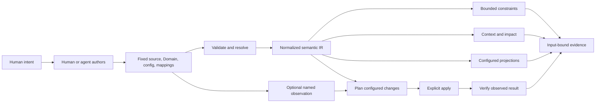

# Architecture

**Status:** v0.11.0 is the latest published release. The current source candidate targets v0.12.0 and includes the bounded `same-target` assertion described below; it is not yet a published distribution. v0.10.0 remains the historical baseline for the generic canonical engineering model. The [roadmap](implementation-plan.md) owns verified delivery status, [Usage](usage.md) owns supported syntax, and the [canonical engineering plan](canonical-engineering-plan.md) owns model decisions. Check [GitHub Releases](https://github.com/Glacius-Labs/Markitect/releases) for available distributions.

v0.11.0 adds per-subject PolicyResults, narrowly scoped digest-bound Project exceptions, and a provider-independent Copy Me authoring workflow. Architecture contracts remain versioned Domain/package contracts; discovery proposals require explicit human adoption. The [engineering constitution](engineering-constitution.md) defines these decisions and limits. Generated Domain contracts and resource policy outcomes require the Project's explicit Markdown target.

## Purpose

Markitect is an engineering knowledge and change compiler. Teams define descriptive engineering models and normative policy as canonical, versioned resources. Markitect validates their declared structure and relationships, calculates bounded change impact, and supplies the same normalized model to documentation, agent-context, verification, and external-system adapters.

The product promise is that an explicitly modeled change can be traced to the outputs, observations, and checks it may affect. A model can carry free prose for people while marking only selected, structured properties as machine-checkable. Markitect proves those declared properties against its fixed inputs; it does not decide whether the model is wise, whether prose is true, whether implementation meets business intent, or whether a person has accepted the result.

The modeling language is extensible through versioned Domain definitions loaded before resources. A Domain defines resource kinds, their typed fields, relation descriptors, and bounded constraint forms. This lets software architecture, delivery, and AI-working knowledge use one small kernel without making every domain concept a built-in Core kind. The bundled AI-working vocabulary is one supplied Domain. External adapters consume the normalized semantic model and explicit mappings; they do not create canonical domain meaning.

## Compiler and evidence model

The target compilation order is:

```text
fixed source, Domain definitions, Project configuration, and adapter mappings
    → validate Domain and resource shapes
    → resolve typed references and relations
    → construct normalized semantic IR
    → evaluate bounded constraints and relation-specific graph rules
    → compile context, impact, projections, and adapter plans
    → optionally observe external state, plan changes, apply, and verify
```

Domain definitions and mappings are canonical inputs with explicit versions and digests. Constraints operate on declared resources, relations, and explicitly selected sets. They must remain bounded and deterministic; arbitrary code execution, unrestricted query languages, model calls, and inferred source-code semantics are outside the kernel.

The semantic IR records qualified kind identity, resource identity and origin, validated values, resolved relation targets, applicable Domain definitions, scope, and source provenance. It is independent of YAML formatting and is the input to consumers. The IR is a normalized statement of what the selected source declares, not a truth oracle about an adopting system.

Relations declare their meaning and graph behavior. A `dependsOn` edge, an ownership edge, and a policy scope can differ in context traversal, invalidation, and cycle rules. Context and impact follow those declared semantics. Constraints over sets must also declare the selection boundary so additions and removals can invalidate their result.

Adapters are explicitly configured with mappings between canonical resources and their consumer-owned outputs or observed objects. Their lifecycle is `observe → plan → apply → verify`; adapters may expose only the stages they support. Observation is a fixed, named input with its own source and digest. If external state drifts while the canonical model is unchanged, a new observation still detects and plans the discrepancy. Apply is an explicit action. Command adapters receive only their declared snapshot inputs in a temporary working directory and run with the caller's local authority; this is not an operating-system security sandbox. A plan, successful command, or verification result does not itself grant human approval.

Every result identifies its fixed source snapshot, Domain and Project configuration, mappings, adapter version, and any observed-state evidence it used. These identify the basis of a result. They do not establish semantic correctness, completeness beyond configured checks, human review, or continuing external truth after observation.

## Current implementation boundary

v0.11.0 retains the v0.10.0 generic Domain registry, normalized model, relation semantics, projections, and explicit adapters. It adds `count.scope`, per-constraint/per-subject PolicyResults, source-bound per-resource exceptions, and a provider-independent discovery workflow over explicitly selected fixed evidence. Architecture traits that constrain the same resource shape are composed in one Domain for the active API version; a `conformsTo` relation does not activate another Domain's constraints. The kernel remains finite and structural: it does not interpret source-code semantics, authenticate exception decisions, or establish that modeled prose is true. Generated Domain contracts and resource policy outcomes require the explicit Markdown target. Human adoption and real-world product benefit remain outside what these machine checks prove. See the [roadmap](implementation-plan.md) and its linked v0.11.0 scenarios for shipped coverage and evidence limits.

## Current source candidate for v0.12.0

The [software architecture stress case](../examples/software-architecture/README.md) uses existing Domain kinds, typed references, relation effects and finite constraints to describe a modular DDD / Vertical Slice consumer. It introduces no kernel architecture kinds, inheritance, implicit policy composition or source-code analysis. The [language-pressure report](design/domain-language-pressure.md) distinguishes enforced assertions from desired statements that need cross-resource comparisons or implementation evidence.

Current source adds explicit API-version/name identity to normalized `domainInputs`, so a PolicyResult's API version joins to its exact Domain source, package version and digest. Context records the named incoming relations responsible for inclusion in `inputs[].via`. Impact records changed-input and relation causes in `causes`. Per-resource policy edits can remain bounded by explicit invalidation edges; collection assertions stay conservative across the project. Configuration, inventory and unknown input changes also remain conservative. These original application-level explanation refinements did not change the Domain language.

The subsequent [resolved-target equality experiment](design/resolved-target-equality.md) adds one generic `same-target` assertion to current source and the generated Domain schema. Two statically named paths, each one or two declared relation steps from one selected subject, must resolve a singleton at every step and end at the same canonical GraphKey. Fully resolved inequality is a per-subject policy result; incomplete or ambiguous traversal is structural and cannot be waived. Results carry ordered edge traces; digests bind paths, relation definitions and traversed canonical inputs. Derived policy dependencies invalidate the subject and its consumers independently of context flags. Policy traversal does not introduce agent-context edges. Existing conservative fallbacks remain for inventory, configuration, unknown inputs and legacy policy dependencies that are not derived. Software Feature ownership is enforced only for its explicitly labeled cohort; Aggregate fan-out and other relational pressure points remain unproven. No arbitrary query, Pattern, inheritance or Composition mechanism is introduced. This source behavior is the v0.12.0 release candidate contract. Until immutable publication is verified, v0.11.0 remains the latest supported download.

## Project artifact boundary

The kernel models explicit engineering resources and declared relations. Project artifacts, including source code, schemas, configuration, infrastructure definitions, CI files, and documentation, remain explicit inputs; the kernel does not infer their domain-specific structure. A custom Domain can declare one array-of-string property as `inputsField`; those paths become opaque snapshot inputs used for context and impact. The bundled AI-working vocabulary continues to declare these inputs through `spec.files`. Inputs remain exact paths and bytes: no arbitrary binary files, globs, or source interpretation; see [Project artifact inputs](documentation.md).

A committed `ContextRun` manifest can select additional exact UTF-8 project artifacts under its `sources` field for one fixed task. Those bytes affect that run's context and digest. The selection adds no resource-graph edge; ordinary `impact` still follows declared resource inputs and its conservative rule for unknown files. The field name does not give source code special treatment.

Markitect's core does not parse an adopting project's programming-language structure, infer symbols, call graphs, dependencies or business meaning from its files, or generate documentation from source code. A changed input can establish that dependent knowledge needs review; it cannot establish that the knowledge is wrong or that revised prose is correct. The declared resource graph is not a graph inferred from the internal structure of project artifacts. A configured adapter or project-owned check may use a specialized analyzer, but its behavior and evidence remain explicit and outside the generic kernel. Apply the same source and impact rules across artifact types.

Project-owned commands in `spec.checks` may run external analyzers during `verify`; configured adapters may also consume declared inputs and the normalized model. Markitect reports their bounded result for the selected snapshot; the adopting project chooses the checks and interprets their findings. A specialized integration must preserve this boundary by supplying explicit inputs or project-owned checks, rather than moving domain-specific analysis into the core.



## Bundled AI vocabulary and shared application contracts

## Resource model

The recommended [repository layout](repository-layout.md) keeps the Project entrypoint at the root, typed knowledge under explicit `.markitect/areas/` paths, and human documentation under `docs/`. Provider projections retain their native paths. This is a convention: configured Areas remain authoritative and existing paths remain valid. Resource Markdown views are generated only when `markdown` is an explicit Project target; they live under `docs/markitect/` and do not own source content.

Bundled AI resources retain local identity `namespace/kind/name`; custom resources use `namespace/apiVersion/kind/name`. Package origin further qualifies imported identities. The Project has identity `kind: Project` in `markitect.yaml`.

| Kind | Responsibility |
|---|---|
| Text | Reusable prose or context |
| Rule | Scoped requirement with an optional check description |
| Workflow | Procedure and dependencies |
| Skill | Agent entrypoint to a procedure |
| Agent | Responsibility and supported provider settings |
| Contract | Required kind and symbolic input/output signature |
| Project | Areas, imports, bindings, checks, render configuration, and exact direct package pins |
| Package | A package archive manifest with areas, exports, a version, and optional package-local bindings |

`rules` declares requirements; `uses` declares concrete dependencies; `needs` requires a Contract; `implements` promises its signature; Project bindings select implementations. `files` declares exact ordinary UTF-8 project artifact inputs. Prose links are navigation and are not inferred dependencies. Area ownership and access follow configured paths and explicit imports; namespaces do not create inheritance.

Optional Project documentation roots enable snapshot-based README router checks. They validate local navigation only; ordinary Markdown remains untyped and router links do not enter the graph. Embedded authoring guidance uses Areas, paths and local routers to help an agent find an existing canonical owner before creating a document. The semantic placement decision remains with the author and reviewer. See [Documentation routers](documentation-routers.md).

The Project may declare `spec.checks` as entries with a name and `run` argument array. A command is an executable plus literal arguments, not a shell expression. This is the project's explicit verification contract. The package may be structurally checked without those entries, but `verify` reports incomplete evidence when no check is declared.

## Deterministic core and adapters

Strict parsing rejects unknown fields, duplicate identities, extra YAML documents, aliases, merge keys, and unsupported tags. Graph checks validate kinds, identities, references, access, bindings, signatures, and cycles. Schemas assist editors; the parser and graph remain authoritative.

The core does not depend on a model API, IDE, provider SDK, or repository-specific policy. The CLI resolves Git selectors through the Git source adapter into a project snapshot. Deterministic application decisions consume that value; they do not execute Git. Filesystem writers, snapshot materialization, release packaging, and explicitly configured output adapters remain boundaries around the core. `verify` executes only the commands declared by the selected Project. It neither chooses a repository profile nor infers a runtime gate from files it happens to find. See [Source snapshots](source-snapshots.md) for the current boundary and its Git-specific contracts.

Ordinary project artifacts stay with their owners and enter context or impact through exact declared inputs. Source code has no special semantic status: Markitect does not parse syntax trees, infer symbols or call graphs, or derive business meaning from code. Domain-specific analysis belongs outside the deterministic core.

### Go implementation boundaries

Markitect uses ports and adapters as a guide to dependency direction, with concrete Go packages where one implementation is sufficient:

| Role | Packages | Dependency boundary |
|---|---|---|
| Resource model and deterministic decisions | `internal/core`, `internal/inputs`, `internal/snapshot` | Operate on explicit values and bytes; no Git, filesystem writer, CLI, or model API dependency. |
| Application use cases | `internal/app` | Compose resolved snapshots, parsing, graph checks, context, impact, review evidence, verification, and controlled writes. |
| Input and output adapters | `internal/source`, `internal/format`, `internal/contentpackage`, `internal/render`, `internal/release` | Acquire Git-backed values, read or produce YAML, archives, schemas, materialized files, and managed outputs. |
| Entry points | `cmd/markitect`, `cmd/markitect-release`, `integration` | Parse commands, choose use cases, and report results. The standalone bootstrap in `integration` remains a single Go source file because distributions execute it directly. |

This is not strict interface-driven hexagonal wiring: application use cases currently call the concrete adapters. There is no interchangeable implementation to justify ports for each one. Add a narrow interface in the consuming package when a real use case needs substitution; keep the deterministic model independent of the adapters. `internal/snapshot` owns the concrete value and deterministic comparison; `internal/source` remains the Git acquisition adapter. The publication `Runner` is an existing example of a consumer-owned boundary for the external `gh` process.

Rendering produces only explicitly selected Markdown, Codex, or Claude outputs and configured rule adapters. The Markdown target writes resource views under `docs/markitect/`; provider outputs link directly to canonical YAML. Markitect owns those supported adapters; additional project-specific output policy remains outside the core. No target is selected implicitly. Format, render, schema, install, and initialization operations validate plans before writing; per-file writes are controlled, not a multi-file transaction.

The source model supports optional project mappings for shared provider entrypoints and strict inventory. It also checks explicitly quoted functional assertions when the Project opts in. Neither mechanism infers dependencies or facts from prose. The [adapter contract](provider-adapters.md) and [consistency contract](consistency.md) describe coverage and limits.

The v0.3.0 source model added direct offline content archives. Project pins are the single content lock; `.markitect/tool/lock.yaml` pins the CLI distribution in v0.9.0 and later. Package members are parsed into origin-qualified graph entries while local identity and canonical paths stay unchanged. The model rejects nested imports, cross-boundary direct references, checks, render targets, and external rule adapters. Verified archives are tracked outside the Git source snapshot and are read-only to formatting and rendering. Package content participates in context and conservative impact/review invalidation. See [Content packages](content-packages.md) for its contract.

The current source model adds minimal project initialization for an existing repository. Preview is read-only and shows the exact Project YAML and area README plan. Writing recomputes the plan and validates the prospective Project through the normal parser, graph, and output checks; it then requires a named non-protected branch and exclusively creates only those two paths. It does not select project-owned checks or policy or edit existing content. Structural success does not establish complete verification; without owner-declared checks, `verify` remains incomplete. See [Usage](usage.md) for the command contract and the [roadmap](implementation-plan.md) for current status.

## Authoring and queries

Portable core authoring resources are embedded and compiled through the normal parser, graph, and context pipeline. They explain resource choice, ownership, explicit dependencies, and diagnostics. `authoring`, `find`, and `explain` support an agent or person inspecting the model; they do not interpret natural-language intent or call a model.

`find` performs literal discovery with exact optional filters. `explain` reports direct relationships and their declaration source. `context` follows dependencies from a selected entry and reports included resources and declared-file inputs. `impact` compares old and candidate dependency closures. Semantic relevance and task-to-entry selection remain explicit reasoning outside the deterministic engine.

## Fixed inputs and evidence

A Git commit resolves to one snapshot with paths, regular-file modes, and bytes. Later working-tree edits do not alter that fixed value. Context fingerprints its selected inputs and tool identity. Impact compares two resolved snapshots, including bytes and modes, then includes old and new consumers of changed dependencies. Unknown or unmodelled inputs conservatively broaden results. Snapshot identity is kept alongside content: the legacy content digest continues to hash sorted paths, mode tokens, and bytes, and does not include the ID or provisional flag. See [Source snapshots](source-snapshots.md) for evidence identity, review compatibility, package provenance, and materialization boundaries.

`verify --revision COMMIT` checks that exact snapshot. It runs Project-declared commands inside its materialized copy using literal executable arguments and bounded time/output. A missing check declaration, unavailable executable, timeout, or output overflow is incomplete evidence. Commands run with local user authority; snapshot materialization is not an operating-system sandbox.

Review evidence is advisory. Reuse requires matching tool, configuration, context and eligible impact. Markitect can record an actual report and assess whether its declared inputs still match; it does not invoke a reviewer, authenticate its prose, prove completeness, or transfer human acceptance.

## Distribution and product boundary

This repository owns Markitect source, schemas, core authoring, generic examples, and release design. An adopting repository owns its content, import scripts, custom output formats, and declared runtime checks. Markitect provides no built-in project-specific migration command.

The immutable `v0.1.0` release and its original package are historical pins. The published `v0.2.0` release removes Project profiles, replaces implicit gates with declared commands, and uses explicit targets and rule adapters for rendering. See the [production assessment](production-assessment.md) for its exact release evidence and [Integration](../integration/README.md) for provisioning and upgrade boundaries.
