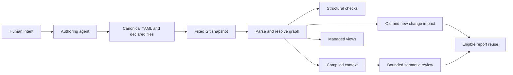

# Architecture

Status: implemented local compiler and release candidate; updated 2026-09-30. [Usage](usage.md) owns exact current syntax. [Refinement decisions](refinement.md) owns proposed changes; [the plan](implementation-plan.md) owns their order.

## Purpose

Treat AI-facing mechanisms as software architecture: clear responsibility, explicit dependencies, controlled scope and predictable change. Go implements deterministic mechanics; YAML describes structure; Markdown remains the reading surface and prose body. Authoring is a core Markitect capability: modelling guidance, workflows, skills and supporting queries share its release lifecycle. Agents handle intent and semantic judgment; deterministic operations do not require a model. The portable core authoring resources are planned next; the current authoring workflow exists in the Konfyra consumer.

## Small domain

| Kind | Meaning |
|---|---|
| Text | Reusable prose/context without another machine role |
| Rule | Scoped requirement; only named implemented checks are executable |
| Workflow | Procedure and dependencies |
| Skill | Agent entrypoint to a procedure |
| Agent | Responsibility and supported provider settings |
| Contract | Required kind and exact symbolic input/output signature |
| Project | Area policy, imports, bindings and output configuration |

Local resource identity is `namespace/kind/name`. Namespaces and names are DNS labels. File paths determine area ownership; the longest containing area owns the resource. Area `imports` permits direct references and does not grant transitive access.

`rules` declares requirements; `uses` declares concrete dependencies; `needs` requires a Contract; `implements` promises its signature. A Project binding selects the implementation. All implementations are checked; compiled context follows the selected one. `files` includes exact ordinary UTF-8 file inputs, subject to area access.

Rules explicitly listed on any containing area apply to its descendant resources. This is path scope, including ancestor paths. A namespace name never creates inheritance; there is no resource inheritance or load-order override. Preserve this behavior until an explicit migration changes it.

## Compiler and adapters

The parser rejects unknown fields, duplicates, extra YAML documents, aliases, merge keys and unsupported tags. The graph checks types, identities, references, scopes, bindings, signatures and cycles. Generated YAML schemas assist editors; they do not replace these semantic checks.

The core has no dependency on Kubernetes, a model API, an IDE or a provider SDK. CLI orchestration, filesystem/Git access, rendering, release packaging and consumer checks are adapters. Existing Konfyra/Cockpit profile code remains in-tree compatibility code; extract an interface only when another adapter demonstrates a stable boundary.

Each output has one owner. Generic rendering supports declared native targets. During the Konfyra pilot, Markitect generates adjacent Markdown and the existing Python renderer owns provider files. It requires a passing Markitect check before rendering. A later replacement must reproduce its mappings and retirement behavior before switching ownership.

## Fixed inputs and change

A revision resolves once to a committed Git tree, captured with paths, modes and bytes. Later working-tree edits cannot change that snapshot. Working-tree results are provisional. Controlled writes check source state and refuse unmanaged collisions; per-file writes are atomic, but there is no repository-wide transaction guarantee.

Context includes the selected entry, transitive dependencies, applicable rules, selected implementations and explicit file contents. It reports inclusion reasons and hashes. Markitect currently requires an explicit resource entry; selecting that entry from a natural-language task is the agent's responsibility.

Impact compares old and new dependency closures. Deleted edges cannot hide their former consumers. Configuration/inventory changes and unmodelled paths conservatively broaden the result. This preserves caution but can limit savings until real inputs are modelled more precisely.

`verify` materializes the fixed snapshot and runs supported profile gates there. `generic` has no extra repository gate. `check` includes generated drift, so the normal authoring order is edit, format, render, check, commit, fixed context/impact/review.

## Evidence limits

`snapshotDigest` identifies the loaded snapshot; context `digest` identifies declared relevant inputs and tool identity; `toolDigest` identifies executable bytes. None establishes that prose is true or complete.

Advisory review reuse requires matching tool/config/context and eligible impact. Markitect records an actual report and checks whether its inputs permit reuse; it neither invokes a model nor interprets a successful result from prose. Hashes do not authenticate a reviewer or hosted CI. Human acceptance is never transferred.

An undeclared semantic dependency remains a modelling gap. Ordinary links are navigation, not inferred graph edges. Structural correctness cannot prove arbitrary instructions compatible, sufficient or followed by a runtime agent.

## Standalone ownership

This repository owns tool source, schemas, generic examples and product design. Consumers own their policies and pinned integration. The current `package` command creates a tool source archive, and `markitect.lock.yaml` currently pins that tool. Reusable content packages and template initialization are proposed work, not current commands.

The API-shaped YAML envelope leaves room for a later Kubernetes adapter, but these resources and schemas are not CRDs. Runtime lifecycle, API conversion, status and reconciliation need an explicit future contract. The module path and API group remain placeholders until a repository host/domain is chosen.
