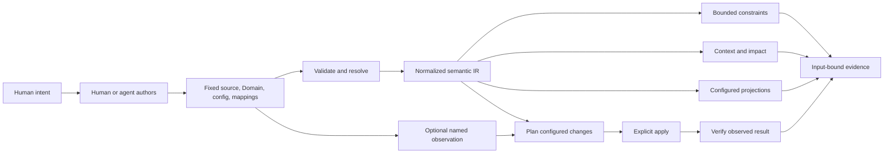
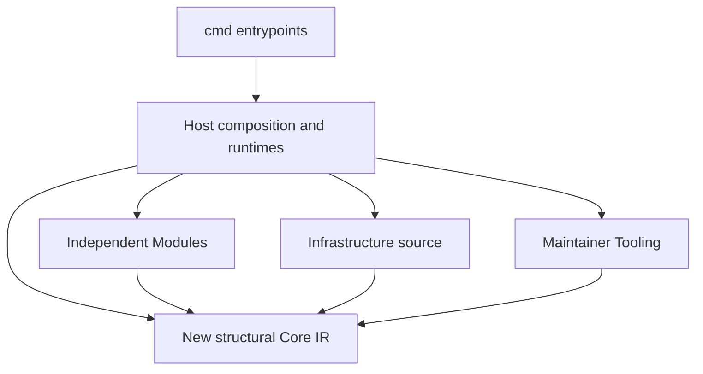

# Architecture

**Status:** v0.13.0 is the latest published release. It adds read-only policy-failure analysis, bounded selective handoff, the provider-neutral Markitect-first workflow and managed-artifact accounting; v0.12.0 remains the historical release for the bounded `same-target` assertion described below. v0.11.0 remains the historical baseline for reusable architecture contracts; v0.10.0 remains the historical baseline for the generic canonical engineering model. Bounded projection-first local reconciliation is implemented in current unreleased source; it is not part of the published v0.13.0 CLI contract. The [roadmap](implementation-plan.md) owns verified delivery status, [Usage](usage.md) owns supported syntax, and the [canonical engineering plan](canonical-engineering-plan.md) owns model decisions. Check [GitHub Releases](https://github.com/Glacius-Labs/Markitect/releases) for available distributions.

v0.11.0 adds per-subject PolicyResults, narrowly scoped digest-bound Project exceptions, and a provider-independent Copy Me authoring workflow. Architecture contracts remain versioned Domain/package contracts; discovery proposals require explicit human adoption. The [engineering constitution](engineering-constitution.md) defines these decisions and limits. Generated Domain contracts and resource policy outcomes require the Project's explicit Markdown target.


The current source-only alpha uses a separate minimal Schema/Definition Core, explicit Schema/Projection Modules and runtime capability resolution. [Canonical projection usage](canonical-projections.md) describes its executable commands; [the migration validation](validation/canonical-projection-reset.md) records results. The published Domain/Resource sections below describe the preserved v0.13 compatibility contract, not operators or vocabulary in the new Core. Installation, materialization and verification remain separate.

## Purpose

The [product vision](vision.md) owns why Markitect exists and the intended human/agent division of responsibility. This architecture supplies its bounded compilation and evidence foundation. Teams use canonical, versioned resources to represent the selected engineering intent they choose to govern. Markitect validates declared structure and relationships, calculates bounded semantic impact, and supplies one normalized model to selected projections, agent context, verification and external-system adapters. The model is not the canonical owner for every fact or file in an adopting repository.

For explicitly modeled dependencies and mappings, results trace a change to the outputs, observations and checks it may affect; unknown inputs retain conservative invalidation. A model can carry free prose for people while marking only selected, structured properties as machine-checkable. Markitect proves those declared properties against its fixed inputs; it does not decide whether the model is wise, whether prose is true, whether implementation meets business intent, or whether a person has accepted the result.

Executable governance does not mean that Core schedules or controls agents. Agent runtimes and CI can consume bounded commands, context and specialist evidence, while the project owns delegation and acceptance requirements. Workflow prose is not a universally enforced process. Continuous agent operation and architecture-level human escalation are the vision's desired operating model, not current runtime capabilities. The authority and verification limits below remain deliberate boundaries; the [alignment assessment](design/product-vision-alignment.md) records implementation gaps separately.

The modeling language is extensible through versioned Domain definitions loaded before resources. A Domain defines resource kinds, their typed fields, relation descriptors, and bounded constraint forms. This lets software architecture, delivery, and AI-working knowledge use one small kernel without making every domain concept a built-in Core kind. The bundled AI-working vocabulary is one supplied Domain. External adapters consume the normalized semantic model and explicit mappings; they do not create canonical domain meaning.

## Compiler and evidence model

The target compilation order is:

```text
fixed source, Domain definitions, Project configuration, and adapter mappings
    → validate Domain and resource shapes
    → resolve typed references and relations
    → construct normalized semantic IR
    → evaluate bounded constraints and relation-specific graph rules
    → compile context, impact, projections, and adapter plans
    → optionally observe external state, plan changes, apply, and verify
```

Domain definitions and mappings are canonical inputs with explicit versions and digests. Constraints operate on declared resources, relations, and explicitly selected sets. They must remain bounded and deterministic; arbitrary code execution, unrestricted query languages, model calls, and inferred source-code semantics are outside the kernel.

The semantic IR records qualified kind identity, resource identity and origin, validated values, resolved relation targets, applicable Domain definitions, scope, and source provenance. It is independent of YAML formatting and is the input to consumers. The IR is a normalized statement of what the selected source declares, not a truth oracle about an adopting system.

Relations declare their meaning and graph behavior. A `dependsOn` edge, an ownership edge, and a policy scope can differ in context traversal, invalidation, and cycle rules. Context and impact follow those declared semantics. Constraints over sets must also declare the selection boundary so additions and removals can invalidate their result.

Adapters are explicitly configured with mappings between canonical resources and selected consumer-owned outputs or observed objects. Their lifecycle is `observe → plan → apply → verify`; adapters may expose only the stages they support. Observation is a fixed, named input with its own source and digest. If external state drifts while the canonical model is unchanged, a new observation can detect and plan the discrepancy within that adapter's declared scope. Apply is an explicit action. Command adapters receive only their declared snapshot inputs in a temporary working directory and run with the caller's local authority; this is not an operating-system security sandbox. A plan, successful command, or verification result does not itself grant human approval.

Every result identifies its fixed source snapshot, Domain and Project configuration, mappings, adapter version, and any observed-state evidence it used. These identify the basis of a result. They do not establish semantic correctness, completeness beyond configured checks, human review, or continuing external truth after observation.

## Current implementation boundary

v0.11.0 retains the v0.10.0 generic Domain registry, normalized model, relation semantics, projections, and explicit adapters. It adds `count.scope`, per-constraint/per-subject PolicyResults, source-bound per-resource exceptions, and a provider-independent discovery workflow over explicitly selected fixed evidence. Architecture traits that constrain the same resource shape are composed in one Domain for the active API version; a `conformsTo` relation does not activate another Domain's constraints. The kernel remains finite and structural: it does not interpret source-code semantics, authenticate exception decisions, or establish that modeled prose is true. Generated Domain contracts and resource policy outcomes require the explicit Markdown target. Human adoption and real-world product benefit remain outside what these machine checks prove. See the [roadmap](implementation-plan.md) and its linked v0.11.0 scenarios for shipped coverage and evidence limits.

## v0.12.0 bounded resolved-target equality

The [software architecture stress case](../examples/software-architecture/README.md) uses existing Domain kinds, typed references, relation effects and finite constraints to describe a modular DDD / Vertical Slice consumer. It introduces no kernel architecture kinds, inheritance, implicit policy composition or source-code analysis. The [language-pressure report](design/domain-language-pressure.md) distinguishes enforced assertions from desired statements that need cross-resource comparisons or implementation evidence.

v0.12.0 adds explicit API-version/name identity to normalized `domainInputs`, so a PolicyResult's API version joins to its exact Domain source, package version and digest. Context records the named incoming relations responsible for inclusion in `inputs[].via`. Impact records changed-input and relation causes in `causes`. Per-resource policy edits can remain bounded by explicit invalidation edges; collection assertions stay conservative across the project. Configuration, inventory and unknown input changes also remain conservative. These original application-level explanation refinements did not change the Domain language.

The [resolved-target equality experiment](design/resolved-target-equality.md) led to one generic `same-target` assertion in the v0.12.0 release and generated Domain schema. Two statically named paths, each one or two declared relation steps from one selected subject, must resolve a singleton at every step and end at the same canonical GraphKey. Fully resolved inequality is a per-subject policy result; incomplete or ambiguous traversal is structural and cannot be waived. Results carry ordered edge traces; digests bind paths, relation definitions and traversed canonical inputs. Derived policy dependencies invalidate the subject and its consumers independently of context flags. Policy traversal does not introduce agent-context edges. Existing conservative fallbacks remain for inventory, configuration, unknown inputs and legacy policy dependencies that are not derived. Software Feature ownership is enforced only for its explicitly labeled cohort; Aggregate fan-out and other relational pressure points remain unproven. No arbitrary query, Pattern, inheritance or Composition mechanism is introduced. This is the published v0.12.0 contract. It establishes finite singleton-path equality for the selected modeled cases; it does not prove broad real-project adoption or business benefit.

<a id="policy-failure-analysis-in-current-source"></a>
## Policy failure analysis in v0.13.0

The v0.13.0 implementation separates structural validity from policy compliance without changing the Domain language. Parsing, resolution, finite policy evaluation and exception evaluation still produce one graph; `model`, Context and Impact use that same normalized meaning. `validationStatus` keeps its acceptance meaning. The model additionally reports `structuralStatus` and `policyStatus`; structural errors make policy status unknown rather than claiming a partial model is trustworthy.

Only a diagnostic explicitly associated with an actual failed PolicyResult is an ordinary policy failure. Classification does not rely on diagnostic names: an ordinary constraint can be named `path`, while an invalid `same-target` traversal also uses `constraint.path`. Untagged, unmatched and structural findings remain blockers, including invalid exceptions.

Explicit `context --analyze-policy-failures` and `impact --analyze-policy-failures` allow read-only inspection of ordinary failures. Their output visibly binds analysis status to fixed snapshot/configuration/model identities, and a completed analysis still exits 1 if either side fails policy. Context retains the normal declared closure; policy-only dependencies do not introduce context edges. Impact exposes direct PolicyResult changes and subjects alongside its existing conservative affected set and causes. This improves explanation without claiming that direct subjects are the whole implementation review set or narrowing conservative invalidation.

Check, Verify, reconciliation and mutation remain strict. There is no automatic waiver, alternative compiler or policy evaluator. This capability is part of the published v0.13.0 contract; the immutable v0.12.0 release does not include it. The [focused design](design/policy-failure-analysis.md) owns its state and exit contracts; [Usage](usage.md#read-only-analysis-of-failed-policies-unreleased-source) records invocation and retains the prior heading anchor.

<a id="selective-adoption-preparation-in-current-source"></a>
## Selective adoption preparation in v0.13.0

Existing-project preparation is separate from greenfield `init` and the semantic compiler. `prepare` consumes an owner-supplied exact-path/full-commit scope, preflights fixed-tree metadata and opens only selected Git blobs. It previews a versioned handoff and writes only with the reviewed digest into an absent, external workspace. Repository identity, selected modes/bytes, review/privacy/retention claims and bounded coverage remain explicit. This preserves generic snapshot digests and adds no graph edges or Domain semantics.

`copy-me` reads that handoff and only its supplied evidence, plus an explicit queue, candidate files and optional decision. The pure validator checks byte/reference consistency, anchors, conflict links, coverage, frequency-claim shape and decision freshness. It never acquires Git content, calls a model, authenticates the reviewer or adopts policy. More evidence is an explicit request for a new owner-selected capture. No Markitect Project or ContextRun is required; optional run/report identities remain supplied evidence. The [handoff design](design/selective-adoption-handoff.md) owns the exact contract and security/retention limits; [Usage](usage.md#selective-adoption-preparation-and-copy-me-unreleased-source) owns invocation and retains the prior heading anchor. This is bounded handoff infrastructure, not a claim of discovery quality or full adopter migration.

## Project artifact boundary

The generic kernel sees project artifacts—source code, schemas, configuration, infrastructure, CI and documentation—as exact paths and opaque bytes. Under the projection-first target, the product layer will let a project explicitly classify in-scope paths as canonical Markitect sources, declared external inputs, projection targets, generated outputs, tool/vendor-owned artifacts or exact exclusions. These roles are not inferred from a filename or syntax and do not make all repository files Markitect-owned. v0.13.0's `inputsField` and `spec.files` paths remain opaque snapshot inputs for context and impact; the shipped Artifact Coverage check accounts only for explicitly configured roots and supplied ownership facts. It does not establish semantic consistency or whole-repository convergence. The broader local projection contract is in progress and is not current release behavior; see [Project artifact inputs](documentation.md).

A committed `ContextRun` manifest can select additional exact UTF-8 project artifacts under its `sources` field for one fixed task. Those bytes affect that run's context and digest. The selection adds no resource-graph edge; ordinary `impact` still follows declared resource inputs and its conservative rule for unknown files. The field name does not give source code special treatment.

Markitect's core does not parse an adopting project's programming-language structure, infer symbols, call graphs, dependencies or business meaning from its files, or generate documentation from source code. A changed input can establish that dependent knowledge needs review; it cannot establish that the knowledge is wrong or that revised prose is correct. The declared resource graph is not a graph inferred from the internal structure of project artifacts. A configured adapter or project-owned check may use a specialized analyzer, but its behavior and evidence remain explicit and outside the generic kernel. A modeled behavior written as prose is not executable proof; source-level verification must state its finite scope and unsupported cases.

### Projection-first source direction (in progress)

The earlier [projection-first reconciliation design](design/projection-first-reconciliation.md) established reusable local lifecycle mechanics. The accepted [canonical reset](design/canonical-projection-reset.md) supersedes its no-Core-change implementation direction: the source-only vNext candidate introduces a separate structural Core while preserving validated plan/apply/verify safeguards. Human narrative, implementation detail outside modeled contracts, vendor/tool material and external observations keep explicit independent roles. A projection result establishes only the declared representation checks. Deterministic outputs may be compared byte-for-byte; AI materialization is variable candidate content and requires project-owned checks rather than exact-byte identity.

The earlier unreleased projection-first implementation remains the validated source for reusable plan/apply/verify mechanics. The accepted canonical reset now defines a separate source-only vNext Core candidate; the reset design records the migration boundary and reuses validated guards without promoting the historical projection IR into a second shared contract. Published v0.13.0 retains its supported contract: explicit resource and artifact inputs, selected existing render targets, configured checks and adapters, and narrow Observe/Plan/Apply/Verify operations. Active source Projects bind exact contracts/coverage and require their selected projections during Verify; inactive Projects retain their previous behavior. There is no repository-wide or universal semantic convergence gate. Context remains declared semantic closure; Impact remains semantic impact with conservative causes, not an exact source-file or target allowlist. A saved plan binds its reviewed inputs and operations but is not owner approval or proof of chronology.

Project-owned commands in `spec.checks` may run external analyzers during `verify`; configured adapters may also consume declared inputs and the normalized model. Markitect reports their bounded result for the selected snapshot; the adopting project chooses the checks and interprets their findings. A specialized integration must preserve this boundary by supplying explicit inputs or project-owned checks, rather than moving domain-specific analysis into the core.



## Resource model

The recommended [repository layout](repository-layout.md) keeps the Project entrypoint at the root, typed knowledge under explicit `.markitect/areas/` paths, and human documentation under `docs/`. Provider projections retain their native paths. This is a convention: configured Areas remain authoritative and existing paths remain valid. Resource Markdown views are generated only when `markdown` is an explicit Project target; they live under `docs/markitect/` and do not own source content.

Bundled AI resources retain local identity `namespace/kind/name`; custom resources use `namespace/apiVersion/kind/name`. Package origin further qualifies imported identities. The Project has identity `kind: Project` in `markitect.yaml`.

| Kind | Responsibility |
|---|---|
| Text | Reusable prose or context |
| Rule | Scoped requirement with an optional check description |
| Workflow | Procedure and dependencies |
| Skill | Agent entrypoint to a procedure |
| Agent | Responsibility and supported provider settings |
| Contract | Required kind and symbolic input/output signature |
| Project | Areas, imports, bindings, checks, render configuration, and exact direct package pins |
| Package | A package archive manifest with areas, exports, a version, and optional package-local bindings |

`rules` declares requirements; `uses` declares concrete dependencies; `needs` requires a Contract; `implements` promises its signature; Project bindings select implementations. `files` declares exact ordinary UTF-8 project artifact inputs. Prose links are navigation and are not inferred dependencies. Area ownership and access follow configured paths and explicit imports; namespaces do not create inheritance.

Optional Project documentation roots enable snapshot-based README router checks. They validate local navigation only; ordinary Markdown remains untyped and router links do not enter the graph. Embedded authoring guidance uses Areas, paths and local routers to help an agent find an existing canonical owner before creating a document. The semantic placement decision remains with the author and reviewer. See [Documentation routers](documentation-routers.md).

The Project may declare `spec.checks` as entries with a name and `run` argument array. A command is an executable plus literal arguments, not a shell expression. This is the project's explicit verification contract. The package may be structurally checked without those entries, but `verify` reports incomplete evidence when no check is declared.

## Deterministic core and adapters

Strict parsing rejects unknown fields, duplicate identities, extra YAML documents, aliases, merge keys, and unsupported tags. Graph checks validate kinds, identities, references, access, bindings, signatures, and cycles. Schemas assist editors; the parser and graph remain authoritative.

The core does not depend on a model API, IDE, provider SDK, or repository-specific policy. The CLI resolves Git selectors through the Git source adapter into a project snapshot. Deterministic application decisions consume that value; they do not execute Git. Filesystem writers, snapshot materialization, release packaging, and explicitly configured output adapters remain boundaries around the core. `verify` executes only the commands declared by the selected Project. It neither chooses a repository profile nor infers a runtime gate from files it happens to find. See [Source snapshots](source-snapshots.md) for the current boundary and its Git-specific contracts.

Ordinary project artifacts stay with their owners and enter context or impact through exact declared inputs. Source code has no special semantic status: Markitect does not parse syntax trees, infer symbols or call graphs, or derive business meaning from code. Domain-specific analysis belongs outside the deterministic core.

<a id="go-implementation-boundaries"></a>
### Go ownership and final dependency model

The [clean-architecture consolidation decision](design/clean-architecture-consolidation.md) documents the integrated v0.13.0 source layout. The accepted [canonical reset](design/canonical-projection-reset.md) supersedes its kernel ownership for current source: published v0.13.0 remains unchanged; the historical kernel and consumers are isolated below Host compatibility, while internal/core is the new structural compiler. The [consolidation report](validation/clean-architecture-consolidation.md) remains evidence for that earlier source candidate.

| Responsibility | Final owner | Dependency and meaning boundary |
|---|---|---|
| New structural Schema/Kind/Property/Definition compilation, pure IR, resolved nominal references, provenance and structural diagnostics | New Core: internal/core | Receives explicitly selected and decoded inputs from Host. No Domain policy, authoring codecs, project/module activation, Git, providers, paths, execution or persistence. |
| Historical v0.13.0 Domain/resource/policy kernel and consumers; compatibility codecs/use cases; current authoring, Module activation, canonical compilation, request binding, model/context/impact, process execution, persistence and static composition | Host: internal/host, including internal/host/compat/v0_13/{kernel,consumers} | Preserves historical runtime behavior while Host composes new Core and capability packages. New Definitions are not lowered into legacy Resources. |
| Operational records | Host: internal/host/records | Pure validation and encoding over caller-supplied facts; no file loading, check execution or persistence. |
| New independent capability implementations and installable Schema/Projection Module packages | Host-composed packages: internal/modules/<name> | Core plus private subtree and standard library only; no sibling, Host, compatibility, Infrastructure or Tooling imports. Go implementation packages are not installable manifests. |
| Git and working-tree acquisition, revision resolution and materialization | Infrastructure: `internal/infrastructure/source` | Acquires source and supplies Core snapshot values; it does not interpret canonical policy or adopting-project layout. |
| Architecture import gate, release, publication, licenses/notices and standalone distribution bootstrap | Tooling: `internal/tooling/{architecture,release,publish,licenses}` and `integration` | Maintainer algorithms invoked through Host runtime composition; never a runtime capability Module. |
| All executable entrypoints, including maintainer commands | `cmd/...` thin Host runtimes | CLI packages import Host only, dispatch to Host runtime functions and report results. They do not call Core, Modules, Infrastructure or Tooling directly. |
| Examples, adopter fixtures and experiments | Harness | Validation code is not a production dependency or an exemption from dependency rules. |

The source-only vNext dependency graph is statically composed; v0.13.0 compatibility consumers remain behind Host and are not dependencies of the new Core:



The historical compatibility kernel receives normalized canonical Resource.Data values and authorized edges through Host, preserving v0.13 behavior. The new structural Core compiles explicitly selected Schema and Definition inputs into its own pure IR. Host decodes and authorizes inputs for both boundaries; neither kernel acquires source or infers adopter-project meaning. No lowering translates new Definitions into legacy Resources.

Host owns the historical public frontend and v0.13 codecs as compatibility contracts, plus new Module-manifest activation and explicit Core-input decoding. Content-package archive and legacy Domain/resource validation remain compatibility responsibilities. The new Core does not absorb those input formats, and installable Module manifests are distinct typed extension contracts.

Host resolves runtime projectionBindings from a full canonical Projection identity to an exact installed Module name, then resolves its pinned version and one unique static entrypoint. Module binding is runtime configuration, not canonical intent.

The new Core computes deterministic semantic model digests over structural contracts and values; source provenance/revision remain separately bound. The compatibility kernel preserves historical policy and exception digests under Host. Generic snapshot values and Git acquisition keep their existing explicit boundary; the new Core does not interpret filesystem modes.

Host composition uses direct typed function calls. There is no dynamic plugin loader, service locator, reflection-based registration, generic Module lifecycle or provider switch in Core. Each Module owns its implementation and private tests; Host owns composition and shared runtime contracts.

Rendering remains limited to explicitly selected outputs. The Markdown and agent-rules Modules own their projections; provider outputs link to canonical YAML. Source mappings and explicitly quoted consistency assertions remain opt-in and do not infer dependencies or facts from prose. Format, render, schema, install and initialization retain validated-plan and controlled-write behavior; multi-file writes are not a transaction. See [Provider adapters](provider-adapters.md) and [Factual consistency](consistency.md).

Direct offline content packages remain exact pinned archives, with explicit activation, origin-qualified identities and read-only imported content; nested imports and cross-boundary direct references remain rejected. Project initialization remains read-only in preview and recomputes/validates before writing only the planned Project and Area README. It does not select project-owned checks or policy or edit existing content. Structural success without owner-declared checks remains incomplete verification; see [Usage](usage.md) and the [roadmap](implementation-plan.md).

The architecture gate is `internal/tooling/architecture`. Its static import check covers supported-platform source and tests and has negative fixtures for forbidden directions. The same gate is included in normal tests, a named CI step, the explicit Project check and release quality workflow. These wiring facts do not claim an exact-head pass; the [consolidation report](validation/clean-architecture-consolidation.md) owns gate results. There is no exception allowlist.
## Authoring and queries

Portable core authoring resources are embedded and compiled through the normal parser, graph, and context pipeline. They explain resource choice, ownership, explicit dependencies, and diagnostics. `authoring`, `find`, and `explain` support an agent or person inspecting the model; they do not interpret natural-language intent or call a model.

`find` performs literal discovery with exact optional filters. `explain` reports direct relationships and their declaration source. `context` follows dependencies from a selected entry and reports included resources and declared-file inputs. `impact` compares old and candidate dependency closures. Semantic relevance and task-to-entry selection remain explicit reasoning outside the deterministic engine.

## Fixed inputs and evidence

A Git commit resolves to one snapshot with paths, regular-file modes, and bytes. Later working-tree edits do not alter that fixed value. Context fingerprints its selected inputs and tool identity. Impact compares two resolved snapshots, including bytes and modes, then includes old and new consumers of changed dependencies. Unknown or unmodelled inputs conservatively broaden results. Snapshot identity is kept alongside content: the legacy content digest continues to hash sorted paths, mode tokens, and bytes, and does not include the ID or provisional flag. See [Source snapshots](source-snapshots.md) for evidence identity, review compatibility, package provenance, and materialization boundaries.

`verify --revision COMMIT` checks that exact snapshot. It runs Project-declared commands inside its materialized copy using literal executable arguments and bounded time/output. A missing check declaration, unavailable executable, timeout, or output overflow is incomplete evidence. Commands run with local user authority; snapshot materialization is not an operating-system sandbox.

Review evidence is advisory. Reuse requires matching tool, configuration, context and eligible impact. Markitect can record an actual report and assess whether its declared inputs still match; it does not invoke a reviewer, authenticate its prose, prove completeness, or transfer human acceptance.

## Distribution and product boundary

This repository owns Markitect source, schemas, core authoring, generic examples, and release design. An adopting repository owns its content, import scripts, custom output formats, and declared runtime checks. Markitect provides no built-in project-specific migration command.

The immutable `v0.1.0` release and its original package are historical pins. The published `v0.2.0` release removes Project profiles, replaces implicit gates with declared commands, and uses explicit targets and rule adapters for rendering. See the [production assessment](production-assessment.md) for its exact release evidence and [Integration](../integration/README.md) for provisioning and upgrade boundaries.

<a id="markitect-first-and-artifact-coverage-release-candidate"></a>
## Markitect-first and artifact coverage (published v0.13.0)

The [canonical Change workflow](../internal/host/embedded/resources/workflow-markitect-first-change.yaml) separates implementation freedom from engineering-intent changes. The shipped authoring context makes it available provider-neutrally; a project's root guidance routes agents to its version-bound tool and selected Context. Desired intent changes before implementation when the intent changes. Implementation-only tasks cause no invented canonical edits. Markitect's root Project dogfoods that division with generated Codex/Claude Skill entrypoints.

The [artifact check](design/managed-artifact-coverage.md) is a standalone source-package helper selected through existing Project checks. It derives canonical sources, exact inputs and renderer owners and checks literal managed roots, exact tooling ownership and reasoned file exclusions. It adds no Domain operator, graph composition, source-language semantics or SPI change. Direct working-tree coverage can detect new untracked files; fixed Verify binds the same check to the exact materialized candidate. Output-byte drift remains the compiler's separate check. Unmanaged roots remain ordinary project review scope.

Self-dogfood also exposed an output-inventory boundary: independently executable nested Projects outside the parent's Areas/output namespaces must not be mistaken for stale parent projections. The [focused boundary design](design/nested-project-output-boundary.md) owns the correction and its protections. This does not import child models, policies, context or impact into the parent. Whole-snapshot conservative impact remains visible.

## Canonical reset: source-only vNext boundary

The published v0.13.0 contract remains unchanged. The canonical reset is a source-only alpha migration direction, not a released CLI or a claim that every planned interface has passed its gates. The [product vision](vision.md) remains the owner of the thesis and human/agent responsibilities; the [accepted reset design](design/canonical-projection-reset.md) owns migration decisions and validation limits.

The candidate Core (internal/core) is a small pure structural compiler over explicitly supplied inputs: Schema, Kind, Property and Definition; closed typed values; multiplicity; resolved references; normalized model, provenance and diagnostics. It owns no Domain policy, Project/Module loading, source acquisition, target paths, providers, execution or persistence. The historical v0.13.0 kernel and consumers retain their published semantics behind Host compatibility. They are isolated for migration, not deprecated, and new Definitions are not lowered into legacy Resources as a competing canonical model.

Installable Modules have exactly two mutually exclusive types. A Schema Module extends what can be expressed canonically through Schemas, Kinds, Properties, semantic purposes and reusable vocabulary; it has no projection behavior and does not write target repositories. A Projection Module teaches execution how to represent intent in a target through expertise, allowed surfaces, tools, guidance, discovery signals and verification guidance; it introduces no canonical Kinds and does not redefine source semantics. Neither type treats sibling Module artifacts as authority or synchronizes with sibling Modules. A bundle may install several Modules but is not a third type. Go packages under internal/modules/... are implementation units, not automatically installable Modules. Host owns static composition. If a target needs both new vocabulary and representation capability, use separate Schema and Projection Modules.

A canonical Projection Definition, where useful, states desired representation semantics: representation type, exact canonical scope, target/location and applicable ProjectionPolicies. It does not name a package, Module, Projector version or Executor. Installation and runtime configuration do not themselves declare the desired representation. Source configuration binds a full Projection identity to one exact installed Module name; Host resolves its version pin and a unique internal entrypoint. Compatible binding changes leave canonical Definitions/model digest unchanged while staling plans and records bound to the previous request/configuration. ProjectionPolicy is the project-owned semantic bridge between domain meaning and target constraints; it is not a code-generation DSL. The public model is Module capability. The current source retains the Projector noun only in internal entrypoint identity/provenance; it is not a canonical Kind or a standalone public operation.

The owner-preferred high-level user workflow is change canonical intent → aggregate `plan` → reviewed `apply`. The current source alpha exposes bounded `controller-propose`, `controller-execute`, `controller-apply` and `controller-verify` actions; these explicit actions are not aliases for a future general `plan`/`apply` interface, and no background controller is introduced. The single conceptual execution model is bounded canonical scope → Executor Agent → candidate representation → Verifier Agent with independent evidence. Deterministic renderers, generators, compilers, formatters, SDKs and CLIs are tools available to that execution and verification. Executor-authored tests alone are not independent assurance.

The controller acquires the exact canonical config, listed Definitions, Module manifests and Schema files from each full immutable Git revision. It records the repository identity, full commit, selected paths and selected-byte digest separately; it does not acquire unrelated source blobs through this selected loader. For configured target roots it inventories path metadata, then reads bytes only for explicitly affected or otherwise required owned artifacts. Unobserved bytes remain unknown, and the bounded inventory does not claim whole-repository coverage. Conservative model/revision freshness can remain broader than the materialization work set.

Projection Modules own their independent proposal inputs and return bounded work, no-op or escalation. Host composes those outputs, checks exact target names and ownership, and stops on conflicts or insufficient guidance; Modules cannot create canonical business or architecture intent. A no-op describes only the stated inspected evidence and does not imply semantic PASS, acceptance or freshness of skipped evidence. Execution prepares affected proposals in the configured finite assurance DAG, children first; parent Executors receive exact child candidate bytes or explicitly observed active bytes as evidence, never another Executor's transcript. All candidates stay staged for the reviewed aggregate Apply, which revalidates the cohort, plan bindings, preimages and inventory before writing. This does not add a Core traversal primitive or autonomous scheduler. The accepted [proof-readiness capabilities](design/proof-readiness-capabilities.md) and [candidate dependency design](design/candidate-dependency-execution.md) own the detailed runtime contract and evidence limits.

Canonical intent stays separate from operational evidence. Apply reports `materialized-unverified` after materialization; that state is not a fresh fixed-check result, independent Verifier result or acceptance. The external Host-owned append-only ledger stores ProjectionRecords and separate VerificationResults, with explicit active ownership selection and expected-head compare-and-swap. `controller-verify` reruns declared checks against immutable source/evidence revisions and invokes a separately configured fresh Verifier; optional `--write` appends those results. Records and receipts bind exact inputs and runtime provenance, but do not authenticate a caller or provider, establish semantic adequacy, prove complete coverage or imply human acceptance. Commands run with local caller authority; a fresh external runner directory and declared read-only inputs are not an OS sandbox, credential filter or provider privacy guarantee.
