# Architecture

Markitect is model-first development with delegated realization ([Markitect in brief](vision.md#markitect-in-brief)). This page describes how current source implements it: the product flow, the layers, what each layer does and its known problems. The [code map](development/code-map.md) lists every package. [Modules and static composition](development/modules.md) owns the dependency rules.

## Product flow

- People keep one canonical model of the project under `.markitect/` ([project workflow](project-workflow.md)).
- An outer Codex or Claude Code client calls typed operations on a local stdio MCP server, or uses the CLI. The server is fixed to one project root at startup; tool arguments cannot change it.
- The MCP server calls a shared application facade. The CLI uses the same facade for most operations but still calls the runtime directly for runs ([application layer](#application-layer)).
- Markitect compiles the selected model, binds work to fixed Git snapshots and records plans, runs and receipts.
- Managers, reviewers and verifiers run as inner roles in owned candidate workspaces. By default every role runs through the Codex App Server; setup can select another profile per role, including a process executor ([provider adapters](provider-adapters.md#role-profiles)).
- Markitect validates and integrates the candidate deltas, verifies the result and writes the checkout only through guarded Apply.

```mermaid
flowchart LR
  Outer[Outer Codex or Claude Code] -->|typed MCP| MCP[Fixed-root MCP server]
  MCP --> App[Shared project application facade]
  App --> Host[Project model, ledger, checks and run coordinator]
  Host --> Adapter[Codex App Server adapter]
  Adapter --> Candidate[Owned candidate workspaces]
  Candidate --> Delta[Validated candidate delta]
  Delta -->|guarded Apply| Repo[Adopting repository]
```

## Authority and evidence

- The committed model is the accepted specification for its revision under the repository's policy. Drafts are proposals.
- Revisions, digests, reports and supplied provenance bind bytes. They do not authenticate human approval.
- A write that needs a preview is bound to the preview's digest and uses compare-and-swap. `deliver` carries an authorized scope through plan, run, verify, preflight and Apply. It grants no merge, release, deployment or acceptance authority.
- Owned workspaces and agent settings are not an operating-system sandbox. Telemetry of native child processes is partial ([candidate workspaces](project-operations.md#candidate-workspaces-and-recovery)).
- Technical checks, semantic evidence and owner acceptance stay separate. The [A01 validation record](validation/a01-native-smoke-20261010.md) holds the native result.

## Layers

Current source has four product layers and the legacy line:

- **Core** compiles the model and derives views from fixed inputs.
- **Infrastructure** reads Git and writes the working tree under guard.
- **Application** holds the use cases and their CLI and MCP surfaces.
- **Runtime** runs the inner roles and records what they did.
- **Legacy** is the earlier Project/Domain line.

Executables under `src/cmd`, maintainer tooling, harnesses and fixtures have their own layers in the code map. The import gate checks each package against its layer ([mechanical dependency gate](development/modules.md#mechanical-dependency-gate)). Package IDs below refer to the [backlog](work-items/backlog.yaml), which owns their status.

Known problems across layers:

- The gate checks only that product layers do not import legacy packages and use only the guarded write API. It checks no direction between the four product layers. The core and runtime sections below show imports that break the intended direction (ARCH-12).
- Directory names do not show the layer. Most product packages live in `src/internal/host` next to the legacy host root, among them the core packages `projectbriefing` and `projectcoverage` and the infrastructure package `guardedwrite` (ARCH-16).
- Small helpers are copied: `sameStrings` exists in four packages, `equalStrings` in three and `containsString` in five, for example in `core/compile.go` and `projectrun/run.go` (ARCH-05).
- Four packages keep their own record store, each with its own file layout and write path: `projectrun` (`store.go`), `projectexplore` (`store.go`), `projectbriefing` (`store.go`) and `projectadoption` (`session.go`, `manager_run_ledger.go`) (ARCH-14).

## Core layer

The core turns explicit inputs into deterministic results. The same model and snapshot give the same result, and unknown impact stays conservative.

- `src/internal/core` compiles explicitly supplied Schemas and Definitions into a structural model with a semantic digest ([Core README](../src/internal/core/README.md)). It has no engineering assertion language, no providers and no I/O.
- `core/snapshot` holds fixed sets of files and compares them ([source snapshots](source-snapshots.md#current-value)).
- `modules/projectmodel` derives Manager, artifact and impact views from the compiled model.
- `projectcoverage` inventories repository paths and classifies how the model covers them ([DEC-006](concepts/register.md#dec-006-every-file-is-covered-or-explicitly-ignored)).
- `projectbriefing` derives briefings for accepted model changes from committed history and records their dismissal ([briefing design](design/project-world/operation-scopes-and-model-briefings.md)).

Known problems:

- `projectbriefing` and `projectcoverage` run Git through `infrastructure/source` (`projectbriefing/store.go`, `projectcoverage/census.go`). `projectbriefing` also imports the application package `projectwork` and writes its own store under `.markitect/state/briefings/`. The code map defines core as free of Git processes and writes (ARCH-13).

## Infrastructure layer

Infrastructure reads Git and the working tree, and writes the working tree under guard.

- `infrastructure/source` loads fixed snapshots from the working tree or a commit with hardened Git processes ([source snapshots](source-snapshots.md#adapter-and-use-case-ownership)).
- `host/guardedwrite` applies selected changes only while repository, branch, HEAD and captured bytes are unchanged. Product packages may use only its guarded API: `CaptureFiles`, `Apply` and `ApplyChecked`.

Writes bind the inspected root and parent directories through opened handles; a path check alone does not authorize a write. A partial failure is reported as such, because a multi-file write is not a transaction. The [Host write identity contract](design/host-write-identity.md) defines the details. Guarded writes are not an operating-system sandbox.

Known problems:

- `guardedwrite` still exports low-level primitives such as `Root`, `OpenRoot`, `SafeDestination` and `EnsureBranch` (`root.go`). Only the legacy writers in the host root use them, for example `format.go`, `install_write.go` and `outputs_write.go`. An allowlist in the gate keeps product packages away from them (`tooling/architecture/layers.go`) (ARCH-09).
- Each selected source call identifies the Git repository at its start and again at its end (`identifyGit` and `confirmGitIdentity` in `source/selective.go`). One `projectwork.Load` makes several such calls (`projectwork/project.go`) (ARCH-11).

## Application layer

The application layer holds the product's use cases and the surfaces that expose them.

- `projectwork` loads the selected model from the working tree or a commit, and plans and writes model edits under guard.
- `projectexplore` stores explorations, open decisions, scope readiness and Apply receipts.
- `projectadoption` runs Brownfield adoption: fixed-snapshot evidence, Manager proposals and a model-only adoption plan.
- `projectonboarding` writes project-local guidance and skills for Codex and Claude Code.
- `projectapp` is the shared facade over these use cases and the runtime. The MCP server calls only this facade.
- `projectcli` holds the verb table behind the `markitect` command line and its MCP tools, and `mcp` is the stdio MCP adapter ([project operations](project-operations.md)).
- `releasecli` is the command interface of `markitect-release`.

Known problems:

- `projectadoption` runs its Managers through its own stack and ledger on `agentexec` (`manager_run.go`, `manager_run_ledger.go`), separate from `projectrun` (ARCH-15).

## Runtime layer

The runtime runs Manager, review, integration and verify roles and records what happened.

- `projectrun` plans, runs, resumes, repairs, verifies and applies bounded Manager work over fixed snapshots. It owns the run store under `.markitect/runs/`, the budgets, the review rounds and the Apply preflight.
- `agentexec` is the provider-neutral process boundary for one role invocation and its receipt.
- `codexappserver` is the transport to the native Codex App Server.
- `exchangecli` is the reference bring-your-own executor. It hands each invocation to an outside party through request and response files ([provider adapters](provider-adapters.md#bring-your-own-executor)).
- `projectworkspace` creates, harvests and recovers owned candidate workspaces.
- `projectsetup` builds the runtime proposal for `project setup` and the prerequisite report for `project doctor`.

Known problems:

- `projectrun` is large: well over 15,000 production lines. `run.go` alone has more than 2,500 lines, and `runOrResume` more than 1,000. `Plan` (`plan.go`) and `FullVerifyProject` (`full_verify.go`) also exceed 300 lines (ARCH-06).
- Runtime configuration lives in `projectrun`: `Runtime`, `Agent`, `Limits` and `Pricing` (`types.go`) and `ValidateRuntime` (`config.go`). `projectsetup` and `mcp` import `projectrun` for these types, and the native transport invoker is built there too (ARCH-06).
- Runtime and application import each other. `projectrun` imports `projectwork` and `projectexplore`, and `projectsetup` imports `projectwork`; `projectapp`, `projectadoption` and `projectcli` import `projectrun` (ARCH-13; ARCH-06 works on the same seam).
- Five functions in `projectrun/run.go` have no callers: `ownedPath`, `addCost`, `estimateCost`, `resolvesConflicts` and `resolveObligations` (ARCH-05).
- Plan and Apply call `git check-attr --source` (`plan.go`, `apply.go`), which needs Git 2.40 or later. CONTRIBUTING and the [project workflow](project-workflow.md#connect-and-inspect) state the requirement, but no check enforces it (CLI-04).
- A helper whose Close fails stays `cleanup-pending` (`helper.go`). `validateReportClosure` (`obligations.go`) then blocks Verify and Apply, and nothing reconciles the state (BUG-01).
- Bring-your-own executor gaps (RUN-05):
  - `maxCostMicros` is required even when every role is unmetered (`config.go`).
  - Setup rejects script shims only for the native provider, not for process executors (`discoverProcess` in `projectsetup/setup.go`).
  - The exchange adapter has no deadline of its own (`exchangecli/exchange.go`).
  - Declared checks see only the owning agent's environment allowlist (`explicitEnvironment` in `verify.go`).
- `agentexec/lifecycle.go` and `codexappserver/contracts.go` are not gofmt-formatted. CI runs `go vet` but no gofmt check (CI-06).
- Runtime tests run serially. No test calls `t.Parallel`, and the process end-to-end tests re-execute the test binary (for example `projectrun/process_e2e_test.go`). The [tests and CI survey](work-items/surveys/tests-and-ci-20261010.md) measured `projectrun` at 1,467 s on Windows against 112 s on Linux, so the Windows job runs nightly or on demand and does not block merges ([DEC-013](concepts/register.md#dec-013-linux-first-for-tests-and-the-playground)) (TEST-03, CI-05).

## Legacy line

The legacy line is the earlier Project/Domain product: the verbs such as `check`, `context`, `impact`, `render` and `verify` over `markitect.yaml`, the v0.13 kernel and consumers under `host/compat/v0_13`, the metadata adapters, content packages and Copy Me. Its main packages are the host root, `host/cli`, `host/authoring` and `host/compat/v0_13`; the [code map](development/code-map.md#legacy-and-compatibility) lists all of them. The published v0.14.1 release contains it. It is not developed further ([DEC-014](concepts/register.md#dec-014-compatibility-does-not-drive-decisions)). Its own checks still run in this repository's CI until ARCH-09 removes it. Its earlier architecture is kept in a [history record](history/architecture-legacy-sections-20261010.md).

Known problems:

- The `markitect` executable enters through the legacy dispatcher. `src/cmd/markitect/main.go` calls `host/cli`, which routes `project` to `projectcli` and also holds `package`, `bundle`, `install` and `licenses` (`cli_dispatch.go`) (CLI-02, ARCH-08).
- This repository's model is `.markitect/project.yaml`, which `markitect check` gates in CI and the pre-commit hook. The legacy dogfood still runs beside it: `markitect.yaml`, `.markitect/areas`, `.markitect/modules`, the generated legacy views and the `markitect-legacy` steps in `ci.yaml` (ARCH-09).
- `markitect-check-architecture` runs the gate through the host root (`host/architecture.go`), so the gate binary links the legacy package (ARCH-09).
- Only `examples/project-world` uses the model-first format. The other example directories use `markitect.yaml` or the legacy package and Copy Me formats (ARCH-09).

## Project artifact boundary

Markitect treats an adopting project's files, including source code, schemas, configuration, CI and documentation, as exact paths and opaque bytes.

- The model declares which Manager is responsible for which files. Markitect does not infer that from file names, syntax, Markdown links or code.
- When a project selects full coverage, every repository file is covered by the model or explicitly ignored ([DEC-006](concepts/register.md#dec-006-every-file-is-covered-or-explicitly-ignored)).
- Markitect does not parse an adopting project's programming language, infer symbols, call graphs or dependencies, or generate documentation from code.
- Project-owned checks may run specialized analyzers. Their result is evidence for their declared scope only.
- A changed file can show that dependent knowledge needs review. It cannot show that the knowledge is wrong or that revised prose is right.

## Fixed inputs and evidence

- A Git commit resolves to one snapshot of paths, modes and bytes. Later working-tree edits do not change it ([source snapshots](source-snapshots.md)).
- A plan binds its base revision, snapshot and model digest. A changed model, source, runtime or candidate makes it stale and needs a fresh preview.
- Independent reviewers assess each candidate and each integration result during the run. Verify then runs the declared checks and the verify role against the integrated candidate.
- Apply writes only the latest verified integrated candidate and requires its verification digest.
- A passing check, digest or report establishes its declared scope. It is not human acceptance and does not prove semantic correctness.

## Distribution and product boundary

This repository owns Markitect's source, schemas, authoring guidance, examples and release process. An adopting repository owns its content, its checks and its approval policy. A source change does not update an installed release; a release is built and published through the [release process](operations.md#release-operations). Published releases stay immutable records.

## Historical architecture links

These retained anchors route existing links to the [history record](history/architecture-legacy-sections-20261010.md) of the earlier line.

The [Project/Domain compatibility architecture](history/architecture-legacy-sections-20261010.md#historical-projectdomain-and-projection-compatibility-architecture) is historical.

The [compiler and evidence model](history/architecture-legacy-sections-20261010.md#compiler-and-evidence-model) of the Domain kernel is historical.

The [v0.11.0 implementation boundary](history/architecture-legacy-sections-20261010.md#current-implementation-boundary) is historical.

The [v0.12.0 resolved-target equality](history/architecture-legacy-sections-20261010.md#v0120-bounded-resolved-target-equality) is historical.

The [v0.13.0 policy failure analysis](history/architecture-legacy-sections-20261010.md#policy-failure-analysis-in-v0130) is historical.

The [v0.13.0 selective adoption preparation](history/architecture-legacy-sections-20261010.md#selective-adoption-preparation-in-v0130) is historical.

The [projection-first reconciliation preview](history/architecture-legacy-sections-20261010.md#projection-first-reconciliation-experimental-preview) is historical.

The [v0.13 resource model](history/architecture-legacy-sections-20261010.md#resource-model) is historical.

The [deterministic core and adapters](history/architecture-legacy-sections-20261010.md#deterministic-core-and-adapters) of the Domain kernel are historical.

The [earlier Go ownership table](history/architecture-legacy-sections-20261010.md#go-ownership-and-final-dependency-model) is historical; current ownership is in [Layers](#layers) and the [code map](development/code-map.md).

The [v0.13 authoring and queries](history/architecture-legacy-sections-20261010.md#authoring-and-queries) are historical.

The [v0.13.0 Markitect-first workflow and artifact coverage](history/architecture-legacy-sections-20261010.md#markitect-first-and-artifact-coverage-published-v0130) are historical.

The [canonical reset alpha](history/architecture-legacy-sections-20261010.md#canonical-reset-alpha-removed) was removed from source.
