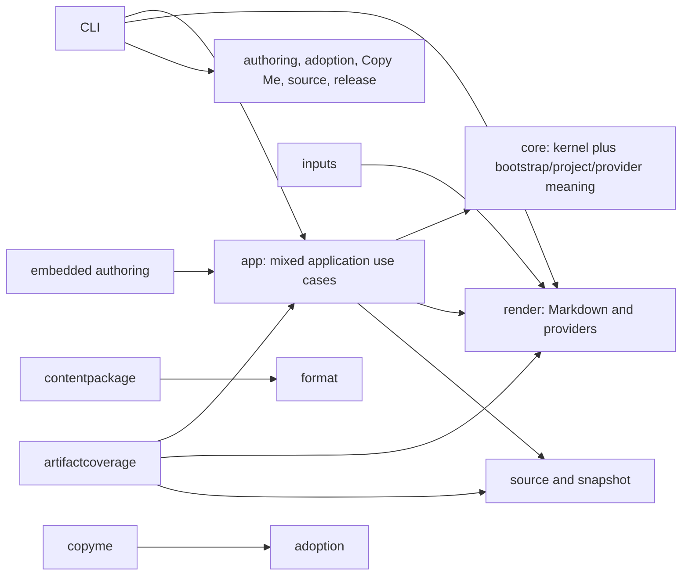
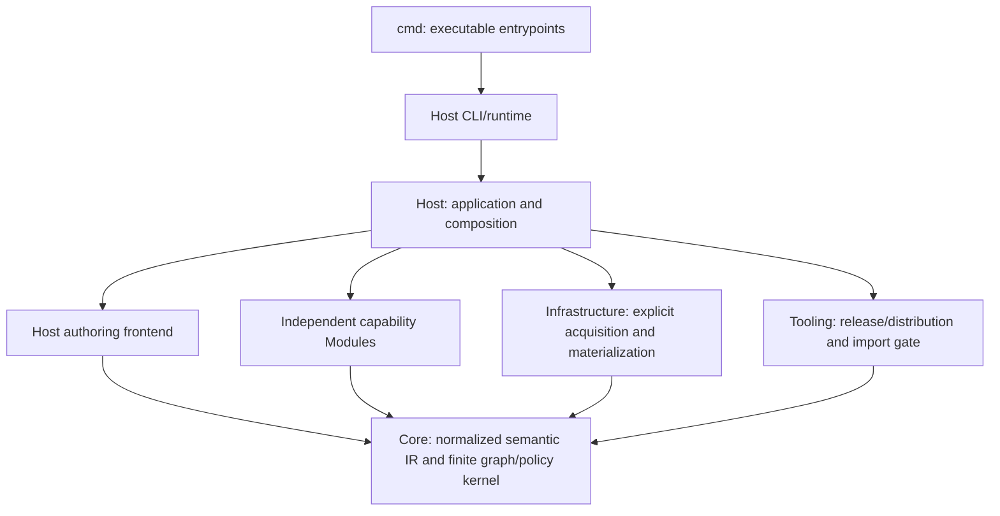

# Clean architecture consolidation decision

Status: migration contract, 2026-10-04. Baseline: `e116e5c16d63546260a2155e80d8965da72ba30b` (published v0.13.0 remains immutable). The [vision](../vision.md) owns product intent; this decision freezes responsibility and import direction before production moves. This is an internal consolidation, not a new Domain language.

## Evidence and starting graph

The [complete baseline inventory](../validation/clean-architecture-baseline.json) records all 29 Go packages, source/test files and import edges: 41 distinct production local edges and 38 distinct test-only edges. `go list ./...` found no production cycle. Core had 13 production files, 3,438 physical production lines (3,212 nonblank/noncomment), ten standard-library imports and YAML. Its zero outward internal imports concealed semantic coupling: Project, Package, Areas, executable checks, providers, AI vocabulary and serialization lowering all lived there.

The machine inventory owns the complete graph; this picture exposes its significant coupling. Provider adapters currently contain logic in command packages and duplicate normalized protocol DTOs.

## Frozen target

A Module imports only Core and its own subtree, plus standard library/justified external dependencies. No sibling Module, Host, Infrastructure or Tooling import is allowed, including unit tests. External examples/integration harnesses are explicitly classified Harness. Core imports only its own subtree and justified language/encoding dependencies. CLI imports only Host. Host composes concrete functions; no service locator, reflection, dynamic plugin loader or generic Module lifecycle is introduced.

| Current ownership | Final owner and reason |
|---|---|
| Generic Domain descriptors, primitive/closed typing, refs, declared graph effects, finite constraints, same-target, result/dependency traces | Core: independently meaningful for Software, Delivery or any supplied vocabulary |
| Generic exception matching, exact semantic/subject digests, frozen expiry | Core: generic narrow governance over generic results; accepts an explicit exception set and opaque provenance, never a Project or clock |
| Qualified resource and origin identities | Core: opaque origin values; no package activation/export/pin semantics |
| Deterministic YAML encoding for existing policy digests | Core hashes generic deterministic encodings. Host supplies opaque subject encodings when legacy bootstrap field order is compatibility-relevant; Core never parses or branches on them. No YAML decoding or built-in authoring marshaler in the kernel. Encoding is not authoring interpretation |
| Snapshot value/digest/diff | Core snapshot subtree: generic immutable path/mode/byte evidence shared by acquisition, adoption and tooling; no Git operations or layout discovery |
| Project/Package/Area/pins/exports/import policy, AI vocabulary/signatures/bindings, public YAML codec/schema | Host authoring frontend: normalize promised source contracts once; not an independent Module and not a second semantic authority |
| Model/context/impact, init/install, observe/plan/apply/verify, process execution and controlled writes | Host application use cases: orchestrate the one model and preserve trust boundaries |
| Semantic-model/v1alpha1 wire descriptors | Core IR: existing public shape and identity/digest meaning; Host supplies snapshot/config/source metadata and compiles it once |
| render providers | Agent Rules Module: independent private Codex/Claude adapters over normalized resources and explicit module config/bytes |
| render Markdown and markdownlinks | Markdown Module with private link support: opt-in derived views/navigation |
| artifactcoverage | Managed Artifact Coverage Module: pure ownership evaluation over Host-supplied exact inventory and generated-owner facts; no snapshot loading or renderer import |
| adoption/copyme | Adoption Module, private capture/review packages: immutable handoff is the capability boundary; no sibling dependency or automatic adoption |
| contentpackage archive plus manifest/domain/resource validation | Host authoring content-package frontend: cohesive source decoding/activation; no forced runtime Module that would depend on Host codec |
| authoring embedded canonical resources | Host embedded authoring input, separate virtual Project; never Module→Host |
| source | Infrastructure: Git and working-tree acquisition/materialization; consumes Core snapshot values |
| release/publish/licenses | Tooling: maintainers' immutable distribution workflow and notices, not runtime Modules |
| All cmd entrypoints, including maintainer release/check CLIs | Thin CLI wrappers delegate to Host runtime; Host invokes Tooling algorithms or Modules. The baseline inventory classifications are historical audit roles, not final import exemptions |
| command provider adapters | Independent concrete adapter Modules, Host runtime supplies protocol and explicit bytes; command wrappers delegate |
| Git Hooks/Pipelines | Independent bounded artifact Modules: literal configured paths/bytes/ownership/check linkage, no shell semantics or universal pipeline DSL |
| inputs | Host input resolution using Host-composed generated paths; no sibling Module import |
| examples/integration/experiments | Harness; not a production exemption, and cannot be imported by production |

## Every significant Core concept

`model.go`: KEEP Metadata, identity/ref values, Domain/Kind/Property/Relation/Constraint/Selector, PolicyResult/Dependency, same-target traces, generic diagnostics and graph. MOVE Project/Package/Area/Binding/Check/Documentation/Adapter/Provider/Consistency/assertion bags and typed `Spec` to their authoring/config owners. DELETE Core's source-envelope MarshalYAML and SetData lowering; Host owns serialization and normalization. Path/line strings may remain opaque provenance labels; Core must not interpret them as paths or acquire bytes.

`registry.go`: KEEP empty registry, validation/clone/lookup, version conflicts and finite assertion validation. MOVE built-in vocabulary registration and reserved authoring names to Host. `graph.go`: KEEP generic resource indexing, explicit resolved relationships/adjacency, diagnostic ordering. MOVE Project existence, package origin/export/import checks and builtin resource selection to frontend. `graph_domains.go` and bounded `same_target.go`: KEEP generic typed resolution, explicit cycle semantics, traces and derived policy inputs. `graph_references.go`: KEEP generic identity resolution; MOVE package/import/binding/provider access rules. MOVE `graph_areas.go`, `graph_bindings.go`, project/provider checks, AI mixed runtime-cycle detection, `packages.go`, and `check.go` outward. `policy.go`: KEEP finite evaluation, generic digests and explicit source-bound exceptions; remove Project access. No traversal/collection/constraint semantics expand.

## One semantic owner

The frontend may retain a typed source representation to validate promised source syntax, but it is transient. `Resource.Data` is the sole normalized canonical resource value. Modules receive the Core IR plus their own decoded configuration and Host-supplied explicit artifact bytes/ownership facts. They never decode canonical Project/Package/Rule YAML or mutate Core meaning. Host builds artifact inventory from resolved inputs; the coverage Module does not rediscover `files` from resource Data. Generated output ownership is supplied by composition, not read from another Module's output as truth.

Compatibility tests capture fixed example model/context/check/render bytes before moves, including policy digests. Preserve CLI flags/exit codes, public source/schema/protocols, generated content and identity/digest meanings; internal Go APIs are not compatibility requirements. Remove transitional aliases after integration. Moving code does not change an installed release.

## Enforcement before migration

`internal/tooling/architecture` parses Go imports without compiling the inspected source; all supported-platform files and unit tests are included. Negative fixtures cover Core→Module, Module→sibling, Module→Host and CLI bypass. Exact file/line/import edges are diagnostics. The baseline live gate intentionally fails existing violations; this checkpoint is not an acceptable release candidate. No exception allowlist hides them. CI's mandatory `go test ./...` immediately includes the gate; a named CI step and explicit project check will accompany integration. Release quality already calls the same source CI. The old-path classifications are migration inventory, removed when those packages disappear.

The inventory and this contract must be committed and independently reviewed before production moves. Stabilize Core-facing contracts centrally, then dispatch isolated worktrees with owned paths. A Module's concrete generic request comes to the coordinator; Modules never edit Core/siblings. An unmet boundary is a blocker, not an excuse to relax the law.

## Validation and remaining decisions

Require zero illegal imports, negative real patch failure, deterministic/golden compatibility, schema/examples/packages/bootstrap, Windows/Linux exact-head CI, strict acceptance and reconciliation controls, managed-artifact negative cases, and fresh-agent Markitect-first discovery. Record before/after Core metrics without optimizing LOC mechanically. No release occurs from this checkpoint. Historical adoption failures remain evidence; private owner-approved candidates remain unaccepted and outside the repository.
Checkpoint review: independent Core/contract and capability reviews found the target coherent after clarifying that maintainer CLI wrappers also delegate Host. A separate gate review found and corrected stdlib-only unclassified-package omission, overly broad Harness classification, self-import handling and blanket hidden-directory skipping. Baseline failures are intentional migration blockers, never a passing/release claim.
Digest review clarification: existing bootstrap exception subject digests bind the deterministic typed-source envelope field order. Map ordering alone cannot preserve those bytes. The Host frontend supplies an explicit GraphKey-to-encoding map for hashing; the Core copies/hashes it opaquely. Policy evaluation still uses normalized Data and resolved relations exclusively. Generic consumers may use the normalized Data encoding. This compatibility input grants no query, evaluator callback or source interpretation capability.
