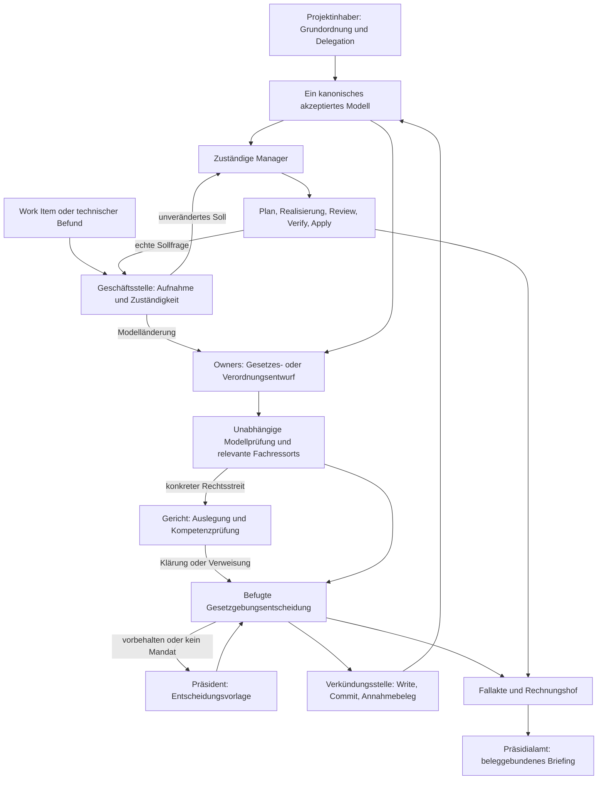

# Government: Konzept und späterer Umsetzungsplan

Stand: 9. Oktober 2026. **Ausgearbeitetes Zielkonzept mit empfohlenen Entwurfsentscheidungen und einem vollständigen Plan für eine spätere Implementierung.** Government ist hier eine geplante Erweiterung. Diese Dokumente ändern weder das akzeptierte Produktmodell noch unterstützte APIs. Der Auftrag umfasst Konzeption und Planung; die Umsetzung und die vorgesehenen Versuche beginnen erst mit einem späteren Auftrag.

Government soll gewöhnliche Anliegen in ein gutes, befugt angenommenes Projektmodell überführen. Du bestimmst als Projektinhaber die Grundordnung und erhältst als Präsident Briefings und die vorbehaltenen Entscheidungen. Innerhalb deiner Delegation bearbeitet die Verwaltung Routinefälle, Fachressorts prüfen Folgen, die Gesetzgebungsfunktion nimmt Modelländerungen an, Gerichte klären konkrete Streitfragen und die Manager realisieren das angenommene Modell. Das angestrebte Ergebnis ist **mehr fachlich begründete Autonomie bei weniger notwendiger menschlicher Koordination**. Diese Wirkung bleibt eine zu prüfende Hypothese.

## Grundlage und Reichweite

Die [vorangegangene Evaluation](../../research/government-evaluation/README.md) und die dort erhaltenen [direkten Nutzerideen](../../research/government-evaluation/user-ideas.md) sind die Grundlage. Die Zuverlässigkeit der kleinen Markitect-Basis ist weiterhin die vereinbarte Prämisse, kein Ergebnis dieses Entwurfs. Produktbefunde stammen ausschließlich aus `fc6d09a234572c344279a342416475e788435f1f`; ihr [Quellenregister](../../research/government-evaluation/source-basis.md) bezeichnet sie mit `P`. Die Dokumentationsarbeit beginnt am unveränderlichen BASE `d41aaeb3950c99be467e1f198d3f08428e96691b` auf `codex/government-evaluation-20261009`. Vor einer Umsetzung wird eine tatsächlich verfügbare stabile Produktrevision neu festgelegt und abgeglichen.

Das Konzept umfasst Modellpflege, delegierte Annahme, Fachprüfung, Streitentscheidung, Präzedenz, Qualitätspflege und den dafür nötigen Betrieb. Es beschreibt einen Host und ein Projekt mit einem maßgeblichen akzeptierten Modellstand. Cockpit, Gamification, visuelle Regierungswelt, verteilte Hosts und externe Deploymenttransaktionen sind spätere eigene Themen. Es gibt keine Entscheidung für Kubernetes, etcd oder einen permanenten Agenten pro Institution.

## Dokumentationsstruktur und Eigentümer

Die folgenden Dateien besitzen jeweils einen eigenen Gegenstand. Verweise verbinden sie; dieselbe Vorschrift wird nicht in mehreren unabhängigen Dokumenten gepflegt.

| Dokument | Kanonischer Gegenstand dieses Entwurfs |
|---|---|
| [Institutionen und Begriffe](terminology.md) | Korrekte Bezeichnungen, bewusste Grenzen der Staatsanalogie, Rollen und Fachressorts |
| [Grundordnung und Befugnis](constitution-and-authority.md) | Normrang, Delegation, Reservate, Freiheitsraum und getrennte Konfigurationsachsen |
| [Gesetzgebung und Gerichte](legislation-and-courts.md) | Modellverfahren, Einwände, Abwägung, Instanzen, Ausnahmen und Präzedenz |
| [Architektur](architecture.md) | Fachmodule, Abhängigkeiten und Anschluss an Markitect-Pakete |
| [Verträge und Zustände](contracts.md) | Verbindliche Entwurfsinvarianten, Eingaben, Records und wirksame Übergänge |
| [Betrieb](operations.md) | Konkurrenz, Unterbrechung, Budget, Widerruf, Briefings, Audit und Aufbewahrung |
| [Entwurfsentscheidungen](decisions.md) | Empfohlene Lösungen, verworfene Alternativen und Bedingungen für spätere Änderung |
| [Durchgängige Beispiele](walkthroughs.md) | Zusammenspiel anhand von Routine, Rechtsstreit, Zieländerung, Recovery und Vereinfachung |
| [Umsetzungsplan](implementation-plan.md) | Arbeitspakete, Abhängigkeiten, Liefergegenstände, Prüfungen und Freigabepunkte |
| [Anforderungsabdeckung](coverage.md) | Rückverfolgung der Nutzerideen zu Teilproblemen, Lösungen und Arbeitspaketen |
| [Prüf- und Übergabeprotokoll](verification.md) | Tatsächliche Dokumentationsprüfungen und Grenzen der Übergabe |
| [Unabhängige Gegenprüfung](review.md) | Gefundene Konzeptlücken und ihre erneute Prüfung nach Integration |

Zum Einstieg: Begriffe, Grundordnung und die Beispiele lesen. Für die spätere Umsetzung: Entscheidungen, Architektur, Verträge und Plan zusammen verwenden. Die Evaluation bleibt die datierte Begründungs- und Quellenbasis; dieser Bereich besitzt die nächste, ausführlichere Entwurfsfassung.

## Das Regierungsmodell

Vier Funktionen sind zu unterscheiden:

1. **Grundordnung setzen:** Der Projektinhaber bestimmt Zweck, nicht delegierte Entscheidungen und zulässige Befugnisse. In der Analogie ist dies die konstituierende Autorität.
2. **Gesetzgebung:** Ein ausdrücklich befugter Akteur nimmt genau bezeichnete neue Modellregeln unter der bisherigen Ordnung an. Auch eine delegierte Entscheidung verändert tatsächlich das Soll; bloße Vorschlagserstellung erfüllt dieses Ziel noch nicht.
3. **Exekutive:** Verwaltung und Manager bereiten Arbeit vor, koordinieren, realisieren und prüfen angenommene Entscheidungen. `Apply` ist der kontrollierte Vollzug einer konkreten Realisierung.
4. **Rechtsprechung:** Eine unabhängige Instanz klärt einen konkreten Streit über geltende Regeln, Zuständigkeit oder ihre Anwendung. Eine erwünschte neue Regel geht wieder in die Gesetzgebung.

Der Titel Präsident bezeichnet deine gewünschte Leitungs- und Briefingrolle. Er entspricht hier einer projektspezifischen Präsidialordnung; die tatsächlichen Kompetenzen werden ausdrücklich festgelegt. Ministerien vertreten fachliche Ressorts wie Sicherheit, Architektur oder Nutzerinteressen. Sie ersetzen keine Managerzuständigkeit. Der Rechnungshof prüft Rechenschaft und Verfahrensqualität; das Präsidialamt bereitet Briefings vor.

Die Institutionen sind Aufgaben mit Mandaten. Sie können durch kurze Agentenaufrufe oder deterministische Hostfunktionen ausgeübt werden. Der Host verwaltet Befugnis und wirksame Übergänge; ein Agent liefert fachliche Auslegung, Vorschlag oder Urteil innerhalb dieses Rahmens. Eine zusätzliche Rolle allein beweist keine unabhängige Prüfung.

## Eine Modellwelt, zwei organisatorische Achsen

Die vertikale Managerhierarchie bleibt zuständig für Modellinhalte, Artefakte und Integration. Die horizontale Ressortachse bringt Fachperspektiven ein. Ein Sicherheitsstandard steht beim dafür verantwortlichen Modellowner; seine Prüfung in Orders und Inventory erzeugt keine zweite Kopie. Gerichtsakten, Briefings und Präzedenzrecherche enthalten Begründungen und Beobachtungen. Sie werden erst durch einen befugten kanonischen Modelländerungsvorgang zu dauerhaft bindenden neuen Regeln.

Das Konzept bewahrt damit die ursprüngliche Markitect-Idee: **gewünschten Zustand einmal pflegen und seine Realisierungen daran ausrichten**. Government delegiert zusätzlich die Pflege dieses Zustands. Es darf weder eine parallele Soll-Welt noch eine Regelproduktion schaffen, die sich durch eigene Urteile und Erfolgszahlen legitimiert.

## Ausbau in überprüfbaren Stufen

Die erste nutzbare Stufe enthält Grundordnung, begrenzte Delegation, Modellfall, unabhängige Prüfung, echten Annahmevorgang, sichere Rückkopplung, Budget und ein einfaches Briefing. Sie braucht keine voll besetzte Ministerienlandschaft. Danach folgen gezielte Fachressorts, gerichtliche Instanzen sowie Präzedenz und langfristige Modellpflege. Der [Plan](implementation-plan.md) gibt dafür einen gemeinsamen Vertrag und eine eindeutige Integrationsreihenfolge vor.

Jede Stufe liefert einen eigenen Nachweis: mechanische Vertragsprüfung, tatsächliche begrenzte Agentenentscheidung, menschliche Annahme der fachlichen Ergebnisse und gemessene Entlastung. Ein korrekt gespeicherter Beschluss beweist keine richtige Absicht. Eine gute Einzelentscheidung beweist noch keine dauerhafte Autonomie. Der Ausbau wird nach seinem Zusatznutzen gegenüber einer einfacheren delegierten Managerlösung beurteilt.
