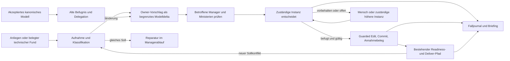

# Government: Architekturvorschlag

**Status:** Konzept für eine spätere Umsetzung, kein implementierter Produktvertrag und keine Freigabe zur Migration. Produktbasis der Analyse ist `fc6d09a234572c344279a342416475e788435f1f` (`P` im [Quellenregister](../../research/government-evaluation/source-basis.md)); Arbeitsbasis dieses Entwurfs ist `d41aaeb3950c99be467e1f198d3f08428e96691b`. Die [funktionale Evaluation](../../research/government-evaluation/functional-design.md) und die [Nutzerideen](../../research/government-evaluation/user-ideas.md) begründen das Ziel. Alle hier genannten neuen Operationen und Dateien sind Vorschläge.

## Stellung im Produkt

Government entscheidet, **welche Änderung am einzigen kanonischen Soll** aus einem Anliegen entstehen darf und wer sie nach welcher geltenden Befugnis annehmen kann. Der vorhandene Projekt-Host kennt bereits Manager, explizite Zuordnungen, Modelledits, Context/Impact, Readiness und den gebundenen Deliver-Pfad [P4–P10]. Er besitzt noch keine Government-Autorität: Der vorhandene `Decision`-Eintrag ist kein Gerichtsentscheid und die Prüfung eines Actor-Pfads kein materieller Befugnisbeweis [P5, P7]. Government sitzt daher vor der Annahme einer Modellrevision und übergibt erst einen nachweisbar angenommenen Modellcommit an Readiness/Delivery.

Die normative Wahrheit bleibt in den vom Projekt gewählten kanonischen Modell-Dateien. Ziele, Pflichten, delegierte Entscheidungsräume, Vorbehalte und die Ownership einer Regel besitzen je einen verantwortlichen Modell-Owner. Ein Fall, eine Ministeriumsstimme, ein Präzedenzverweis und ein Briefing sind gebundene Verfahrensdaten, keine zweite Sollquelle. Eine Änderung der Government-Policy ist selbst ein Modellfall und wird unter der **vorher** gültigen Befugnis entschieden. Ein Projekt kann Government nicht aktivieren und zugleich durch eine neue, noch nicht angenommene Delegation die erste Entscheidung legitimieren.

Die Gesetzgebungsfunktion ist die ausdrücklich delegierte **Annahme eines neuen Solls**. Sie ist ein eng begrenzter Actor-Vertrag, kein zweiter Modell-Owner. Das Kabinett kann Vorschläge koordinieren; es wird dadurch nicht automatisch zum Gesetzgeber. Gerichte legen geltende Normen im konkreten Konflikt aus und entscheiden nur innerhalb ihres Mandats. Wo bestehende Pflichten geändert oder ausgenommen werden müssten, braucht der Fall die dafür vorher festgelegte Annahmeinstanz. Der erste Opt-in verlangt einen vertrauenswürdigen Projekt-Owner und einen bereits akzeptierten Modellanker. Danach hält ein Host-eigener Annahme-Cursor nur fest, **welcher Commit unter welcher Modell-/Policy-Fassung angenommen wurde**. Er enthält keine konkurrierenden Normtexte.

Government ergänzt die vertikale Managerhierarchie um horizontale **Prüfmandate**. Der Orders-Manager beispielsweise schreibt die Bestellregel; Inventory besitzt den Freigabevertrag; der gemeinsame Elternmanager koordiniert und integriert beide Kandidaten. Ein Sicherheitsministerium prüft die Auswirkungen über beide Slices hinweg und begründet gegebenenfalls einen Einwand. Es bekommt dadurch weder Schreibrechte an fremden Regeln noch die Integrationsrolle des Elternmanagers. Die gemeinsame Sicherheitsnorm hat selbst genau einen kanonischen Owner. „Ministerium“ kann eine nur für den Fall gestartete spezialisierte Rolle sein; weder dauerhafte Prozesse noch ein neues weltweites Rollenregister sind erforderlich. Das [konzeptionelle Modulmodell](../project-world/conceptual-modules.md) beschreibt fachliche Projektverantwortung; die unten stehenden Government-Module bezeichnen interne Host-Verantwortungen und sind davon zu unterscheiden.

## Interne Module und Verantwortungen

Die folgende Zerlegung ist ein **fachlicher Modulschnitt innerhalb einer Host-Funktion**, keine Behauptung über heute installierbare Module oder schon vorhandene API. Jedes Modul hat einen eigenen Grund für Änderung und einen schmalen Ergebnisvertrag. Eine kleine erste Implementierung darf mehrere Verantwortungen in einem Go-Package zusammenhalten, solange die Vertragsgrenzen sichtbar bleiben.

| Verantwortung | Besitzt und liefert | Benötigt; vorgeschlagene spätere Operationen |
|---|---|---|
| Verfassung und Delegation | Aus dem **akzeptierten alten Modell** abgeleitete Befugnis, Scope, Reservierungen, Pflichtprüfungen, Widerruf und Policy-Epoche. Keine selbständige Policy-Datei. | Projektmodell und feste Revision; `ResolveAuthority`, `CheckMandate`, `CheckRevocation`. |
| Aufnahme und Gesetzgebung | Originalanliegen, Herkunft, Lesarten, Klassifikation, zuständige Modell-Owner, begrenzten Deltaentwurf und dessen Revisionen. Technische Reparatur geht zurück an den bestehenden Managerablauf. | Verfassung/Delegation sowie Model/Context/Impact; `OpenCase`, `ClassifyIntent`, `PrepareModelProposal`, `ReviseProposal`. |
| Ministerien und Anhörung | Auswahl der anwendbaren Perspektiven, fallbezogene Stellungnahmen, konkrete Einwände, Nichtbetroffenheit, offene Evidenz und Aktualität der Antworten. | Festen Vorschlag, Modellziele, relevante Artefakte; `SelectConsultations`, `RecordOpinion`, `AssessOpinionFreshness`. |
| Entscheidung | Konflikttyp, Entscheidungsraum, Instanz, begründete Abwägung, Appeal und Eskalation. Unterscheidet bindenden Einwand von beratender Gegenposition. | Befugnis und frische Anhörung; `AdjudicateCase`, `RequestAppeal`, `ResolveAppeal`. |
| Inkraftsetzung | Exakten beschlossenen Delta-/Modelldigest, guarded Write, tatsächlichen Git-Commit, Annahmebeleg und kontrollierte Übergabe. Serialisiert Annahmen über erwarteten HEAD. | Befugnis, Entscheidung und vorhandene Modelledit-/Git-/Readiness-Seams; `PrepareEnactment`, `CommitModel`, `RecordAcceptance`, `HandoffAcceptedModel`. |
| Journal, Präzedenz, Audit und Briefing | Append-only Fallereignisse, gebundene Gründe, Status, Budget, Wiederaufnahme, Analogiehinweise und belegtes Briefing seit Cursor. Keine automatische Normbildung. | Ereignisse aller Verantwortungen und Delivery-Rückmeldung; `AppendCaseEvent`, `InspectCase`, `FindRelevantReasons`, `BuildBriefing`. |

Der Datenfluss ist gerichtet: Aufnahme liest geltende Autorität; Anhörung bewertet einen festen Vorschlag; Entscheidung liest beide; Inkraftsetzung verwendet nur einen gültigen Beschluss; Journal beobachtet und bewahrt Ergebnisse. Ein Präzedenzfund wird der Entscheidung **als gekennzeichneter Hinweis** gegeben und kann keine Befugnis oder Pflicht erzeugen. Ein Briefing darf eine neue Untersuchung anregen, schreibt aber nie selbst kanonische Regeln. Revisionen schließen alte Stellungnahmen nicht stillschweigend ein: eine neue Kandidatenfassung verlangt erneute Betroffenheits- und Frischeprüfung.

## Paket- und Importgrenzen

Der gegenwärtige Clean-Architecture-Vertrag lässt `src/internal/core` ausschließlich die ausgewählten strukturellen Werte kompilieren. Host wählt Quellen, interpretiert Projektpolitik, koordiniert Prozesse und persistiert; `src/internal/modules/<name>` sind Go-Implementierungseinheiten, nicht automatisch installierbare Schema- oder Projection-Module [P3; [Architektur](../../architecture.md#canonical-reset-source-only-vnext-boundary)]. Government muss **projektgewählte** Ziele und Rechtsfolgen interpretieren, Git-Zustand beobachten, Befugnis prüfen und Runs koordinieren. Daher ist eine Host-Funktion unter dem vorgeschlagenen `src/internal/host/government/` der angemessene erste Ort. Mögliche private Unterordner sind `authority/`, `casework/`, `consultation/`, `adjudication/`, `enactment/` und `journal/`; die obige Verantwortungstabelle ist verbindlicher für den Entwurf als die Ordnerzahl.

Reine, providerunabhängige Werte oder Digest-/Zustandsprüfungen können in einem privaten Host-Vertragspaket liegen. Sie gehören nur dann in `src/internal/host/records` oder einen allgemeinen Module-Bereich, wenn eine zweite echte Host-Fähigkeit sie benötigt und die Importregel gewahrt ist. Kein Government-Kind wandert allein wegen der Metapher nach Core. **Die gewählte v1-Lösung erweitert die vorhandenen Projektmodell-Deskriptoren und Parser in `src/internal/modules/projectmodel/` um ausdrücklich deklarierte Governanceangaben.** Die normative Policy lebt beim bestehenden Projekt-/Managerowner; der Host erhält daraus ein normalisiertes Ergebnis. Ein separat installierbares Vokabular oder Projection Module ist eine spätere Alternative, keine zusätzliche Voraussetzung der ersten Umsetzung. Die genaue versionierte Feldsyntax wird in GP01 festgelegt. `src/cmd/...` und MCP bleiben dünne Eingänge zur gleichen Host-Operation; keine CLI/MCP-Variante bekommt eigene Autoritätssemantik. Provideradapter liefern Vorschläge oder Reviews über explizite Inputs. Ihre Texte sind Evidenz, keine Policy.

Die bestehende Implementierung liegt auf der aktuellen Basis vor allem in `src/internal/modules/projectmodel/`, `src/internal/host/projectwork/` und `src/internal/host/projectrun/` [P5–P10]. Der neue Host-Pfad würde deren **öffentliche Host-Services und gebundene Ergebnisse** verwenden, nicht deren Interna kopieren. Das aktuelle Readiness/Deliver-Verfahren bleibt der Ausführungseinstieg; die zusätzliche Annahmeprüfung speist ihm eine bestimmte Modellrevision und einen Beleg zu. Ein Realisierungsfehler kehrt zur Reparatur unter demselben Soll zurück. Ein echter Zielkonflikt erzeugt einen neuen Government-Fall; der Ausführer lockert keine Regel oder Prüfung zur Selbstbestätigung.

Die alte Variante auf `04e225d5caee78c2a198607143863fca1e829750` besitzt getrennte Constitution/Area/Ressort/Mandate/Responsibility/Realization-Strukturen sowie Queue- und Bindungsmechanik [A1–A5]. Daraus sind Digest-Bindung, endliche Queue, CAS und Recovery als **Ideen oder isolierte Algorithmen** prüfbar. Ihr separates Normmodell, altes Vokabular, Einstimmigkeit und API sind keine Migrationsvorlage und werden nicht automatisch übernommen. Der aktuelle Projekt-Manager bleibt kanonischer Eigentümer; eine zweite alte Government-Welt würde genau die beabsichtigte einmalige Modellpflege aufheben.

## Betrieb und Ausbaugrenze

Der erste Betriebsrahmen ist ein Host, ein Projekt, eine aktive akzeptierte Modellrevision und serieller Annahme-CAS. Vorbereitende Untersuchungen dürfen parallel sein. Eine Annahme konkurriert auf dem ganzen maßgeblichen Modellstand; Dateidisjunktheit allein genügt nicht, weil Ziel, Delegation und Pflichtprüfung gemeinsam wirken. Ein weiterer Host erfordert später Fencing, geteilte Claims und Identität. Etcd und Kubernetes sind dadurch weder vorausgesetzt noch ausgewählt. Fallbudget, begrenzte Anhörungs-/Appeal-Runden und explizite unbekannte Wirkungen sind Teil des Host-Ablaufs. Die detaillierten Übergänge und Belege stehen in [Verträge](contracts.md).

Die Naht zwischen Git-Commit und Annahmebeleg ist absichtlich sichtbar: Ein Commit kann schon existieren, während der Akzeptanz-Cursor noch auf das alte Modell zeigt. In diesem Zustand bleiben Government-geschützte Readiness/Delivery und weitere Modellannahmen angehalten, bis der ursprüngliche Vorgang eindeutig rekonstruiert oder geklärt ist. Auch alte Edit-Endpunkte und außerbandige Modellcommits dürfen den Cursor nicht überholen. Reine Artefakt-Nachfolger können einen Annahmebeleg nur mit unverändertem kanonischem Modelldigest, gültiger Abstammung und frischer Policy verwenden; ihre Delivery-Basis ist dennoch ein eigener Git-Stand. Diese Sperre ist Teil der späteren Host-Integration, nicht durch ein Agentenprompt zu ersetzen.

Ein minimaler Fähigkeitsnachweis sollte zuerst einen **wirklich delegierten, begrenzten Modellentscheid** samt Commit, Annahmebeleg und Rückübergabe zeigen. Nur Modellvorschläge mit stets menschlicher Freigabe sind ein valider früher Zustand, belegen aber noch keine autonome Government-Modellpflege. Formale Gültigkeit, grüne Checks und übereinstimmende Agentenstimmen beweisen weder gutes Soll noch menschliche Akzeptanz. Kosten, Ausnahmen, menschliche Eingriffe, falsche Annahmen und Folgeschäden gehören in spätere reale Evaluation; die heutigen Quellen belegen dafür noch keine Erfolgsrate [P14].
