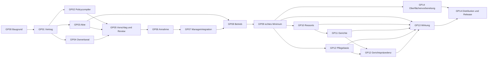

# Umsetzungsplan: delegierte Modellentscheidung in Markitect

**Status: umsetzbarer Konzeptplan, keine Startfreigabe und kein implementierter Produktvertrag.** Alle unten genannten Government-Arbeitspakete und Nachweise stehen auf **NICHT GESTARTET**. Die Evaluation nimmt eine zuverlässig funktionierende kleine Markitect-Basis als Arbeitsprämisse an; sie bestätigt weder die noch offenen Produktgates noch eine neue Releasefähigkeit. Der konkrete spätere Produktstand muss vor Codearbeit neu bestimmt werden. Forschungsbasis sind [funktionaler Entwurf](../../research/government-evaluation/functional-design.md), [Umsetzbarkeitsurteil](../../research/government-evaluation/feasibility-assessment.md), [Validierungsfragen](../../research/government-evaluation/validation-questions.md) und [Quellenregister](../../research/government-evaluation/source-basis.md). Der aktuelle Produktpfad und seine tatsächlichen Gates stehen in [Roadmap](../../implementation-plan.md) und [Product Readiness](../../work-items/product-readiness/README.md).

## Ziel, Schnitt und Baugrund

Government soll für **eine begrenzte Klasse** von Anliegen das richtige Soll vorbereiten, unter bereits geltender Befugnis annehmen und die akzeptierte Modellrevision an den vorhandenen Managerablauf übergeben. Ein erster tragfähiger Schnitt umfasst einen Host, ein Projekt, eine maßgebliche Modelllinie und seriell angenommene Modelländerungen. Ein echter delegierter Routinefall muss ohne menschliche Entscheidung über *diesen einzelnen Fall* abschließen können; reservierte oder unklare Fragen müssen mit einer entscheidungsfähigen Vorlage beim Menschen enden. Ein Agent darf Befugnis, Prüfschritte oder Erfolgskriterien weder aus seinem Vorschlag ableiten noch zur Rettung einer gescheiterten Realisierung absenken.

Das vorhandene rekursive `.markitect/`-Projektmodell bleibt die einzige Sollquelle. Vertikale Manager besitzen Statements, Artefakte und Integration; horizontale Ressorts liefern Prüfungen, keine zweiten Modellkopien. Government gehört als Projektpolicy und Host-Orchestrierung an die bestehende Model-first-Welt: wenige explizite, versionierte Norm-/Delegationsangaben im bestehenden `projectmodel`; deterministische Fall- und Zustandsprüfung sowie Ausführung im Host, etwa unter `src/internal/host/government/`; Bindung an `projectwork`, `projectrun`, `projectadoption` und `projectcli` über benannte Hostverträge. Diese Paketnamen sind Planungsziele, vor Implementierung an einem frischen BASE zu bestätigen. CLI und MCP müssen dieselben Hostanwendungsfälle benutzen. `src/internal/core` erhält keine Staats-, Domänen-, Provider- oder Quellcode-Semantik. Installierbare Schema-/Projection-Module und historische Project/Domain-Kompatibilität werden nicht zu einer zweiten Regierungslaufzeit umgebaut. Die [Architektur](../../architecture.md#go-ownership-and-final-dependency-model), [Modulgrenzen](../../development/modules.md) und [Contribution-Gates](../../../CONTRIBUTING.md) sind dafür maßgeblich.

Die Entwurfsbegriffe „Präsident“, „Ministerium“, „Gericht“ und „Rechnungshof“ bezeichnen Befugnisse und Verfahren, keine zwingend ständig laufenden Prozesse. Das Menschenmandat begründet und begrenzt Delegation. Ein Review, eine Abstimmung, ein Commit, ein Actorname oder ein Digest beweisen für sich keine Zustimmung. Die Normebenen und Inhaber werden im [Autoritätsentwurf](constitution-and-authority.md), die Rollennamen in der [Terminologie](terminology.md) präzisiert. Entscheidend ist die technische Bindung zwischen altem Mandat, exaktem Vorschlag, Entscheidung, tatsächlich vorhandenem Commit und Annahmebeleg. **An dieser Naht wird die Freigabe vor jeder nachfolgenden Plan-, Readiness-, Deliver- und Apply-Wirkung wieder geprüft.**

## Reihenfolge und Integrationsgates

`GP00 → GP01 → {GP02, GP03, GP04} → GP05 → GP06 → GP07 → GP08 → GP09` ist der minimale Produktpfad. Geschweifte Klammern erlauben getrennte Vorarbeiten nach einem gemeinsam eingefrorenen Vertrag. `GP10` und `GP11` können auf dem belastbaren Fallpfad aufbauen; `GP12` folgt der ersten Ende-zu-Ende-Erfahrung. `GP13` misst die Wirkung, `GP14` schließt Produktoberflächen und Releasegates. Jede parallele Änderung an gemeinsamem Schema, öffentlichen DTOs, Übergangsregeln oder der Annahmenaht hat **einen** Integrationsowner. Zweige dürfen private Implementierungen bearbeiten; die jeweilige Integrationsänderung und die zugehörigen Gegenfälle werden zentral zusammengeführt. Die Tabelle benennt Verantwortungsrollen, keine bereits zugeteilten Personen.

GP13 kann den Delegationsvergleich nach GP09 beginnen; der Vergleich der Zusatzinstitutionen wartet auf deren tatsächlich geprüften Umfang. GP12 kann allgemeine Pflegegründe ab GP09 behandeln, Gerichtspräzedenz nach GP11. Dünne vorläufige CLI-/MCP-Eingänge beziehungsweise ein expliziter Hostharness entstehen bereits mit GP05–GP07, damit GP09 die wirklichen Host-/Providerpfade ausführen kann. GP14 stabilisiert diese Oberfläche, Migration und Distribution; es ist kein nachgelagerter Ersatz für den im Pilot nötigen Einstieg.

**Übergang vor dem Gerichtsausbau:** GP06 verwendet noch keine nicht implementierte CourtRuling-Instanz. Klare erlaubte Routinefälle erhalten den unabhängigen Modellreview und den befugten legislativen Beschluss. Bleibt die Geltung eines beanspruchten harten Einwands strittig, setzt der Host `ControlStatus: needs-owner`; keine Annahme, keine Timeoutzustimmung und kein automatischer Richterspruch folgen. Die Entscheidungsvorlage benennt Norm, Scope, konkurrierende Auslegungen und fehlende Evidenz. Der Owner veranlasst zusätzliche Prüfung, Revision, Ablehnung oder eine befugte kanonische Klarstellung. Anschließend braucht der exakte frische Vorschlag wieder seinen eigenen Annahmebeschluss. Erst GP11 darf diesen Streit an die konfigurierte unabhängige Gerichtskompetenz übergeben. Dies ist eine gezielte Grenze des v1-Pilots, keine pauschale Human-Approval-Pflicht für Routinefälle.

| Gate | Was vor dem nächsten Schritt feststehen muss | Nachweis und Stopbedingung |
|---|---|---|
| G0: Baugrund | Stabile, tatsächlich geprüfte Produktbasis, abgeschlossene erforderliche laufende Arbeitspakete und Case-Study-Zahlen nach Nutzerprämisse; neuer vollständiger BASE-SHA, Inventar der aktuellen APIs, aktiver Owner und Schutzpfade | [Markitect-first](../../markitect-first.md): `check`, ausgewählter `context`, Klassifikation, Sourceabgleich. Ein älterer Forschungs-SHA oder grünes Fixture ersetzt diese Prüfung nicht. |
| G1: Vertrag | Endliche Änderungsklassen, Mandate, Vorbehalte, Baseline-/Bootstrapverfahren, Fallidentitäten, Annahme- und Frischeregeln, Opt-in/Kompatibilitätsform, Failure-Status und Beispiel im kanonischen Owner beschlossen | Strukturierter Vertragskandidat am exakten BASE geprüft; `impact` und Review vor korrespondierender Implementation. Offener Grundsatz oder unklare Policy stoppt den betroffenen Codepfad. |
| G2: geschlossene Mechanik | Modellprüfung, Falljournal und Host-Annahme verhindern Selbstermächtigung, Bypass, Stale-Entscheidung und Replay | Feste Unit-/Integrations-Gegenfälle einschließlich Fehler- und Abbruchpunkten; nur deklarierte technische Aussagen. |
| G3: funktionales Minimum | Ein echter delegierter Routinefall durchläuft Vorschlag, unabhängigen Modellreview, Entscheidung, vorhandenen Commit, Beleg, Readiness und Manager-Delivery; reservierter Fall eskaliert | Autorisierter nativer Lauf mit wirklichen Actors und exakten Records, danach unabhängige fachliche und menschliche Prüfung. Fixture-PASS und Providertext sind dafür kein Ersatz. |
| G4: institutioneller Zusatznutzen | Konkrete Konflikte rechtfertigen Fachperspektiven, gerichtliche Instanz oder Präzedenz | Separate Vergleichs- und Holdoutfälle; bei fehlendem Zusatznutzen bleibt der einfachere delegierte Managerweg. |
| G5: Produkt-/Releaseentscheidung | Stabilität, Dokumentation, installierter Kandidat, unterstützte Plattformen und relevante Abnahme abgeschlossen | Normale CI-/Releasepipeline und veröffentlichte Version erst nach eigener Freigabe; Sourcecode und native Abnahme sind noch kein Release. |

Die spätere Umsetzung startet auf einem **neuen** Feature-Branch von G0, nicht durch stilles Weiterbauen auf `fc6d09a234572c344279a342416475e788435f1f` (Produktbefund dieser Evaluation) oder `d41aaeb3950c99be467e1f198d3f08428e96691b` (Ausgangscommit dieser Konzeptarbeit). Auch bestehende experimentelle Government-Mechanik ist nur Randfall- und Testmaterial. Ein getrenntes Constitution/Area/Ressort-Modell, pauschale Einstimmigkeit, eigener Ref-Promotionweg oder zweite Queue würden die jetzige Produktwelt duplizieren.

## Arbeitspakete

**GP00 — Basis und Produktabgleich (G0; Owner: Produktintegration).** Stabile Quelle, laufende Arbeit, nativer Akzeptanzstand, installierte Version und betroffene Artefakte inventarisieren; alte G1–G5-Invarianten gegen den aktuellen `src/`-Baum abgleichen. Deliverable ist ein SHA-gebundener Implementerhandoff mit konkreten Paketgrenzen, unverändertem beziehungsweise geändertem Intent, Risikoliste und Gate-Befunden. Akzeptanz: kein unversionierter oder nur historisch getesteter Stand wird als aktuelle Produktfähigkeit bezeichnet; vorhandene `project`-Operationen samt tatsächlicher Einstiegspfade sind dokumentiert. Die Forschungsprämisse bleibt Prämisse, bis G0 sie mit Produktbelegen ersetzt.

**GP01 — kanonischer Vertrag und vertikaler Fall (G1; Owner: Modell-/Vertragsintegration; nach GP00).** Eine ausführbare Beispielordnung für einen Shop-Fall festlegen: Präsident/Trusted Owner, wenige Entscheidungsklassen, reservierte Schutzregel, delegierter Bereich, Pflichtreview, Endlichkeit, Widerruf und eine legitime Routineänderung. Die eine kanonische Modellquelle und ihre versionierten Deskriptoren werden festgelegt; die Modelldelta- und Fallrecords benennen Quelle, Anfrage, Originalzweck, Alternativen, Ausgangsrevision und Eigentümer. Eine Opt-in-Migration definiert, wie bestehende Projekte ohne Government unverändert laufen und wie alte Projekte bewusst eine initiale Autorität mit `AcceptedModelAnchor` und `PolicyEpoch` erhalten. Die konkrete Syntax, das Schemaformat, öffentliche Namen, Status-/Fehlercodes und gespeicherte Recordversionen sind am aktuellen Produktstand zu entscheiden und mit `check`, `context` und `impact` am Intent-Kandidaten zu prüfen. Akzeptanz: ein einzelner Routine- und ein reservierter Gegenfall lassen sich ohne implizite Kompetenz oder zweite Sollquelle vollständig ausdrücken; historische Releases und Records werden nicht umgedeutet.

**GP02 — Policycompiler und Deterministik (Owner: Project-model-Implementierung; nach GP01).** Bestehendes `projectmodel` um die gewählten expliziten Norm-/Delegationsangaben ergänzen: Quelle, Scope, Entscheidungsklasse, maximale Wirkung, Pflichtprüfungen, Geltung, Änderungskompetenz und Widerruf. Struktur/Referenzen, eindeutige Owner, erklärte Rangordnung und konservative Betroffenheit deterministisch prüfen; unbekannte deklarierte Reichweite erweitert die Prüfung oder eskaliert. Befugnis wird gegen das **alte akzeptierte Modell** bewertet. Deliverables: Schema/Parser, normalisierte und bytegenaue Digestbindung, Impact, klare Diagnostik, ausführbares Beispiel und generierte Views. Akzeptanz: Änderung geschützter Mandatsfelder, Entfernung eines deklarierten Pflichtchecks oder geschützten Artefakts und fehlende vorgeschriebene Evidenzrecords blockieren. Bedeutungsverdeckte Normabsenkung in freiem Text und unbekannte fachliche Folgen brauchen darüber hinaus unabhängigen semantischen Review; der Compiler behauptet dafür keinen Vollständigkeitsbeweis. Nie aktivierte Projekte bestehen ihre bisherigen Gates.

**GP03 — Fallidentität und langlebige Akte (Owner: Host-Records; nach GP01).** Versionierte, append-only Records für Work Item, Interpretation, Modellkandidat, Evidenz, Review, Einwand, Entscheidung, Annahme und Realisierung definieren. Verschiedene IDs und Digests binden Anfragefassung, BASE, Norm-/Mandatsrevision, exakten Kandidaten, Actorversuche und externe Wirkung; historische Gründe bleiben separat vom geltenden Modell. Unbekannt und nicht beobachtet bleiben eigene Zustände. Deliverable ist ein prüfbares Journal mit Resume- und Cursorregel. Akzeptanz: unterbrochene Vorgänge lassen sich ohne erfundenen Erfolg inspizieren; eine neue Fall-ID oder neue Kandidatenfassung recycelt keine alte Zustimmung; jeder Bericht zeigt die Belegkette.

**GP04 — vertrauenswürdiger Ownerkanal (Owner: Host-Identität/Integration; nach GP01).** Bootstrap und spätere Mensch-/Ownerentscheidung verwenden den in [Verträge](contracts.md) gewählten lokalen Operatoreingang außerhalb der Agententoolmenge. Eine einmalige Hostanforderung bindet Projekt, CaseID, Aktion, exakten Kandidaten, alten Anker, Policy-/AuthorityEpoch, Ablauf und Nonce; der konfigurierte Owneradapter bestätigt die ausdrückliche Operatorhandlung. Git-Actorname, Issue-/Chattext und `Decision.actor` sind keine Authentifizierung. Implementieren: einmaliger Verbrauch, fehlender Kanal, falsche Bindung, Ablauf, Replay, Widerruf und Wiederfreigabe. Owner-Control-Ereignisse verengen vorhandene Befugnis unmittelbar nach dauerhafter Bestätigung; Erweiterung bleibt Normänderung. Akzeptanz: gewöhnliche Agentenausgaben und importierte Texte können keinen Ownerbeleg im kooperativen Adaptervertrag erzeugen; fehlende oder widerrufene Autorität endet mit `needs-owner` beziehungsweise `stale`/`suspended`. Schutz gegen untrusted Prozesse mit denselben OS-Rechten erfordert eigene Identitäts-/Isolation und ein separates Gate; v1 behauptet ihn nicht.

**GP05 — Klassifikation und exakter Modellvorschlag (Owner: Host-Proposal; nach GP02–GP04).** Aus Originalanliegen und tatsächlichen Befunden wird eine gebundene Auswahl `Reparatur`, `Solländerung` oder `offen` erstellt. Der zuständige vertikale Owner formuliert bei Solländerung ein begrenztes Delta, Alternativen, Annahmen, Scope und vorgeschlagene Prüfer. Ein unakzeptierter `ProposalCommit` auf isoliertem Zweig/Workspace ermöglicht feste `check`-/`context`-/`impact`-Prüfung; er bewegt weder Projektzweig noch Annahme-Cursor. Reviews binden diesen Prüfsnapshot, beide Modelldigests und relevante Befugnis-/Prüfkonfiguration. Der spätere autorisierte ModelCommit bleibt eine eigene Identität; Übernahme von Evidenz verlangt belegte Gleichheit und Frische. Ein unabhängiger Modellprüfer sieht zusätzlich Originalauftrag und Gegenfragen. Akzeptanz: Reparatur läuft mit unverändertem Soll in die Managerroute; neue Funktion wird nicht als Bugfix versteckt; mehrdeutiges Ziel oder fehlende Evidenz wird sichtbar und führt zu `awaiting-evidence` oder `needs-owner`.

**GP06 — Entscheidung und Annahmenaht (Integrationsowner: Host Government; nach GP05; kritischer Pfad).** Ein zuständiger Entscheider hört die nötigen Perspektiven, beurteilt Pflichtverletzung, faktische Unsicherheit und Mandat gegen den alten Stand und zeichnet Gründe samt fortbestehenden Einwänden. Ein akzeptierter **exakter** Kandidat wird erst durch einen erlaubten Commit auf der erwarteten Modelllinie materiell vorhanden; danach bindet ein Annahmebeleg Beschluss, altes Mandat, Modelldigest und tatsächlichen Commit. Ein bloß geschriebenes Modell bleibt `model-written-pending-acceptance`. Wenn ein Owner einen bereits existierenden Commit anerkennt, ist nur ein explizit erlaubter Nachkomme mit identischem Modellinhalt und unverändert gültiger Kompetenz zulässig; eine beliebige fremde oder sachlich geänderte Revision nicht. Expected-head/CAS serialisiert Annahmen. Akzeptanz: Commit vor Beleg, Beleg vor Readiness/Delivery; stale Policy, paralleler Beschluss, Mandatswiderruf, geänderter Kandidat und unregistrierter Modellcommit blockieren. Kein automatischer Rebase erklärt zwei semantisch kollidierende Deltas kompatibel.

**GP07 — vorhandenen Managerweg lückenlos anbinden (Integrationsowner: `projectwork`/`projectrun`; nach GP06).** Jeder Einstieg in Edit, Readiness, Deliver, Plan, Resume, Repair, Verify, Preflight und Apply, soweit er ein angenommenes Modell benötigt, prüft dieselbe aktive Autoritäts-/Annahmebasis. CLI und MCP dürfen diese Naht nicht unterschiedlich interpretieren. Nach Annahme laufen die bekannten Manager-, Review-, Full-Verify- und Guarded-Apply-Verträge; ein Realisierungsfehler löst Reparatur oder neue echte Intentfrage aus. Deliverable ist eine Integrationsmatrix aller öffentlichen und internen Schreib-/Fortsetzungspfade. Akzeptanz: direkter Aufruf eines älteren Pfads umgeht Government im Opt-in-Projekt nicht; Widerruf oder Normwechsel stalet abhängige Pläne auch bei unveränderten Zielbytes; Opt-out behält seine bisherige Semantik.

**GP08 — Betriebssicherheit, Budget und Recovery (Owner: Host-Operationen; nach GP03, GP06–GP07).** Gesamtfallbudget zählt Interpretation, Recherche, Reviews, Gegenrede, Revision, Entscheidung, Realisierung, Briefing, alle Actor-/Toolversuche und bekannte Wiederaufnahmen nach expliziten Zählregeln. Endliche Runden und Eskalationsgrenzen verhindern Debattenschleifen. Resume inspiziert den ursprünglichen Turn und seine Wirkungen; unbekannte Wirkung wird weder wiederholt noch zu PASS erklärt. Vor Apply darf ein Vorschlag zurückgezogen werden; nach Apply verlangt Rücknahme einen neuen autorisierten Vorgang und gegebenenfalls projektseitige Kompensation. Akzeptanz: Fault Injection an Entscheidung, Commit, Receipt und Apply; Lost Response, Crash, neue Fall-ID, Budgetende und Widerruf erzeugen prüfbare Stop-/Recoveryzustände statt Doppelwirkung.

**GP09 — erster echter vertikaler Beleg und Basisbriefing (G3; Owner: Produktintegration + unabhängige fachliche Abnahme; nach GP07–GP08).** Das ausführbare Beispiel durchläuft einmal eine begrenzte delegierte Modelländerung samt realem Actorreview, tatsächlichem Modellcommit, Annahmebeleg und vorhandener Delivery. Ein zweiter Fall berührt eine reservierte Schutzregel und endet mit konkreten Optionen beim Menschen. Ein Briefing seit gespeichertem Cursor zeigt angenommenes Soll, technische Realisierung, offene/abweichende Einwände, unbekannte Evidenz, fällige Mandate und nötige Ownerfragen mit Belegen. Akzeptanz: native Provider-/Hostrecords lassen sich zu jeder Wirkung verfolgen; ein fachlicher Prüfer bewertet Originalzweck und Gegenfälle unabhängig. Technische PASS, nativer Ablauf und menschliche Annahme werden getrennt berichtet. Ohne echte Routineentscheidung bleibt die Schicht ein Approval-Assistent, nicht das geplante Minimum.

**GP10 — selektive Ressorts und Konfliktweg (Owner: Government-Rollen; nach GP09).** Erst anhand konkreter querliegender Fälle werden Fachperspektiven als konfigurierte Prüfmandate hinzugefügt: Betroffenheit konservativ wählen, Stellungnahmen und bindende Einwände unterscheiden, nicht betroffene Rollen begründet auslassen. Ein Ressort beantragt Änderungen beim vertikalen Owner und erhält keine pauschale Schreibkompetenz. Akzeptanz: ein Sicherheits-/Architekturfall liefert einen belegten neuen Befund oder eine nachvollziehbare Nichtbetroffenheit; zusätzliche Stimme ohne neue Erkenntnis zählt nicht als Erfolg. Kein ständiges Ministerium ist erforderlich, solange Fallaufträge genügen.

**GP11 — erste und zweite Instanz, Appeal (Owner: Government-Entscheidungsverfahren; nach GP10).** Eine erste befugte Instanz entscheidet einen konkreten Streit über Auslegung, Tatsachen oder Kompetenz; ein endlicher Appeal kann wegen benanntem Fehler an eine anders befugte oder unabhängig prüfende Instanz gehen. Normänderung bleibt ein eigener Modellvorgang, ein Urteil kein stilles Gesetz. Entscheidungen erfassen tragende Gründe, dissent, Fristen/Budget und Endzustand. Akzeptanz: harte Pflicht wird weder durch Mehrheit noch Schweigen aufgehoben; fehlende Fakten führen zu Vertagung oder Ownerfrage; zweite Instanz besitzt nachweisbar andere Kompetenz oder Prüfaufgabe und wiederholt nicht bloß das erste LLM-Urteil.

**GP12 — Gründe, Ausnahmen und Modellqualität (Owner: Modellpflege; nach GP09, für Gerichtsgründe auch GP11).** Fälle speichern Voraussetzungen, geltende Normen, Alternativen und Revisionen für beratende Präzedenzsuche; Analogie erfordert neue Begründung, geänderte Ziele machen alte Gründe prüfpflichtig. Wiederholte Ausnahmen und Regelwachstum erzeugen Aufträge zum Vereinfachen, Zusammenfassen oder Entfernen mit Schutzwirkungsprüfung. Akzeptanz: geänderte Voraussetzungen führen nicht automatisch zum alten Ergebnis; ein überholter Präzedenz ist erkennbar; eine gestrichene Schutzregel benötigt einen selbständig befugten Normvorgang. Zählwerte allein gelten nicht als Modellqualität.

**GP13 — Wirksamkeitsstudie und Entscheidung über Ausbau (G4; Owner: unabhängige Evaluation; nach GP09, für Institutionennutzen nach GP10–GP12).** Drei Arme mit gleichem Originalanliegen, Zielmodell, Ressourcen, Tools und Prüfpflichten: (1) Modellvorschlag plus Human Approval, (2) eng delegierter Manager mit unabhängigem Review, (3) Government mit fallbezogenen Ressorts und Konfliktinstanz. Vorab Qualitätsmaßstab, harte nicht kompensierbare Fehler, getrennte Schwellen für Delegation und Institutionen und zurückgehaltene Fälle festlegen; reale Actors und alle Vorbereitungsarbeiten zählen. Messen: richtige/befugte Entscheidungen, stille Fehlentscheidungen, spätere Modellpflege, gesamte menschliche Aufmerksamkeit einschließlich Mandatsarbeit/Audit/Recovery, Actorstarts, Laufzeit und bekannte Kosten; unbekannte Providerkosten bleiben unbekannt. Longitudinale Fälle prüfen Regeln, Gründe, Ausnahmen und Rücknahme über mehrere Änderungen. Akzeptanz: Ergebnis pro Arm und Nachweise separat; bei fehlendem Zusatznutzen wird der Ausbau reduziert oder verworfen, nicht durch grüne Mechaniktests umdefiniert.

**GP14 — Produktoberfläche und Distribution (G5; Owner: Produkt-/Releaseintegration; nach GP09, Umfang nach GP13-Entscheid).** Dieselben Hostfälle über klare CLI-/MCP-Operationen, generierte Schema-/Provideransichten, gültige Beispiele, Migration und Bedien-/Recoverydokumentation verfügbar machen. Öffentliche Namen und gespeicherte Formate werden versioniert; historische Project/Domain-Befehle bleiben gemäß Kompatibilitätsentscheidung unberührt. Relevante gezielte Tests, Architektur-Importgate, Modell-`check`/`context`/`impact`, Artefaktabdeckung, feste Candidate-Gates, installierter Paket-Smoke und CI unter unterstützten Plattformen sind nach [CONTRIBUTING](../../../CONTRIBUTING.md) nachzuweisen. Veröffentlichung und Adoptermutation brauchen ihren jeweils eigenen autorisierten Vorgang. Ein Quellcommit aktualisiert keine installierte Version.

## Test- und Evidenzordnung

Die konkreten Übergänge und Zustandsnamen werden aus [Verträge](contracts.md) übernommen. GP03 implementiert die dort gewählten versionierten JSON-Ereignisse, dauerhafte Vorgangsreservierung und atomaren Annahme-Cursor; GP04 liefert Control-Ereignisse mit AuthorityEpoch. GP06/GP08 prüfen zusätzlich den Widerruf **nach Commit, vor Receipt und vor Cursorfortschritt**, sowie einen bereits geschriebenen Receipt ohne bestätigten Cursor. Dieser Zustand darf durch Recovery keine inzwischen widerrufene Befugnis wiederbeleben. Opt-out wird als befugter alter-Policy-Übergang getestet; fehlender Anker oder entfernte Statusdatei deaktiviert den Schutz eines aktiven Projekts nicht.

Der erste Testblock prüft deterministische Invarianten an festen Snapshots: gültiges Opt-in, vollständiger alter Autoritätsstand, genaue Kandidatenidentität, konservativer Impact, Pflichtreviews, Einwände, Commit-/Receiptfolge, erwarteter Head und Abbruch. Negativfälle sind wichtiger als zusätzliche Happy-Path-Varianten: Selbstermächtigung; entfernte Checks oder geschützte Artefakte; falscher/fehlender Owner; alter Review auf neuer Kandidatenfassung; späterer Widerruf; zwei disjunkte Deltas mit gemeinsamer Priorität; unregistrierter Modellcommit; falscher Nachkomme; direkter `Edit`-/`Readiness`-/`Deliver`-Bypass; Crash oder Lost Response an jeder Wirkgrenze. Diese Tests zeigen Mechanik, nicht Intentgüte.

Der zweite Block nutzt das ausführbare Shop-Beispiel als echte vertikale Integration: erst Reparatur bei unverändertem Soll, dann erlaubte Stornierungsvariante mit Bestandsfolge, danach eine verbotene Umgehung des Zahlungsstandards. Der native Lauf benutzt den tatsächlichen konfigurierten Provider und protokolliert alle Versuche und Wirkungen. Fachliche Reviews sehen die Originalanfrage und zurückgehaltene Gegenfälle. Die Produktstudie misst anschließend mehrere unabhängige Fälle und Folgeänderungen; bloß dieselben vom Implementer geschriebenen Tests erneut zu bestehen ist keine unabhängige Qualitätsevidenz.

Jedes Gate hält mindestens BASE/CANDIDATE-SHA, Konfiguration, genaue Befehle, Records, Resultat und `NOT RUN`-/`INCOMPLETE`-Grenzen fest. Normale Build-/CI-Ergebnisse, Native-Run, menschliche Abnahme, Release und gemessener Vorteil sind eigene Spalten. Nur ein ausdrücklich befugter Owner kann Grundziele, neue Delegationsklassen, reserved Risiken, eine Absenkung bisheriger Pflichten oder die Annahme fachlich mehrdeutiger Prioritäten entscheiden. Das Engineeringteam kann innerhalb des angenommenen Vertrags Dateizuschnitt, Recordtechnik und Tests gestalten; technische Bequemlichkeit ist kein Ersatz für diese Entscheidungen.

## Relative Last und Abbruchpunkte

GP00–GP01 sind **mittlere Vertragsarbeit** mit hoher Wirkung auf alles Weitere. GP02–GP08 bilden einen **großen zusammenhängenden Produktblock**; die Annahmenaht GP06 und ihr Schutz aller Einstiegspfade GP07 bestimmen den kritischen Pfad. GP09 ist eine **eigene mittlere bis große native und fachliche Prüfung**, deren Ergebnis offen bleibt. GP10–GP12 sind jeweils **mittel bis groß** und nur nach konkretem Nutzenfall sinnvoll. GP13 kann wegen frischer Actors, Holdouts und Folgeveränderungen **dominierend** werden. GP14 hängt vom tatsächlich übernommenen Umfang ab. Das sind relative Größen, keine Kalenderzusage. Fehlende Autoritätsquelle, nicht schließbarer Bypass, unbrauchbare Routineklasse oder negative Qualitäts-/Aufmerksamkeitsbilanz stoppen oder verkleinern den Ausbau. Dann bleibt der nachgewiesene kleinere Arbeitsweg ein legitimes Ergebnis.
