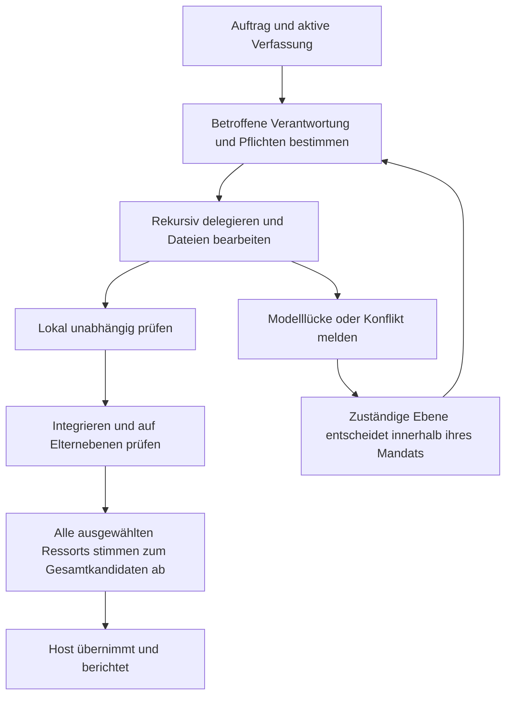

# Markitect Government: Designpaket

Stand: 2026-10-07. Design v0.1 des Koordinators, vorbereitet vor dem Go zur Koordination und Implementierung. Dieses Paket beschreibt die zu bauende Variante; es behauptet keine implementierten Fähigkeiten oder Versuchsergebnisse. Die beiden vom Nutzer angekündigten Chats erhalten erst nach seinem Go konkrete Aufträge.

## Ziel und Auftrag

Ein akzeptiertes kanonisches Modell beschreibt die gewünschte Projektwelt. Das gesamte Projekt-Repository ist ihr konkretes Abbild. Eine rekursive Organisation verantwortet Änderungen, deren Umsetzung in Dateien, unabhängige Prüfung und das Zusammenspiel. Sie kann innerhalb expliziter Delegation auch das Modell weiterentwickeln. Der angestrebte Nutzen ist verlässliche, nachvollziehbare Entwicklungsarbeit mit wenig menschlicher Routinekoordination.

Der Nutzer hat dem Koordinator Spielraum für das Architekturdesign und die spätere Führung von Implementer und Case Study gegeben. Der zuletzt ausdrücklich genannte Arbeitsschritt ist gründliche Planung vor Beginn dieser Koordination. Architect führt seine bereits direkt beauftragte Classic-Linie unabhängig weiter. Dieses Paket erteilt ihm keinen zusätzlichen Auftrag und veröffentlicht keine Government-Version.

Die Government-Linie ist zunächst eine experimentelle Variante desselben Produkts. Bestehende technische Mechanismen werden nach ihrem Nutzen übernommen. Ihre Namen, vorhandene Paketzuschnitte oder Kompatibilitätsformen schreiben die neue öffentliche Architektur nicht vor. Die Entscheidung über eine dauerhafte Produktaufteilung folgt aus der Implementierung und dem Vergleich, nicht aus dem Namen des Experiments.

## Ein Auftrag im Zielmodell

Beispiel: „Eine stornierte Bestellung muss ihren reservierten Bestand freigeben.“ Der fachliche Graph verbindet Bestellung, Reservierung, Übergangsregeln und ihre Dateien. Der verantwortliche Elternbereich verteilt Teilaufträge an die Bereiche Bestellung und Bestand; beide können HTTP-, Datenbank-, Test- und Dokumentationsdateien verantworten. Technologie bestimmt hier die benötigte Fähigkeit. Sie erzeugt keine eigene Leitungsebene.

Die Elternprüfung untersucht, ob Stornierung und Bestandsfreigabe zusammen funktionieren. Ressorts prüfen anschließend ihre übergreifenden Pflichten am selben fertigen Kandidaten. Ergibt sich eine Modelllücke, wird eine begründete Änderung nach der bisher geltenden Ordnung entschieden und erneut umgesetzt und geprüft. Eine ungeklärte Entscheidung hält die davon abhängige Arbeit an; andere autorisierte Aufträge können weiterlaufen.

## Zuständigkeit der Dokumente

| Dokument | Verbindlicher Inhalt innerhalb dieses Designpakets |
|---|---|
| [Architektur](architecture.md) | Begriffe, Modell- und Artefaktverträge, rekursive Verantwortung, Autorität, Kandidaten, Review, Übernahme und Wiederaufnahme |
| [Quellübergang](source-transition.md) | An festen Classic-Quellen geprüfte Wiederverwendung, technische Lücken und Implementierungsreihenfolge |
| [Studienprotokoll](evaluation.md) | Gemeinsame Fälle, drei Versuchsarme, Messung, faire Ausgangslage und unabhängige Bewertung |
| [Liefer- und Koordinationsplan](delivery-plan.md) | Arbeitspakete, Endkriterien, Zuständigkeiten und vorbereitete Aufträge für die zukünftigen Chats |

Änderungen am fachlichen Design gehören in die Architektur, Änderungen an Bewertungskriterien ins Studienprotokoll. Der Lieferplan verweist darauf und führt keine zweite Version dieser Verträge. Bei Widersprüchen sind Implementierung und Versuch für den betroffenen Vertrag anzuhalten, bis der Koordinator die Dokumente konsistent berichtigt; Regeln werden nicht durch Auswahl des bequemeren Dokuments umgangen.

Die [ursprüngliche Diskussion](../government-of-coding-agents-assessment.md), das [frühere Betriebsmodell](../delegated-engineering-operating-model.md), die [Änderungslandkarte](../delegated-engineering-change-map.md) und der [erste Validierungsplan](../delegated-engineering-validation-plan.md) bleiben Herkunft und historischer Kontext. Neu getroffene Entscheidungen dieses Pakets haben für die geplante Government-Variante Vorrang. Sie ändern keine veröffentlichten Classic-Verträge.

## Leitplanken

- Kanonische Definitionen besitzen einen expliziten `purpose`; Struktur und Referenzen bleiben prüfbar. Ein Zwecktext allein ist kein Qualitätsnachweis.
- Akzeptiertes Soll, beobachtetes Repository, Aufträge und Ausführungsnachweise bleiben unterscheidbar. Beobachtungen schaffen keine eigene normative Autorität.
- Modellgegenstände und tatsächliche Dateien sind in beide Richtungen zuordenbar. Mehrere Verpflichtungen pro Datei sind möglich; unkoordinierte konkurrierende Writer sind es nicht.
- Verantwortungsbereiche strukturieren die Arbeit. Technologien und Renderer sind Fähigkeiten innerhalb dieser Organisation.
- Ein übergeordneter Bereich behält seinen Gesamtauftrag und seine Integrationspflicht. Jede ausführende Ebene wird unabhängig geprüft.
- Dauerhafte Zuständigkeit und vorübergehende Agenteninstanz sind getrennt. Feine Prüfläufe bis zur einzelnen Invariante sind möglich, aber kein Pflichtstandard.
- Delegation erweitert keine eigene Befugnis. Echte Modell- und Architekturänderungen können vorher delegiert werden; Selbstermächtigung und nachträgliches Schönschreiben eines Fehlversuchs sind ausgeschlossen.
- Jedes ausgewählte Ministerium stimmt dem festen finalen Kandidaten ausdrücklich zu. Auslassung, Timeout, veraltete Stimme und ein Gerichtsurteil ersetzen diese Zustimmung nicht.
- Jeder Lauf berichtet auch bei Fehler, Nichtbetroffenheit und Abbruch. Sichtbarkeitseinstellungen ändern weder Aufzeichnung noch Entscheidungsregeln.
- Wiederholungen, Parallelität und Dauerbetrieb haben Grenzen, stabile Zustände und nachvollziehbare Wiederaufnahme.

## Aktueller Nachweisstand

Der technische Ausgangspunkt der Quellanalyse ist der abgeschlossene Classic-Checkpoint `1ea5c76f55526fc4d721e865885436153f48b497`. Der [Abschlussabgleich](../architect-government-checkpoint.md) hält dessen begrenzte Piloten und Quellprüfungen fest. Die Dokumentations-Arbeitskopie auf `codex/government-assessment` enthält ältere Produktquellen und ist nicht als Government-Implementierungsbasis zu verwenden.

Die hier beschriebenen Government-Verträge sind ein Design. Insbesondere autonome Managementhierarchie, neue Autoritätsprüfung, Einstimmigkeit vor Übernahme, vollständige Repository-Zuordnung und robuste Dauerlauf-Wiederaufnahme sind dadurch nicht implementiert oder validiert. Synthetische Protokolltests können solche Verträge später prüfen; die behauptete Verbesserung gegenüber gewöhnlichen Agenten erfordert tatsächliche vergleichbare Läufe.

## Übergang nach dem Go

Der Koordinator liest die tatsächlich neu angelegten Chats und ihre Arbeitsverzeichnisse zurück, bindet eindeutige Implementierungs- und Versuchskandidaten und übergibt die vorbereiteten Aufträge. Zuerst beginnen die gemeinsame Vertragsgrundlage und der unabhängige Fallaufbau. Ein vollständiger Sechs-Zellen-Vergleich beginnt nach den im Lieferplan genannten Funktionsnachweisen und einem festgeschriebenen Versuchsprotokoll. Es ist keine zusätzliche pauschale Designfreigabe erforderlich, sofern das angekündigte Go den beschriebenen Auftrag bestätigt; echte Zielkonflikte werden mit einer konkreten Empfehlung vorgelegt.
