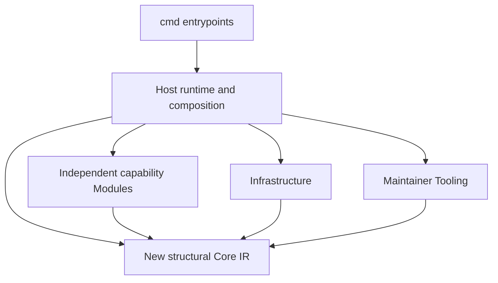

# Modules and static composition

This page owns the dependency rules between Markitect's packages and how they are composed. The [code map](code-map.md) lists every package with its layer, purpose and owning document. [Architecture](../architecture.md#layers) describes what each layer does and its known problems. The [clean-architecture consolidation decision](../design/clean-architecture-consolidation.md) records how this structure was introduced.

## Go capability packages

Go packages under `internal/modules/<name>` are implementation units, not installable manifests. Today they are the project model (`projectmodel`, in the core layer) and the adoption capture and review helpers of the legacy line (`adoption`).

## Dependency direction

CLI packages import Host only. Host statically wires concrete functions, consumes Core IR, and supplies explicit configuration and exact artifact bytes or inventory facts. Infrastructure acquires/materializes source and supplies Core snapshot values. Tooling owns maintainer release, publication, licenses and import-gate algorithms; Host runtime composition invokes those algorithms. Examples, experiments and adopter fixtures are Harness, never production imports or dependency-law exemptions. `integration/run-markitect.go` is independently copied distribution Tooling; it uses the standard library and imports no Markitect package.

Each new capability package under internal/modules/<name> imports only the new Core and its own subtree among Markitect packages; it may use any third-party library that helps ([DEC-020](../concepts/register.md#dec-020-markitect-uses-any-library-that-helps)). It must not import a sibling package, Host, Infrastructure or Tooling; this restriction covers production files, tests and supported-platform variants. Host statically composes capabilities, but packages do not call back into Host or self-register. There is no dynamic loader, reflection framework, generic Module lifecycle or provider switch in Core. No layer is limited to the standard library; the import gate checks only imports between Markitect packages.

## Responsibility map

The [code map](code-map.md) owns the package list. In short:

- **Core:** the structural compiler, snapshots and project-model views. The compiler receives explicitly selected, decoded inputs and returns structural results only.
- **Infrastructure:** Git and working-tree access, fixed snapshots and guarded writes. It owns Git acquisition and file-mode conversion.
- **Application:** the product's use cases and their CLI and MCP surfaces.
- **Runtime:** the inner roles in owned candidate workspaces.
- **Legacy:** the earlier Project/Domain line. Product layers may not import it; ARCH-09 removes it.
- **Executables, tooling, bootstrap, harnesses, experiments and fixtures** complete the map.

The earlier map with its v0.13 compatibility rows is in the [history record](../history/development-modules-legacy-sections-20261010.md#responsibility-map).

## Adding, changing or removing a capability package

Create a capability package only for an independently owned capability with clear inputs, outputs and validation that does not belong in the semantic kernel or Host's shared orchestration. Before implementation, record its owner, exact subtree, Core-facing types, configuration, artifact-byte contract, tests, unsupported behavior and output ownership. Keep the implementation and unit tests inside that subtree. Request coordinator-owned Host wiring; do not edit shared DTOs, Core, Infrastructure, Tooling, CI or another capability package in such an assignment.

A capability package's concrete generic limitation is a request to the coordinator, not permission to edit Core. Include at least two concrete cases from distinct vocabularies, the current expression and exact failure, finite normalization/check/adapter alternatives, affected consumers, exact version/input behavior, diagnostics, digest/context/impact effects and a deterministic test. The coordinator decides whether shared semantics change and owns any Core edit before dependent package work proceeds.

Remove a capability package only after its Host wiring, Project references, generated-output ownership, tests and documentation are accounted for. Delete its private implementation and fixtures together, verify that no production or test imports remain, and rerun the architecture gate. Do not leave an empty package, stale generated output or an unused generic Core primitive simply because the package was removed.

## Mechanical dependency gate

The checker is at `internal/tooling/architecture`. It parses Go imports without compiling the inspected production source and examines all supported-platform files and unit tests. Its negative fixtures cover Core-to-Module, Module-to-sibling, Module-to-Host and CLI bypass; the policy also forbids Module-to-Infrastructure and Module-to-Tooling edges. Diagnostics identify the exact file, line and import. No exception allowlist may conceal a violation.

The gate also reads the layers of the [code map](code-map.md) from the checked repository. Core, infrastructure, application and runtime packages may not import legacy packages, in production or test code. Legacy packages may still import them. These product packages may use only the guarded API of `src/internal/host/guardedwrite`: `CaptureFiles`, `Apply`, `ApplyChecked` and the types `Capture`, `Change`, `File` and `Result`. Its other exports are low-level primitives for the remaining legacy writers. The gate parses each product file that imports the package and reports every other name the file uses from it, and every dot import. The gate lists the permitted names, so a new export stays forbidden to product packages until it is added to that list. Negative fixtures cover each product layer and each form of the guarded-write rule.

`TestRepositoryArchitecture` makes `go test ./...` exercise the repository scan. The named CI step runs the package gate, the explicit `architecture-imports` Project check delegates through Host, and the release workflow runs the same CI through its reusable quality job. This wiring does not establish a passing result; exact-head gate outcomes and migration status remain for the coordinator's report. A migration candidate is complete only after the same gate passes at the exact head and independent review confirms the full diff.

## Historical module links

These retained anchors route existing links to the [history record](../history/development-modules-legacy-sections-20261010.md).

[Installable Modules](../history/development-modules-legacy-sections-20261010.md#installable-modules-and-go-capability-packages) belonged to the removed canonical alpha.

[Module-owned proposal contracts](../history/development-modules-legacy-sections-20261010.md#module-owned-proposal-contracts) belonged to the removed canonical alpha.

[Operational projection evidence](../history/development-modules-legacy-sections-20261010.md#operational-projection-evidence) belonged to the removed canonical alpha.
