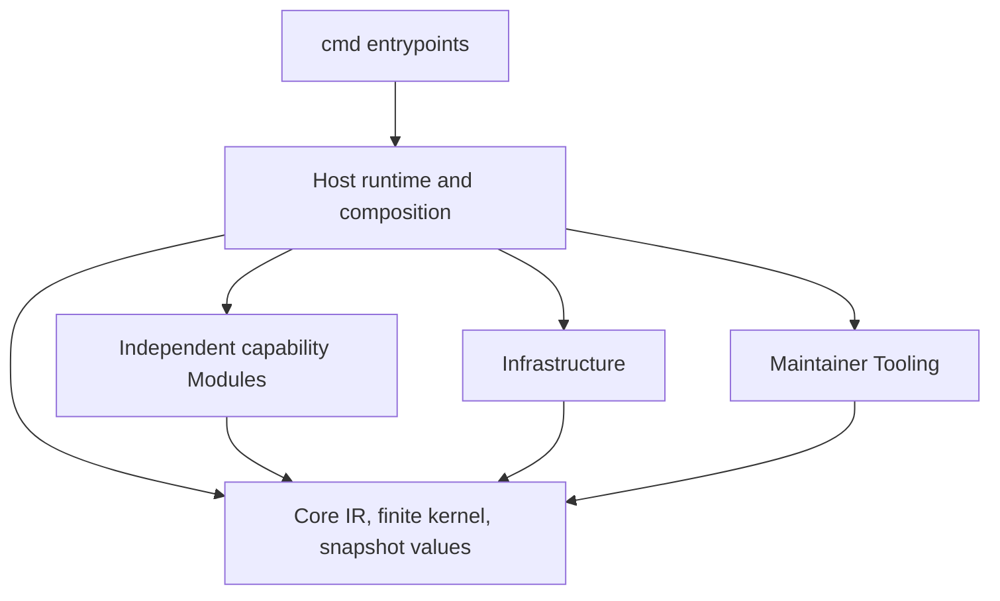

# Modules and static composition

This document records the final package responsibilities frozen by the [clean-architecture consolidation decision](../design/clean-architecture-consolidation.md). It does not change the immutable published v0.13.0 release. Exact source migration and gate evidence are recorded separately by the coordinator. The [product vision](../vision.md) remains the owner of product intent and human/agent responsibilities; this document records technical ownership without copying or revising that thesis.

## Dependency direction

CLI packages import Host only. Host statically wires concrete functions, consumes Core IR, and supplies explicit configuration and exact artifact bytes or inventory facts. Infrastructure acquires/materializes source and supplies Core snapshot values. Tooling owns maintainer release, publication, licenses and import-gate algorithms; Host runtime composition invokes those algorithms. Examples, experiments and external integration fixtures are Harness, never production imports or dependency-law exemptions.

Each Module under `internal/modules/<name>` may import Core and its own private subtree, plus the standard library and justified external libraries. It must not import a sibling Module, Host, Infrastructure or Tooling; the restriction covers production files, unit tests and supported-platform variants. Host may compose Modules. A Module may not call back into Host or register itself dynamically. There is no service locator, reflection loader, generic lifecycle framework or Core provider switch.

## Responsibility map

| Final package/responsibility | Owns | Does not own |
|---|---|---|
| Core: `internal/core` and `internal/core/snapshot` | Generic `Resource.Data`; empty registry; validated normalized IR; generic graph, finite policy and explicit exception semantics; deterministic result/dependency traces; immutable snapshot path/mode/byte values, digest and diff | Authoring YAML, Project/package activation, Git loading, clocks, filesystem writes, provider fields, source parsing, CLI or adopting-project meaning |
| Host: `internal/host` | Transient source specifications/codecs and source compilation; Project/Package/Area/provider/pinned-contract interpretation; generic exception provenance supply; content-package validation, embedded inputs, model/context/impact, process/write use cases, static composition and runtimes | Core semantic policy, source acquisition, dynamic plugin lifecycle or independent policy interpretation |
| Adoption Module: `internal/modules/adoption` | Selected capture and review handoff functions over explicit fixed source and supplied records | Automatic discovery, selection expansion, reviewer authentication, candidate acceptance, policy adoption or imports from Host/sibling Modules |
| Agent-rules Module: `internal/modules/agentrules` | Private Codex/Claude render adapters, provider-owned links and bounded provider configuration | Core vocabulary or canonical YAML ownership; provider SDK/model calls |
| Markdown Module: `internal/modules/markdown` | Explicit Markdown projection, private link resolution, literal consistency checks and local router/navigation checks | Inferred graph edges from prose, semantic source analysis or implicit targets |
| Artifact-coverage Module: `internal/modules/artifactcoverage` | Pure ownership checks over Host-supplied exact file inventory and generated-owner facts | Snapshot loading, renderer imports, inventory rediscovery from resource data or Core/Domain changes |
| Git-hooks Module: `internal/modules/githooks` | Bounded declared hook artifact ownership/linkage and literal inputs | Shell interpretation, implicit hook installation or a universal lifecycle framework |
| Pipelines Module: `internal/modules/pipelines` | Bounded pipeline artifact ownership/check linkage over explicit bytes | Pipeline execution, a universal pipeline DSL or inferred provider state |
| .NET Module: `internal/modules/dotnet` | Explicitly mapped captured project-reference declarations and literal XML contract checks | General source-code analysis or inference beyond mapped input |
| GitHub Module: `internal/modules/github` | Offline consumption of explicitly mapped captured repository metadata | Live GitHub reads/writes or provider Apply |
| Azure DevOps Module: `internal/modules/azuredevops` | Offline consumption of explicitly mapped captured repository metadata | Live Azure DevOps reads/writes or provider Apply |
| Infrastructure: `internal/infrastructure/source` | Git revision and working-tree acquisition, process hardening for acquisition, and materialization | Semantic decisions, Project layout, or policy interpretation |
| Tooling: `internal/tooling` | Release, publication, license/notice operations and static architecture import analysis | Runtime adoption capabilities or a Module dependency |

Host owns all public source contracts and transient typed forms: `SourceSpec`, Project, Package, Area, provider configuration, pinned contracts, schemas, built-in authoring vocabulary and content-package interpretation. Its source compiler validates and normalizes those inputs once. Host owns embedded authoring resources and ordinary inputs. Module configuration owns provider fields; Host lowers supported legacy `SourceSpec` fields into the owning Module configuration. No Module decodes canonical Project, Package, Rule or Domain YAML.

Core receives one normalized canonical `Resource.Data` value per resource, after source validation and Host authorization/resolution of graph edges. There is no second `SourceValue` normalization or alternate semantic owner. Host root composition consumes Core IR. Module path planning is separate from `Validate`: planning declares the paths/ownership facts, while validation checks the prepared plan and does not infer or expand paths.

Core hashes generic deterministic encodings. For compatibility-sensitive bootstrap exception digests, Host supplies an explicit GraphKey-to-opaque-encoding map; Core hashes those bytes only and never parses or branches on them. Policy evaluation uses normalized `Resource.Data` and Host-authorized resolved edges. Snapshot mode strings retain their historical opaque encoding for digest compatibility; Core compares and hashes those strings but does not interpret Git file modes. Infrastructure owns Git acquisition and conversion.

All artifact inputs remain opaque exact paths/modes/bytes at the generic boundary. Specialized Modules may inspect only their explicitly declared formats and captured bytes under their bounded contracts. They must not infer domain meaning from prose or source code, expand input selection, claim semantic truth, or turn machine output into human acceptance. Existing strict check/verify behavior, explicit exceptions, conservative impact, fixed-snapshot evidence and observe/plan/apply/verify trust boundaries remain in force.

## Adding, changing or removing a Module

Create a Module only for an independently owned capability with clear inputs, outputs and validation that does not belong in the semantic kernel or Host's shared orchestration. Before implementation, record its owner, exact subtree, Core-facing types, configuration, artifact-byte contract, tests, unsupported behavior and output ownership. Keep the implementation and unit tests inside that subtree. Request coordinator-owned Host wiring; do not edit shared DTOs, Core, Infrastructure, Tooling, CI or another Module in a Module assignment.

A Module's concrete generic limitation is a request to the coordinator, not permission to edit Core. Include at least two concrete cases from distinct vocabularies, the current expression and exact failure, finite normalization/check/adapter alternatives, affected consumers, exact version/input behavior, diagnostics, digest/context/impact effects and a deterministic test. The coordinator decides whether shared semantics change and owns any Core edit before dependent Module work proceeds.

Remove a Module only after its Host wiring, Project references, generated-output ownership, tests and documentation are accounted for. Delete its private implementation and fixtures together, verify that no production or test imports remain, and rerun the architecture gate. Do not leave an empty package, stale generated output or an unused generic Core primitive simply because the Module was removed.

## Mechanical dependency gate

The checker is at `internal/tooling/architecture`. It parses Go imports without compiling the inspected production source and examines all supported-platform files and unit tests. Its negative fixtures cover Core-to-Module, Module-to-sibling, Module-to-Host and CLI bypass; the policy also forbids Module-to-Infrastructure and Module-to-Tooling edges. Diagnostics identify the exact file, line and import. No exception allowlist may conceal a violation.

`TestRepositoryArchitecture` makes `go test ./...` exercise the repository scan. The named CI step runs the package gate, the explicit `architecture-imports` Project check delegates through Host, and the release workflow runs the same CI through its reusable quality job. This wiring does not establish a passing result; exact-head gate outcomes and migration status remain for the coordinator's report. A migration candidate is complete only after the same gate passes at the exact head and independent review confirms the full diff. This does not claim that v0.13.0 has the final package layout.