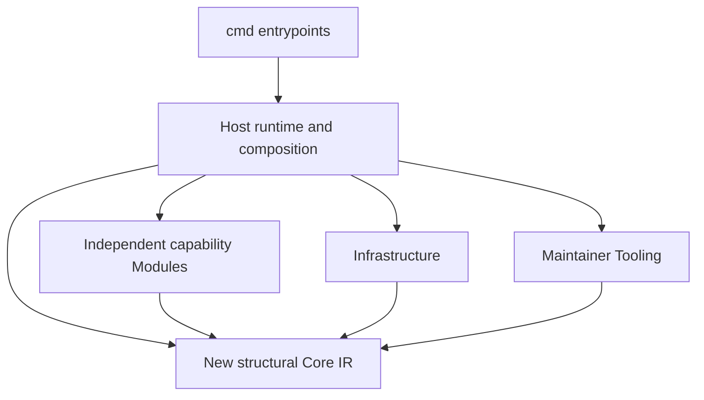

# Modules and static composition

This document records current source module ownership and labels the clean-architecture consolidation as historical compatibility structure. The canonical Projection alpha bundled with v0.14.1, with its installable Modules and capability packages, has been removed from current source; the [v0.14.1 module guide](https://github.com/Glacius-Labs/Markitect/blob/v0.14.1/docs/development/modules.md) describes it. The validated projection lifecycle informs the accepted canonical reset without changing the preserved v0.13.0 contract. The [consolidation report](../validation/clean-architecture-consolidation.md) records dated migration evidence; each subsequent source change requires its own candidate validation and does not update the published binary. The [product vision](../vision.md) remains the owner of product intent and human/agent responsibilities; this document records technical ownership without copying or revising that thesis.

## Installable Modules and Go capability packages

Installable Schema and Projection Modules belonged to the canonical Projection alpha and have been removed from current source. Go capability packages under internal/modules/<name> are implementation units, not installable manifests: currently the project model (`projectmodel`) and the adoption capture/review helpers (`adoption`). The responsibility map below describes current source ownership; rows marked historical retain v0.13.0 compatibility behavior.

## Dependency direction

CLI packages import Host only. Host statically wires concrete functions, consumes Core IR, and supplies explicit configuration and exact artifact bytes or inventory facts. Infrastructure acquires/materializes source and supplies Core snapshot values. Tooling owns maintainer release, publication, licenses and import-gate algorithms; Host runtime composition invokes those algorithms. Examples, experiments and adopter fixtures are Harness, never production imports or dependency-law exemptions. `integration/run-markitect.go` is independently copied distribution Tooling; it uses the standard library and imports no Markitect package.

Each new capability package under internal/modules/<name> imports the new Core and its own subtree plus the standard library only. It must not import a sibling package, Host, Infrastructure or Tooling; this restriction covers production files, tests and supported-platform variants. Host statically composes capabilities, but packages do not call back into Host or self-register. There is no dynamic loader, reflection framework, generic Module lifecycle or provider switch in Core. The new Core has no external dependencies; historical dependencies remain isolated behind Host compatibility.

## Responsibility map

| Final package/responsibility | Owns | Does not own |
|---|---|---|
| New Core: internal/core | Pure, standard-library-only Schema/Kind/Property/Definition structural compiler, resolved references and normalized IR | Domain policy, Project/Module loading, source acquisition, paths, providers, execution or persistence |
| Host: internal/host | Compatibility source frontend, explicit input selection, static composition, model/context/impact, execution, persistence and guarded writes | Core semantic expansion, dynamic plugin loading, source acquisition or independent policy interpretation |
| Adoption implementation package: internal/modules/adoption | Selected capture/review implementation helpers; implementation package only, not an installable Module manifest | Automatic discovery, expanded selection, reviewer authentication or adoption authority |
| Historical agent-rules consumer: internal/host/compat/v0_13/consumers/agentrules | Preserved v0.13 Codex/Claude outputs and behavior under Host compatibility | New Core semantics or provider/model calls |
| Historical artifact-coverage consumer: internal/host/compat/v0_13/consumers/artifactcoverage | Preserved v0.13 coverage behavior under Host compatibility | Whole-repository proof or inferred ownership |
| Historical Git-hooks consumer: internal/host/compat/v0_13/consumers/githooks | Preserved v0.13 bounded artifact checks under Host compatibility | Shell interpretation or implicit installation |
| Historical Pipelines consumer: internal/host/compat/v0_13/consumers/pipelines | Preserved v0.13 bounded artifact checks under Host compatibility | Pipeline execution or inferred provider state |
| Historical GitHub consumer: internal/host/compat/v0_13/consumers/github | Preserved offline v0.13 behavior under Host compatibility | Live provider reads/writes or Apply |
| Historical Azure DevOps consumer: internal/host/compat/v0_13/consumers/azuredevops | Preserved offline v0.13 behavior under Host compatibility | Live provider reads/writes or Apply |
| Historical Projections consumer: internal/host/compat/v0_13/consumers/projections | Preserved validated plan/apply/verify mechanics and regression behavior | New shared IR or a parallel projection engine |
| Infrastructure: internal/infrastructure/source | Git revision and working-tree acquisition, process hardening for acquisition, and materialization | Semantic decisions, Project layout, or policy interpretation |
| Tooling: `internal/tooling` | Release, publication, license/notice operations and static architecture import analysis | Runtime adoption capabilities or a Module dependency |

Host owns static composition, as well as the historical v0.13 authoring codecs and compatibility use cases. New Core source types are transient inputs to structural compilation. Host owns target path authorization, execution, persistence and guarded writes.

The new Core receives explicitly selected, decoded Schemas and Definitions from Host and produces structural IR only. The historical v0.13 kernel, Resource.Data, graph policy and consumer semantics live under internal/host/compat/v0_13 and preserve their existing contracts; they are not the new Core API. Host compatibility adapters own any conversion required to keep legacy commands working, and new Definitions are not lowered into legacy Resources.

New Core digests bind structural Schemas and Definition values; source location and exact captured provenance remain separate. The Host compatibility kernel preserves its historical model, policy and exception digests. Infrastructure owns Git acquisition and mode conversion; the new Core does not interpret file modes.

All artifact inputs remain opaque exact paths/modes/bytes at the generic boundary. Specialized Modules may inspect only their explicitly declared formats and captured bytes under their bounded contracts. They must not infer domain meaning from prose or source code, expand input selection, claim semantic truth, or turn machine output into human acceptance. The earlier Projections Module is preserved under Host compatibility as validated implementation evidence, not as the new shared IR or a parallel engine. Host remains responsible for loading snapshots, executing configured checks, accounting for artifact ownership, and guarding writes. Deterministic renderer output and variable AI candidate bytes remain distinct evidence cases; candidate presence alone cannot establish convergence. Explicit projection dependencies propagate drift or incomplete evidence to dependent contracts, without scheduling materialization. Existing strict check/verify behavior, explicit exceptions, conservative impact, fixed-snapshot evidence and observe/plan/apply/verify trust boundaries remain in force.

## Module-owned proposal contracts

Module-owned proposal contracts, their Host registrations and the module-replacement example belonged to the canonical Projection alpha and have been removed from current source; the [v0.14.1 module guide](https://github.com/Glacius-Labs/Markitect/blob/v0.14.1/docs/development/modules.md#module-owned-proposal-contracts) describes them.

## Adding, changing or removing a Module

Create a Module only for an independently owned capability with clear inputs, outputs and validation that does not belong in the semantic kernel or Host's shared orchestration. Before implementation, record its owner, exact subtree, Core-facing types, configuration, artifact-byte contract, tests, unsupported behavior and output ownership. Keep the implementation and unit tests inside that subtree. Request coordinator-owned Host wiring; do not edit shared DTOs, Core, Infrastructure, Tooling, CI or another Module in a Module assignment.

A Module's concrete generic limitation is a request to the coordinator, not permission to edit Core. Include at least two concrete cases from distinct vocabularies, the current expression and exact failure, finite normalization/check/adapter alternatives, affected consumers, exact version/input behavior, diagnostics, digest/context/impact effects and a deterministic test. The coordinator decides whether shared semantics change and owns any Core edit before dependent Module work proceeds.

Remove a Module only after its Host wiring, Project references, generated-output ownership, tests and documentation are accounted for. Delete its private implementation and fixtures together, verify that no production or test imports remain, and rerun the architecture gate. Do not leave an empty package, stale generated output or an unused generic Core primitive simply because the Module was removed.

## Mechanical dependency gate

The checker is at `internal/tooling/architecture`. It parses Go imports without compiling the inspected production source and examines all supported-platform files and unit tests. Its negative fixtures cover Core-to-Module, Module-to-sibling, Module-to-Host and CLI bypass; the policy also forbids Module-to-Infrastructure and Module-to-Tooling edges. Diagnostics identify the exact file, line and import. No exception allowlist may conceal a violation.

`TestRepositoryArchitecture` makes `go test ./...` exercise the repository scan. The named CI step runs the package gate, the explicit `architecture-imports` Project check delegates through Host, and the release workflow runs the same CI through its reusable quality job. This wiring does not establish a passing result; exact-head gate outcomes and migration status remain for the coordinator's report. A migration candidate is complete only after the same gate passes at the exact head and independent review confirms the full diff. This does not claim that v0.13.0 has the final package layout.

## Operational projection evidence

Operational ProjectionRecords, VerificationResults and the records package belonged to the canonical Projection alpha and have been removed from current source; the [v0.14.1 module guide](https://github.com/Glacius-Labs/Markitect/blob/v0.14.1/docs/development/modules.md#operational-projection-evidence) describes them.
