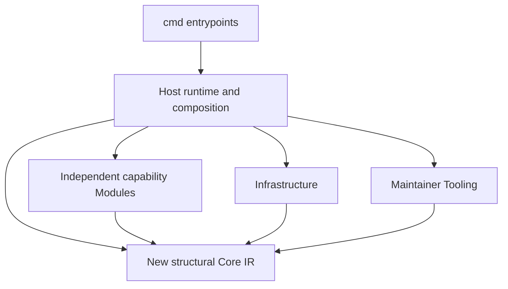

# Modules and static composition

This document records the current source-only architecture and labels the clean-architecture consolidation as historical compatibility structure; the validated projection lifecycle informs the accepted canonical reset. It does not change the immutable published v0.13.0 release. Exact source migration and gate evidence for the consolidation are recorded in the [consolidation report](../validation/clean-architecture-consolidation.md); the new Module requires separate candidate validation. The [product vision](../vision.md) remains the owner of product intent and human/agent responsibilities; this document records technical ownership without copying or revising that thesis.

## Installable Modules and Go capability packages

The accepted [canonical reset](../design/canonical-projection-reset.md) defines an installable Module as a versioned user-selected package with exactly one type. A Schema Module contains one or more schema registrations and no projectors. A Projection Module contains projector registration and no schemas. Mixed manifests fail activation. A bundle may offer both packages for installation convenience but is not a third Module type. Do not confuse these installable packages with Go implementation packages under internal/modules/<name>.

A canonical Projection expresses desired representation only: spec.representation (initially dotnet or markdown), exact semantic scope, target and policies. It does not hard-bind a Module or projector. Runtime source configuration maps the full Projection identity to an exact installed Module name using projectionBindings entries that pair the full identity in projection with the exact installed name in module. Host resolves the installed version pin and exactly one internal entrypoint. Compatible binding changes leave canonical Definitions/model digest unchanged but stale plans and records bound to the previous request. Module installation or configuration alone creates no Projection and materializes nothing. New capability packages use the new Core, their own subtree and standard library only; the historical kernel and consumers remain reachable only through Host compatibility.

The table below describes current source ownership; rows marked historical retain v0.13.0 compatibility behavior. The earlier projection lifecycle remains validated evidence, not the new Core API. The single Executor → candidate → Verifier flow is the target for all projections. Markdown rendering, compilers and analyzers are tools inside that bounded process, not a second projection architecture. Reconciliation derives bounded work from canonical delta, impact, configured target scopes and ownership facts; users do not enumerate implementation files. Modules may propose affected work or no work but cannot add semantics. Conflicts stop before execution; unknown scope broadens review. Targeted planning/apply remains a diagnostic or tool step, not a claim of a background controller.
## Dependency direction

CLI packages import Host only. Host statically wires concrete functions, consumes Core IR, and supplies explicit configuration and exact artifact bytes or inventory facts. Infrastructure acquires/materializes source and supplies Core snapshot values. Tooling owns maintainer release, publication, licenses and import-gate algorithms; Host runtime composition invokes those algorithms. Examples, experiments and adopter fixtures are Harness, never production imports or dependency-law exemptions. `integration/run-markitect.go` is independently copied distribution Tooling; it uses the standard library and imports no Markitect package.

Each new capability package under internal/modules/<name> imports the new Core and its own subtree plus the standard library only. It must not import a sibling package, Host, Infrastructure or Tooling; this restriction covers production files, tests and supported-platform variants. Host statically composes capabilities, but packages do not call back into Host or self-register. There is no dynamic loader, reflection framework, generic Module lifecycle or provider switch in Core. The new Core has no external dependencies; historical dependencies remain isolated behind Host compatibility.

## Responsibility map

| Final package/responsibility | Owns | Does not own |
|---|---|---|
| New Core: internal/core | Pure, standard-library-only Schema/Kind/Property/Definition structural compiler, resolved references and normalized IR | Domain policy, Project/Module loading, source acquisition, paths, providers, execution or persistence |
| Host: internal/host | New and compatibility source frontend, manifest activation, explicit input selection, static composition, bounded request construction, model/context/impact, execution, persistence and guarded writes | Core semantic expansion, dynamic plugin loading, source acquisition or independent policy interpretation |
| Adoption implementation package: internal/modules/adoption | New source-only selected capture/review helpers; implementation package only, not an installable Module manifest | Automatic discovery, expanded selection, reviewer authentication or adoption authority |
| Historical agent-rules consumer: internal/host/compat/v0_13/consumers/agentrules | Preserved v0.13 Codex/Claude outputs and behavior under Host compatibility | New Core semantics or provider/model calls |
| Markdown capability: internal/modules/markdown | New source-only Markdown target behavior and bounded checks over supplied inputs | Canonical semantic authority, inferred graph edges or unselected outputs |
| Historical artifact-coverage consumer: internal/host/compat/v0_13/consumers/artifactcoverage | Preserved v0.13 coverage behavior under Host compatibility | Whole-repository proof or inferred ownership |
| Historical Git-hooks consumer: internal/host/compat/v0_13/consumers/githooks | Preserved v0.13 bounded artifact checks under Host compatibility | Shell interpretation or implicit installation |
| Historical Pipelines consumer: internal/host/compat/v0_13/consumers/pipelines | Preserved v0.13 bounded artifact checks under Host compatibility | Pipeline execution or inferred provider state |
| .NET capability: internal/modules/dotnet | New source-only explicitly mapped project-reference and literal XML checks | General source-code analysis or unmapped semantics |
| Historical GitHub consumer: internal/host/compat/v0_13/consumers/github | Preserved offline v0.13 behavior under Host compatibility | Live provider reads/writes or Apply |
| Historical Azure DevOps consumer: internal/host/compat/v0_13/consumers/azuredevops | Preserved offline v0.13 behavior under Host compatibility | Live provider reads/writes or Apply |
| Historical Projections consumer: internal/host/compat/v0_13/consumers/projections | Preserved validated plan/apply/verify mechanics and regression behavior | New shared IR or a parallel projection engine |
| Operational records: internal/host/records | Pure stdlib validation/encoding and caller-supplied freshness/ownership evaluation; no filesystem/source loading or persistence | Safe append, active-history selection, check execution or authority claims |
| Infrastructure: internal/infrastructure/source | Git revision and working-tree acquisition, process hardening for acquisition, and materialization | Semantic decisions, Project layout, or policy interpretation |
| Tooling: `internal/tooling` | Release, publication, license/notice operations and static architecture import analysis | Runtime adoption capabilities or a Module dependency |

Host owns current canonical input selection, Module manifest decoding and static composition, as well as the historical v0.13 authoring codecs and compatibility use cases. New Core source types are transient inputs to structural compilation; installable Module manifests remain a distinct contract. Host owns target path authorization, execution, persistence and guarded writes.

The new Core receives explicitly selected, decoded Schemas and Definitions from Host and produces structural IR only. The historical v0.13 kernel, Resource.Data, graph policy and consumer semantics live under internal/host/compat/v0_13 and preserve their existing contracts; they are not the new Core API. Host compatibility adapters own any conversion required to keep legacy commands working, and new Definitions are not lowered into legacy Resources.

New Core digests bind structural Schemas and Definition values; source location and exact captured provenance remain separate. The Host compatibility kernel preserves its historical model, policy and exception digests. Infrastructure owns Git acquisition and mode conversion; the new Core does not interpret file modes.

All artifact inputs remain opaque exact paths/modes/bytes at the generic boundary. Specialized Modules may inspect only their explicitly declared formats and captured bytes under their bounded contracts. They must not infer domain meaning from prose or source code, expand input selection, claim semantic truth, or turn machine output into human acceptance. The earlier Projections Module is preserved under Host compatibility as validated implementation evidence, not as the new shared IR or a parallel engine. Host remains responsible for loading snapshots, executing configured checks, accounting for artifact ownership, and guarding writes. Deterministic renderer output and variable AI candidate bytes remain distinct evidence cases; candidate presence alone cannot establish convergence. Explicit projection dependencies propagate drift or incomplete evidence to dependent contracts, without scheduling materialization. Existing strict check/verify behavior, explicit exceptions, conservative impact, fixed-snapshot evidence and observe/plan/apply/verify trust boundaries remain in force.

## Adding, changing or removing a Module

Create a Module only for an independently owned capability with clear inputs, outputs and validation that does not belong in the semantic kernel or Host's shared orchestration. Before implementation, record its owner, exact subtree, Core-facing types, configuration, artifact-byte contract, tests, unsupported behavior and output ownership. Keep the implementation and unit tests inside that subtree. Request coordinator-owned Host wiring; do not edit shared DTOs, Core, Infrastructure, Tooling, CI or another Module in a Module assignment.

A Module's concrete generic limitation is a request to the coordinator, not permission to edit Core. Include at least two concrete cases from distinct vocabularies, the current expression and exact failure, finite normalization/check/adapter alternatives, affected consumers, exact version/input behavior, diagnostics, digest/context/impact effects and a deterministic test. The coordinator decides whether shared semantics change and owns any Core edit before dependent Module work proceeds.

Remove a Module only after its Host wiring, Project references, generated-output ownership, tests and documentation are accounted for. Delete its private implementation and fixtures together, verify that no production or test imports remain, and rerun the architecture gate. Do not leave an empty package, stale generated output or an unused generic Core primitive simply because the Module was removed.

## Mechanical dependency gate

The checker is at `internal/tooling/architecture`. It parses Go imports without compiling the inspected production source and examines all supported-platform files and unit tests. Its negative fixtures cover Core-to-Module, Module-to-sibling, Module-to-Host and CLI bypass; the policy also forbids Module-to-Infrastructure and Module-to-Tooling edges. Diagnostics identify the exact file, line and import. No exception allowlist may conceal a violation.

`TestRepositoryArchitecture` makes `go test ./...` exercise the repository scan. The named CI step runs the package gate, the explicit `architecture-imports` Project check delegates through Host, and the release workflow runs the same CI through its reusable quality job. This wiring does not establish a passing result; exact-head gate outcomes and migration status remain for the coordinator's report. A migration candidate is complete only after the same gate passes at the exact head and independent review confirms the full diff. This does not claim that v0.13.0 has the final package layout.

## Operational projection evidence

A canonical Projection Definition says what representation is intended; it does not say what was actually written. Host appends a separate immutable ProjectionRecord after materialization. It binds Projection identity, full source revision, new Core model digest, reviewed plan digest, pre-apply input snapshot digest, opaque canonical Host request digest, Module/projector identity, scope/policy IDs, exact created/modified/retained paths and target snapshot. Deletion is explicitly unsupported in the initial contract. A separately versioned VerificationResult binds the record, exact model/revision/target snapshot, verifier and every declared check. Missing/extra checks or any failed/incomplete check cannot yield passed.

The records package is a pure stdlib validator/encoder: it does not load sources, execute checks, inspect filesystem state, choose active history or persist bytes. Host supplies active records and explicit inventory facts to build the bidirectional scope/artifact index. Duplicate owners fail, and unknown/excluded/tool/vendor facts remain explicit. The index cannot infer chronology or repository completeness. Digests validate content identity, not authorization, independent verifier identity, semantic sufficiency or human acceptance. Host remains responsible for exclusive safe append and existing write guards.
