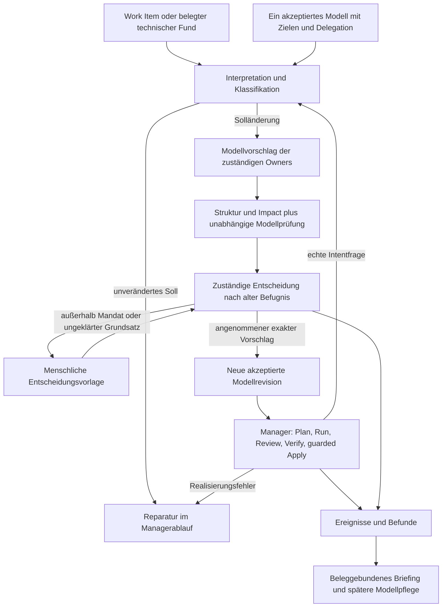

# Funktionaler Lösungsentwurf

**Status: Synthesevorschlag, kein neuer Produktvertrag.** Die kleine zuverlässige Markitect-Basis ist die Nutzerprämisse. Aktuelle Sourcebefunde sind durch `P` an `fc6d09a234572c344279a342416475e788435f1f` gebunden; alte Befunde durch `A` an `04e225d5caee78c2a198607143863fca1e829750`. [Quellenregister](source-basis.md) löst Dateien und Zeilen auf. Direkte Nutzerideen stehen in [user-ideas.md](user-ideas.md).

## Teilprobleme und Abhängigkeiten

Government bearbeitet zwei zusammenhängende Fragen: **Welches Soll soll aus einem Anliegen entstehen? Wer darf dieses Soll innerhalb welcher Grenzen annehmen?** Der bereits angenommene Markitect-Ablauf beantwortet die anschließende Realisierung. Gute Realisierung kann die erste Frage nicht nachträglich beantworten.

| Teilproblem | Eingabe / Abhängigkeit | Notwendiges Ergebnis | Entscheidende Grenze |
|---|---|---|---|
| Auftrag verstehen | Originalanliegen, aktuelles Modell, tatsächliche technische Funde | Ziel, Lesarten, Annahmen, offene Frage und Klassifikation | Der plausible erste Entwurf ist keine akzeptierte Absicht. |
| Befugnis bestimmen | Bereits akzeptierte Ziele, Scope und Delegation | Zulässige Entscheidungsklasse, Pflichtprüfung, Vorbehalte | Der neue Vorschlag kann seine eigene Befugnis nicht erzeugen. |
| Modellvorschlag erstellen | Interpretation, eindeutige Owners, Context/Impact | Begrenztes, gemeinsam prüfbares Modelldelta | Keine zweite Sollquelle aus Ressorttexten oder Fallhistorie. |
| Perspektiven prüfen lassen | Fester Kandidat, anwendbare Regeln/Ziele, relevante Evidenz | Konkrete Einwände, Nichtbetroffenheit, Alternativen, Unsicherheit | Stellungnahme, bindender Einwand und Entscheidung sind verschiedene Dinge. |
| Konflikt entscheiden | Einwände, geltende Prioritäten, Kompetenz, Fakten | Begründete Annahme, Revision, Ablehnung oder Eskalation | Einigkeit kann weder Fakten ersetzen noch eine harte Pflicht aufheben. |
| Modell annehmen | Exakter Kandidat, alter Autoritätsstand, Entscheidungsbeleg | Eine neue akzeptierte Modellrevision | Commit und Digest allein authentifizieren keine Freigabe. |
| Realisieren und rückmelden | Akzeptiertes Modell, normaler Managerplan | Geprüfter Kandidat, Apply oder begrenzte Reparatur/Modellfrage | Ausführungsfehler ändern das Soll nicht still. |
| Dauerhaft pflegen | Entscheidungen, Folgen, externe Rückmeldung | Vereinfachung, Revision von Ausnahmen/Präzedenz, angemessenes Briefing | Selbsterzeugte Regeln und Kennzahlen dürfen sich nicht selbst legitimieren. |

Die ersten beiden Schritte bestimmen die Bedeutung aller späteren Ergebnisse. Erst danach lohnt eine ausgebaute Fachrollen- oder Gerichtsstruktur. Falljournal, Frische, Budget und Recovery begleiten alle Schritte.

Die Pfeile beschreiben einen möglichen funktionalen Ablauf. Sie benennen keine zusätzlichen unterstützten CLI-/MCP-Befehle.

## Management und Government in einem Verantwortungsmodell

Der vertikale Manager bleibt für seinen fachlichen Namespace, seine Statements, Artefakte, Dateiverantwortung und die Integration seiner Kinder zuständig [P5–P7, P13]. Eine horizontale Fachperspektive sieht beispielsweise Sicherheitsfolgen über mehrere Manager hinweg. Sie ist ein **Prüfmandat auf fremde Inhalte**, keine zweite Schreibzuständigkeit. Ihre gemeinsamen Standards besitzen wiederum genau einen kanonischen Owner, etwa den zuständigen Engineering-Manager. Ein Sicherheitsreview kann dessen Standard prüfen, seine Anwendung beanstanden oder dem Standardowner eine Änderung vorschlagen.

Entscheidungsbefugnis ist von Inhaltseigentum zu unterscheiden. Ein delegierter Entscheider oder zuständiger gemeinsamer Vorfahr kann einen Konflikt innerhalb seines Mandats entscheiden; die jeweiligen Owners integrieren das Ergebnis in ihre Modellbereiche. Eine gemeinsame Entscheidung erzeugt keine neue globale Kopie aller Regeln. Die institutionellen Namen sind optional. Ein Amt kann eine zeitweise spezialisierte Agentenaufgabe sein; es muss kein ständig laufender Prozess werden. Eine höhere Instanz braucht höhere Befugnis oder eine andere unabhängige Prüfaufgabe, nicht bloß einen teureren Modellaufruf.

Die vorhandene Methode nutzt Execution, Kandidat und Independent Verification auf jeder Ebene; Eltern prüfen ihre eigenen Integrationspflichten [P2]. Government ergänzt diese Methode vor der Modellannahme. Ein Modellreview prüft Zielauslegung und Qualität des vorgeschlagenen Solls. Ein Realisierungsreview prüft dessen spätere Erfüllung. Beide dürfen passende Werkzeuge nutzen, benötigen aber verschiedene Belege. Eine separate privilegierte Integratorinstitution ist dafür nicht nötig; Integration bleibt beim verantwortlichen Elternmanager.

Für kleine Fälle kann eine Person oder Agenteninstanz mehrere vorbereitende Aufgaben erledigen. Sie darf ihre eigene inhaltliche Autorität nicht herstellen oder allein ihren semantischen Erfolg bestätigen. Rollenanzahl und Unabhängigkeit sind verschiedene Größen. Der kritische Zusatznutzen eines Ministeriums ist ein relevanter neuer Befund gegenüber dem vorhandenen Managerreview, nicht eine zusätzliche Unterschrift.

## Eine minimale Entscheidungspolicy

Als erster Vorschlag reicht eine kleine, projektgewählte Menge von Entscheidungsklassen und Vorbehalten. Dazu gehören zuständiger Scope, zulässige Modelldeltas, verpflichtende Anhörung/Prüfung, reservierte Themen, Befugnisquelle und Widerruf. Wenige verständliche Klassen sind einer universellen Rechtssprache vorzuziehen. Jede neue Klasse kann Pflege- und Prüfkosten erzeugen.

Ein enger Routinefall könnte eine schon autorisierte Erweiterung innerhalb eines expliziten Zielrahmens sein. Er muss eine materielle Modelländerung ohne erneuten menschlichen Klick annehmen dürfen, damit die Schicht tatsächlich delegierte Modellpflege liefert. Reine Vorschlagserstellung mit menschlichem Approval ist eine sinnvolle Alternative und ein Vorstadium, erfüllt diese Autonomie aber noch nicht.

Unabhängige Konfigurationsachsen sollten sichtbar bleiben:

- **Freiheit:** Welche Art von Entscheidung oder Gestaltung darf ein Manager selbst wählen?
- **Bindung:** Welche Pflicht gilt im Scope, und wer darf sie ändern oder ausnehmen?
- **Priorität:** Wie werden mehrere erlaubte Varianten gegen Projekt- und lokale Ziele beurteilt?
- **Prüftiefe:** Welche zusätzliche Evidenz und Gegenbeispiele sind erforderlich?
- **Severity:** Welche belegten Folgen, Unsicherheit und Reichweite bestimmen den Instanzenweg?
- **Benachrichtigung:** Was braucht sofortige Aufmerksamkeit oder gehört ins Briefing?

Der aktuelle Strictnesscode addiert Evidenz und Gegenbeispiele; er entfernt keine Pflichtchecks [P8]. Die offene Nutzeridee „Strenge bei Regeln“ sollte deshalb nicht als vorhandener allgemeiner Regelschalter ausgegeben werden. Eine geringe Benachrichtigungsstufe ändert ebenfalls weder Befugnis noch Geltung. Lokale Prioritäten konkretisieren den übergeordneten Rahmen; sie heben seine Pflichten nur über einen ausdrücklich befugten Ausnahmeentscheid auf.

## Vom Beschluss zur akzeptierten Modellrevision

Ein befugter Fallbeschluss und ein geschriebenes Modelldelta sind noch keine akzeptierte committete Spezifikation. Unter der heutigen `committed-model` Policy erwartet Readiness einen gültigen Modellstand im Commit [P4]. Eine zusätzliche Government-Annahmetransition muss deshalb ausdrücklich verantwortlich sein:

1. Der unter der **alten** akzeptierten Policy befugte Actor veranlasst den beschlossenen Modelledit. Vor dem Write werden Beschluss, erwarteter Ausgangsstand, Befugnis, exakte Delta-/Modelldigests und Pflichtprüfungen erneut geprüft. Wer schreiben und wer annehmen darf, ist explizit zu unterscheiden.
2. Nach guarded Write bleibt der Fall `model-written-pending-acceptance`. Derselbe geregelte Repositoryprozess erstellt den Modellcommit innerhalb seiner dafür erteilten Befugnis; uncommittete Bytes autorisieren keine Delivery. Erforderliche menschliche Entscheidung stammt aus dem vertrauenswürdigen Ownerkanal.
3. Ein nachfolgender Annahmebeleg bindet den bereits existierenden Beschluss und dessen Modelldigest an den **tatsächlichen vollständigen Modellcommit**, die geprüft angewandte alte Policy und den bestätigten Actor-/Ownerkanal. Er entsteht nach dem Commit und bildet keine zyklische Selbstreferenz. Der Host prüft, dass die geladene kanonische Modellfassung genau den beschlossenen Bytes entspricht.
4. Readiness und Delivery erhalten diese akzeptierte Revision, prüfen aktuelle Frische/Widerruf und die getrennte Ausführungsbefugnis. Ein richtiges Urteil in einer Fallakte darf weder Delivery auf dem alten Modell auslösen noch beliebige spätere Commits autorisieren.

Dieser Übergang ist **zusätzlich notwendiges Design**, keine vorhandene Government-API oder neue Authentifizierungsbehauptung. Bei Unterbrechung zwischen Write, Commit und Beleg wird der ursprüngliche Vorgang inspiziert: fehlender Beleg bedeutet ungewisse Annahme, kein Freibrief. Ein vorhandener Commit kann mit exakt gebundenem Beschluss rekonstruiert werden; ein bloß gleicher HEAD ohne ausreichende Herkunft genügt nicht. Folgearbeit wartet, solange diese Naht offen ist. Konkurrierende Annahmen werden gegen denselben erwarteten Projektstand serialisiert.

## Work Items, technische Arbeit und Rückkopplung

Die Fallaufnahme hält Originalauftrag, Quelle, feste Ausgangsrevision, beabsichtigten Nutzen, bekannte Grenzen und offene Lesarten fest. Nicht jede Anfrage braucht einen Normwechsel. Eine private Hilfsfunktion, ein Refactoring oder die Reparatur eines falsch implementierten Zustandsübergangs kann bereits vom Modell und erlaubten Gestaltungsraum gedeckt sein. Neue Dateizuordnungen oder Verantwortungsänderungen können dennoch eine gezielte Modellpflege benötigen; sie sind nicht automatisch neue fachliche Absicht. Gemischte Aufträge werden entsprechend getrennt.

Beispiel: „Im Zustand packing stornieren können“ betrifft Orders, Inventory und gegebenenfalls Payment. Die jeweiligen Owners entwickeln einen gemeinsamen begrenzten Vorschlag. Sicherheits-/Integrationsprüfung kann auf Rückerstattungs- und Wiederholungseffekte hinweisen; Bedienbarkeit auf verständliche Rückmeldung. Ein befugter Vorfahr darf innerhalb akzeptierter Ziele eine Variante entscheiden. Eine notwendige Ausnahme von einer reservierten Zahlungsinvariante geht zur zuständigen höheren Instanz. Nach Modellannahme folgt der vorhandene Managerablauf [P4, P10].

Aus der Umsetzung kommen drei verschiedene Rückmeldungen:

1. **Realisierungsfehler:** Gegen das gleiche Soll reparieren; neue technische Evidenz an den neuen Kandidaten binden.
2. **Fehlende Tatsache oder technische Unmöglichkeit:** Genau benennen, welche Behauptung unklar ist und welche Evidenz fehlt. Eine gezielte Untersuchung oder begründete Modellfrage folgt.
3. **Echter Sollkonflikt oder erwünschte neue Abwägung:** Neuer Modellfall mit Originalziel, beobachtetem Problem und Alternativen. Er wird unter dem alten gültigen Mandat entschieden.

Ein schwieriger Implementierungsweg allein rechtfertigt keine schwächere Regel. Umgekehrt muss eine befugte echte Zieländerung möglich bleiben: Ein überholter Test darf nicht für immer die alte Absicht erzwingen. Änderungen an Norm oder Prüfmaßstab brauchen einen eigenen begründeten Entscheidungsweg und vom Umsetzungserfolg unabhängige Kriterien. Der implementierende Actor darf nicht durch passende Änderungen an Modell, Exclusions und Tests seinen fehlgeschlagenen Auftrag nachträglich als Erfolg deklarieren.

## Konflikte und Präzedenz

Ein Konfliktverfahren unterscheidet Struktur-/Ownershipfehler, widersprüchliche Pflichten, zulässige Zielabwägungen, fehlende Fakten und fehlende Kompetenz. Harte Bedingungen müssen eingehalten oder ausdrücklich befugt geändert werden. Präferenzen ordnen zulässige Optionen. Unbekannte Evidenz wird als offen erhalten. Ein gewichteter Nutzenscore kann Priorisierung unterstützen, aber weder fehlende Fakten kompensieren noch eine Pflichtverletzung autorisieren.

Unsere bevorzugte Ausgangsoption ist ein **zuständiger Entscheider mit verpflichtender Anhörung**, sichtbaren Einwänden und begründetem Appeal. Mehrheit, Veto und Einstimmigkeit bleiben projektgewählte Alternativen. Die alte Government-Einstimmigkeit ist eine konkrete experimentelle Policy [A6]; sie wird hier nicht übernommen. Ein nichtblockierender Einwand kann nach begründeter Entscheidung bestehen bleiben. Ein bindender Einwand oder eine fehlende Pflichtprüfung darf weder durch Mehrheit noch durch Schweigen verschwinden. Frist- oder Budgetende endet in begrenzter Vertagung/Eskalation, nicht in fingierter Zustimmung.

Severity sollte aus Folgen, Scope, Reversibilität, reservierten Themen und unsicherer Reichweite entstehen. Bloße Intensität einer Agentendebatte ist kein Risikomaß. Jede Perspektive kann eine begründete Fehlklassifikation anfechten. Die niedrigste ausreichend befugte Instanz entscheidet; höhere Instanzen sind für besondere Tragweite, Kompetenzlücken oder Revision zuständig. Unabhängige Arbeit kann fortgehen, wenn sie nicht vom offenen Delta abhängt.

Präzedenz bedeutet auffindbare **Gründe mit Anwendungsbedingungen**, nicht Training und kein verstecktes Gesetzbuch. Eine Akte bewahrt Sachverhalt, damalige Ziele/Normen und Autorität, Scope, entscheidende Fakten, Alternativen, tragende Gründe, Einwände, Ergebnis und spätere Revisionen. Beim neuen Fall wird die Analogie begründet. Ein Prototypurteil gilt nicht automatisch für einen späteren öffentlichen Dienst. Eine aufgehobene Entscheidung bleibt historisch lesbar; ihre Folgen werden geprüft. Soll ein Präzedenzgrund dauerhaft bindend werden, gehört er als bewusst angenommene Regel in den kanonischen Owner. Die aktuelle `Decision` mit vier Feldern liefert einen Ansatzpunkt, aber keinen vollständigen solchen Vertrag [P5].

## Dauerhafte Qualität und Einfachheit

Formale Modellgültigkeit belegt keine richtige oder verständliche Soll-Welt. Jede neue verbindliche Regel sollte Zweck, Scope, Owner, relevante Gegenbeispiele, Ausnahme-/Revisionsbedingungen und einen realistischen Prüfansatz besitzen. Das ist hier eine Qualitätsempfehlung, kein neues Pflichtfeld des Schemas. Kleine Präzisierungen brauchen kurze Gründe; gemeinsame Sicherheits- und Architekturregeln stärkere Evidenz. Die nötige Granularität ist fallabhängig.

Ein Modellpflegeauftrag muss auch Zusammenfassen, Vereinfachen und Entfernen überholter Regeln vorschlagen dürfen. Wiederholte Ausnahmen, doppelte Begriffe, widersprüchliche Gründe und hohe Fallarbeit sind mögliche Signale. Wenige Regeln sind dabei kein Selbstzweck: Eine sinkende Regelzahl kann Schutzverlust bedeuten. Streichung verlangt Kenntnis der bisherigen Schutzwirkung und frische Folgeprüfung. Der original akzeptierte Zweck bleibt der Maßstab.

Mindestens ein Modellprüfer muss Originalanliegen und unabhängige Gegenfragen sehen. Ein ausschließlich aus dem Entwurf erzeugter Testkatalog kann denselben falschen Zweck perfekt bestätigen. Fachliche Rückmeldung, vorher festgelegte Akzeptanz-/Gegenfälle und Audits nicht eskalierter Entscheidungen liefern zusätzliche Erkenntnis. Eine andere Agentenrolle oder Modellfamilie allein beweist diese Unabhängigkeit nicht. Auch unsere Sol-Analysen teilen mögliche Fehlerquellen.

## Minimaler funktionaler Betrieb

Ein Host, ein Projekt und eine maßgebliche akzeptierte Modellrevision sind ein sinnvoller erster Rahmen. Vorbereitungen und Reviews können parallel sein; Modellannahmen werden zunächst seriell mit erwarteter Revision durchgeführt. Vor Annahme werden relevante Policy, Impact und Einwände neu geprüft. Ein automatischer Rebase macht semantisch widersprechende Entscheidungen nicht kompatibel. Dateidisjunktheit reicht als Konflikttest nicht.

Eine Fallakte bindet Anfragefassung, Ausgangsmodell, Befugnis-/Zielrevision, Modelldelta, Stellungnahmen, Beschluss und dessen Gründe. Die anschließende Ausführung bindet diese Entscheidung an vorhandenen Plan, Kandidat, Review, Verification und Apply. Operationales Journal und historische Gründe bleiben getrennt vom normativen Modell. Eine neue relevante Kandidatenfassung macht alte Stellungnahmen prüfpflichtig. Widerruf oder Zielwechsel kann alte Pläne stalen, auch wenn Zielbytes unverändert sind.

Diese Bindungen beschreiben Konsistenz, keine Authentifizierung. Im kooperativen lokalen Betrieb kann die akzeptierte Delegation aus einem vertrauenswürdigen Ownerkanal kommen. Ansprüche gegen untrusted Prozesse mit denselben OS-Rechten brauchen zusätzliche Identitäts-/Isolationsgrenzen. Work Items, importierte Belege und frühere Agententexte sind Daten; darin enthaltene Handlungsanweisungen dürfen keine Hostbefugnis ändern. Ein Agentenbericht „Owner approved“ reicht nicht. Der aktuelle Code behauptet weder OS-Sandbox noch vollständiges Child-Accounting [P3, P11].

Nach Unterbrechung wird der ursprüngliche Vorgang anhand dauerhafter Bindungen inspiziert; unbekannte Wirkung wird nicht wiederholt oder als Erfolg gewertet. Vorhandene Original-turn-Recovery ist ein guter Unterbau [P11], ersetzt aber noch kein Government-Falljournal. Vor Apply kann ein Vorschlag zurückgezogen werden. Nach Apply braucht Rücknahme eine neue autorisierte Modell-/Realisierungsänderung und gegebenenfalls Kompensation. Ein Git-Revert beweist keine Rücknahme externer Wirkung. Technisches Apply, folgende Prüfungen und projektdefinierte Annahme bleiben gesonderte Zustände.

Ein Fallbudget umfasst Interpretation, Recherche, Fachprüfung, Gegenrede, Revision, Entscheidung, Realisierung, Recovery und Briefing. Alle Versuche und bekannte Ablehnungen werden nach expliziter Zählsemantik erfasst; neue Fall-IDs dürfen ein kumulatives Projektbudget nicht zurücksetzen. Dauer, Starts und Kosten sind getrennte Größen; unbekannte Providerkosten bleiben unbekannt. Endliche Runden schützen gegen Debate-/Appeal-Schleifen. Ein Budgetstopp erzeugt eine brauchbare menschliche Vorlage oder ruhende Arbeit, keine schwächere Pflicht.

Ein funktionales Briefing liefert seit einem gespeicherten Cursor: angenommene Entscheidungen, realisierte und geprüfte Änderungen, wichtige Einwände, offene/ungewisse Fälle, fällige Ausnahmen, widerrufene Befugnis und konkrete Ownerfragen mit Optionen. Jede Aussage zeigt Revision und Beleg; Minderheitseinwände und fehlende Evidenz bleiben sichtbar. Keine Meldung bedeutet nicht Gesamtkonformität. Dauerhafte Datenerhebung muss nur diese Fragen und die spätere Qualitätsevaluation tragen. Private Transkripte sind nicht automatisch Briefingmaterial.

Mehrere aktive Hosts würden gemeinsame Claims, Fencing, konsistente Entscheidungshistorie und Identität erfordern. Das rechtfertigt spätere Koordinationsforschung. Es begründet heute weder etcd noch Kubernetes; beide lösen keine Zielauslegung oder Urteilsgüte. Der erste Nachweis sollte auf das Delegieren einer begrenzten richtigen Modellentscheidung konzentriert bleiben.
