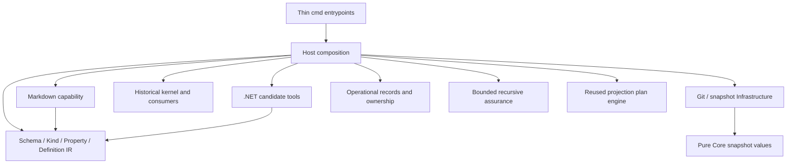

# Canonical projection reset: implementation evidence

Date: 2026-10-06. Starting main: `b03369342065d41b04d4b0feed4a126caf953b40`. Accepted intent commit: `6c27a230556d5b0428fffc0e6b65057685b1f639`. The source candidate implements a bounded executable foundation for the owner-directed reset and three subsequent addenda. [The design](../design/canonical-projection-reset.md) owns decisions; [alpha usage](../canonical-projections.md) owns commands. Published v0.13.0 assets, release metadata, package history and Domain schemas are untouched. This report establishes neither release publication nor adopter acceptance.

## Ownership and migration

The historical eight production/four test Core files moved to `internal/host/compat/v0_13/kernel`. Nine historical consumers moved under `internal/host/compat/v0_13/consumers`: agentrules, markdown, artifactcoverage, githooks, pipelines, projections, dotnet, github and azuredevops. Imports and owned paths changed; exact old semantics and regression tests remain. New Definitions never lower into old Resources. Historical local projection planning delegates to the extracted `internal/host/projectionengine`, preserving one implementation of its byte-binding mechanics.

New Core owns only qualified identities, explicit purposes, closed typed properties/counts, nominal references/Kind references, resolved edge facts, deterministic structural compilation and opaque source provenance. It has no Domain operator, policy engine, Project/package/provider configuration, activation, source acquisition, path/write or execution behavior. Core cycles are permitted graph facts; finite above-Core traversal supplies use-case meaning. Exact value validation and preflight limits reject unsafe custom marshaling and bounded-expansion attacks before encoding.

Host owns YAML/source configuration, exact Module activation, canonical selection/binding, context/impact/reconcile use cases, static target wiring, check execution and guarded writes. Source acquisition remains Infrastructure; release/publish/import checks remain Tooling. Installable Modules are exactly Schema or Projection, while Go helper packages are implementation units. The architecture gate rejects Core outward imports, Module siblings/Host and unknown product owners, including platform/test files. No dynamic loader, reflection DI, shared utility dumping layer or query language was introduced.

Metrics count direct top-level Core Go files in both revisions, exclude unchanged `core/snapshot`, and count physical lines including comments. They expose scope, not an optimization claim:

| Measure | Before | After |
|---|---:|---:|
| Go files / production files | 12 / 8 | 3 / 2 |
| Production physical / nonblank LOC | 2304 / 2226 | 1169 / 1123 |
| Unique production imports | 8, including YAML | 9, all standard library |
| Provider-specific lexical name mentions | 0 | 0 |
| Policy lexical mentions | 90 | 0 |
| Package lexical mentions | 35 | 1 explanatory comment |
| Forbidden Core→Module / Core→Host / Module→Module / Module→Host edges | 0 / 0 / 0 / 0 | 0 / 0 / 0 / 0, mandatory gate passed |

## Executable proof

The public `examples/canonical-projection` fixture contains four exact-pinned local packages: Foundation and commerce Schemas, Markdown and .NET Projection capabilities. Foundation vocabulary lives in a Schema package, not Core. Two explicit desired representations select the same UseCase, Handler and custom EffectAxis Definitions. Source `projectionBindings` resolves actual installed capability; changing a compatible implementation preserves semantic model digest while changing request identity. Missing/duplicate/mismatched/ambiguous bindings fail deterministically. Enabling a Module alone creates no artifact.

The example test runs in guarded temporary Git repositories, with immutable source/target commits and no writes to checked-in fixture sources. It exercises greenfield materialization, a bounded existing-target/drift path, exact candidate/request binding, saved-plan review, explicit Apply, unverified ProjectionRecords, separate immutable checks, ownership indexing, drift repair and read-only reconciliation. Markdown and .NET consume shared Core data independently; neither reads the other's output as canonical truth. .NET candidates are supplied fixed inputs, not evidence of model reasoning quality. A separate local offline .NET 8 build of the positive three-file candidate succeeded with zero warnings/errors; that establishes compilability only, not CreateOrder business behavior.

Important negatives remain executable:

- Unknown kind/ref/property/count/identity and duplicate inputs fail structural compilation; source order cannot select a winner. Shared-DAG expansion/custom JSON marshaling are refused within explicit budgets.
- Mixed Module packages, Schema→Projection dependencies, target mismatch and ambiguous runtime bindings fail.
- No candidate, absent Kind guidance, missing fixed checks, duplicate JSON keys/paths, sibling-prefix escape and modified review inputs fail or escalate before writes.
- Canonical source edits/protected target scopes, aliases/collisions, detached/protected branches and stale source/target/tool/check/candidate/plan bindings remain guarded.
- Verification rejects structurally valid records claiming outside-target or canonical-source artifacts, mismatched model revision, target drift and partial materialization. Check identities bind the complete immutable evidence snapshot, including checker source bytes.
- Empty policy/check sets have one normalized digest across JSON/YAML round trips. This alpha wire correction does not change a published contract.
- Duplicate active owners fail; unknown target files and removed representation ownership escalate. Explicit unknown/excluded inventory remains visible in record indexing; no whole-repository completeness is inferred.
- Parent assurance needs its own checks and all declared children. A passing child cannot establish passing composition; stale/missing evidence is incomplete.

An early enum candidate invented Inventory/Payment categories although the modeled EffectAxis only stated the application boundary. The old marker-only check would accept it. The counterexample is retained; the positive candidate preserves an explicit application property, and the narrowed independent fixture check now rejects the enum. This is evidence of checker insufficiency, not proof that the revised checker covers arbitrary invented behavior. A handler name plus an empty `Handle` method still proves no command behavior.

Independent review also found and closed outside-target record claims, missing source/model revision binding, protected-target planning, stale-record no-op reporting and incomplete provenance tie ordering. Tests retain these cases. An initial test-copy path error accidentally nested fixture copies; the exact new subtree was removed under a resolved-path guard and the test now refuses source/temp aliases before copying. No original fixture was removed. Cross-platform validation also caught a fixture ledger filename using the `sha256:` identity directly: Windows treated the colon as a stream separator and Linux refused it as unsafe. Portable ledger filenames now use the hex portion, while full content identities remain in the payload; path validation was not weakened.

## Reconcile-resolution pressure tests

| Question | Result and limit |
|---|---|
| Can intent delta create work without an implement-file command? | Yes: Host derives bounded representation requests from explicit scopes, reverse reference impact, records and target state. |
| Can unrelated representation scopes remain outside edits? | Yes for known semantic/target changes. Full model/revision binding can still stale unrelated plans/evidence. |
| Do Modules independently propose artifact-level work? | Not yet. Current Host derives scoped work; arbitrary target discovery/model orchestration remains deferred. |
| Does capability replacement change canonical intent? | No: the tested compatible runtime binding changes request/pin identity while semantic model digest stays fixed. |
| Why retain canonical Projection? | It explicitly declares a representation should exist. Installation/configuration otherwise risks silently creating that semantic requirement. Its implementation is not canonical. |
| Can records locate drift without a canonical executor binding? | Yes: exact Projection identity, runtime capability provenance and artifact bytes/modes supply the bounded repair scope. |
| Can no applicable work be reported safely? | It means no materialization edits detected. `evidenceRefreshRequired` separately discloses stale retained records; it is not convergence/PASS. |
| Can work ownership conflict before execution? | Active artifact collisions fail; proposed prefix overlap escalates conservatively. This may over-report disjoint artifacts within one root. |

## Remaining limitations and preserved evidence

Global snapshot/model/revision bindings intentionally preserve conservative freshness. Local impact is an explicit review/materialization set, not a claim all other evidence stays fresh. Reconciliation has no deletion or automatic ownership transfer. Retired owners and unknown target files need review. There is no general classification/exclusion CLI, durable ledger manager, installed remote-module resolver or autonomous reconciliation controller. Apply emits records for explicit caller persistence; active state and append history are different inputs.

Context is exact selected structural context with outgoing edge facts, not the historical task-closure compiler. Nominal references do not support arbitrary ontology members; selected cross-Kind projection scope uses closed identities resolved by Host. .NET guidance remains verbose per Kind. Generic binder checks presence/structure, not prose conflicts, adequacy or business meaning. Runtime binding ambiguity has explicit singleton semantics; multiple entrypoint selection is deferred.

Recursive assurance validates explicit scope trees and evidence but does not execute separate real Executor/Verifier agents. Declared checks run with caller authority against isolated immutable materializations; this is not an OS security sandbox. Check evidence does not hash PATH tools or authenticate actors. A content digest is neither semantic truth nor review authorization. No model quality, productivity, token reduction, human-attention savings or independent semantic assurance is established.

Earlier MyMeetings, AGENTS.md comparison, autonomous gauntlet, failed holdout and drift findings remain unchanged. Their private evidence was neither broadened nor reinterpreted. This source work performs no new Konfyra capture, candidate acceptance or canonical adoption. Existing owner decisions and scope gates remain separate.

## Gates and next decisions

Focused Core/catalog/records/assurance/engine/tool/Host tests and the real-Git projection example are the narrow proof. Full Go tests, vet, build, module verification, schema/example/accounting gates and fixed-snapshot Windows/Linux CI must bind the final candidate commit; the integration PR is the authoritative remote receipt. Publication remains a later decision. No schema generation is required for the preserved Domain language; new alpha source codecs are closed and separately tested.

The next implementation step is explicit record persistence/active-state selection and a scoped Executor/Verifier run driven by the reconcile plan, including independent Module artifact-level proposals. Then replay agent-led greenfield/brownfield modeling using supplied goals/evidence without reusing the sealed holdout. Measure semantic coverage, escalation and upkeep before claiming the broader operating model works. Complete recursive execution/scheduling and broader consumer migration require separate reviewed slices; they are not hidden consequences of a passing compiler or fixture.
