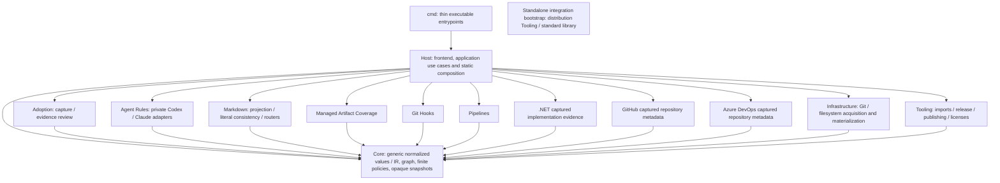

# Clean architecture consolidation validation

Date: 2026-10-04. Starting main: `e116e5c16d63546260a2155e80d8965da72ba30b`. Production-code checkpoint: `8a532af2440702b80705516511391641e42d74a3`; the earlier `621f1a722880cf5b9d403b5753f5ac9152e16358` checkpoint binds the compatibility replay below. Integration and its exact head are recorded by the associated pull request and commit-bound CI. The published [v0.13.0](https://github.com/Glacius-Labs/Markitect/releases/tag/v0.13.0), source `ec312e35c15012c07acb6838c03e9316c5373dde`, remains immutable. No new release is published by this consolidation.

[Vision](../vision.md) owns product intent; [Architecture](../architecture.md#go-ownership-and-final-dependency-model) and the [Module guide](../development/modules.md) describe the final design. The [frozen decision](../design/clean-architecture-consolidation.md) and [baseline inventory](clean-architecture-baseline.json) preceded significant production moves at `11bcf9e`. Independent contract/import reviews examined that checkpoint before isolated implementation streams began. This report describes the migration and measured limits, rather than another product vision.

## Final architecture

Arrows show allowed dependency direction. A Module imports Core and its own private subtree only, in production and tests. Modules do not import one another, Host, Infrastructure or Tooling. CLI imports Host only; Host cannot import CLI. Static concrete calls replace the mixed renderer and direct command-package implementations. No generic Module lifecycle, service locator, dynamic loader, shared/common dumping package or new Domain operator was introduced.

## Ownership audit and moves

| Baseline concern | Final owner / decision |
|---|---|
| Qualified identity, Domain/Kind/property descriptors, closed typing, typed refs, declared relations, finite constraints, same-target, result/dependency traces | KEEP Core: useful independently of any engineering vocabulary |
| Normalized semantic-model/v1alpha1 DTOs | Core IR: one shared contract, existing public shape and digests preserved |
| Policy exceptions, result/constraint/subject digests, explicit policy date | KEEP Core: generic exact-result governance; no Project lookup or ambient clock |
| Source path/line and package/origin labels | KEEP opaque generic identity/provenance; no filesystem, export or package-activation interpretation |
| Historic default-API key abbreviation, opaque digest encodings and snapshot mode tokens | COMPATIBILITY: preserve promised identities/hashes, without bootstrap-kind or Git semantics |
| Project, Package, Areas, pins/imports/exports/bindings, executable checks, provider/source configuration, built-in Rule/Workflow/Skill/Agent lowering | MOVE Host authoring frontend; transient `authoring.Spec`, source codecs/schema and normalization |
| Package archive/manifest/Domain/resource validation | Host authoring/contentpackage: source activation is not an independent Module |
| Embedded authoring resources / ordinary inputs | Host embedded/inputs; source-owned input authorization and composition facts |
| Model/Context/Impact; initialization; checks; observe/plan/apply/verify; controlled writes | Host application use cases over the same normalized model |
| Markdown views, literal consistency and documentation routers | Markdown Module with private link support |
| Codex/Claude projection/inventory/config | Agent Rules Module with independent private provider implementations |
| Managed artifact accounting | Artifact Coverage Module over supplied inventory/owner facts |
| Git and filesystem acquisition/materialization | Infrastructure/source; no semantic decisions |
| Snapshot path/mode/byte values, digest and diff | Core/snapshot; no acquisition or repository-layout assumptions |
| .NET/GitHub/Azure command implementations | Independent Modules; Host owns protocol/IO/process boundary |
| Release/publication/notices/import gate | Tooling, invoked by Host runtimes |
| Public copied bootstrap `integration/run-markitect.go` | Standalone distribution Tooling; standard library only, no product imports |

The complete final package graph and significant Core declarations are in [the final inventory](clean-architecture-final.json). It includes every platform/test source, rather than the current OS's build selection. The baseline package classifications are historical evidence, not permanent exceptions.

Old `internal/app`, `authoring`, `format`, `inputs`, `contentpackage`, `source`, `snapshot`, `release`, `publish`, `licenses`, `adoption` and `copyme` paths moved to their owners. The mixed `internal/render`, cross-capability `markdownlinks` and old `artifactcoverage` implementations were deleted after replacing consumers and porting their concrete risk tests. No internal forwarding compatibility aliases remain. Host no longer duplicates provider inventory or Markdown router/literal-policy implementations.

A dead exported frontend `Compile(...relationships)` accepted but ignored supplied relationships; it had no callers and was removed. Markdown no longer excludes authoring control kinds by their names: explicit configured ownership identifies the excluded root. A regression test allows local Domain concepts named Project/Package to remain ordinary projection inputs.

## Module contracts and review

| Module | Cohesive capability / bounded evidence |
|---|---|
| adoption | Pure selected capture and review records under one capability; Host performs selective Git reads/storage. Existing immutable handoff remains the internal capture→review contract. No auto-adoption/authentication/scope expansion. |
| agentrules | Core IR plus explicit module config/artifacts; private Codex/Claude adapters. OutputPaths, Generate and Validate separate path ownership, bytes and evidence checks. Providers never read each other's output as truth. |
| markdown | Core IR plus explicit projection config/artifacts; views, literal sourced assertions and local routers. Shared path planning drives generation/owners. Links remain navigation. |
| artifactcoverage | Closed configuration plus exact inventory/canonical/input/generated-owner facts; no renderer, source loader or raw resource rediscovery. |
| githooks | Explicit hook path, owner and byte digest. Detects missing/stale/unknown ownership; no shell analysis or installation. |
| pipelines | Explicit provider/artifact digest/owner and bounded YAML scalar locations matched against supplied check facts. No pipeline execution, shell proof or universal CI DSL. |
| dotnet | Explicitly mapped captured project-reference/XML evidence; no general source-language semantics or runtime dependency proof. |
| github | Explicitly captured offline metadata and mapping; no live provider state/Apply. |
| azuredevops | Explicitly captured offline metadata and mapping; no live provider state/Apply. |

Independent reviews covered API responsibility, Core genericity, path/collision behavior, projection parity, protocol boundaries and source inclusion. Module tests consume Core IR and module-local fixtures. Host tests exercise actual parsed snapshots and built thin adapters. Modules own their config formats; they never reinterpret canonical Project/Package/Rule/Domain YAML.

The frontend validates source and supplies authorized resolved edges. Core's `BuildNormalized` accepts that prevalidated contract; it is a caller precondition, not an opaque type proving validation. Built-in source descriptors retain their compatible partial shape at the Host boundary. Modules receive the complete shared normalized model; no second policy model or Module-specific fields were added to IR.

## Measured Core and dependencies

| Metric | Starting Core | Final root Core | Final Core including snapshot |
|---|---:|---:|---:|
| Production files | 13 | 8 | 9 |
| Physical non-test LOC | 3,438 | 2,304 | 2,410 |
| Nonblank/noncomment LOC | 3,212 | 2,199 | 2,284 |
| Distinct direct import paths | 11 | 8 | 10 |

The inventory states the counting method and lists imports. The final combined Core has standard-library imports plus YAML for deterministic generic encoding. It contains no local outward import. Moving the already supported IR/snapshot into Core is included in these counts; file count/LOC are observations, not the architecture's optimization target.

| Distinct final local edge | Production and test forbidden count |
|---|---:|
| Core→Module | 0 |
| Core→Host/CLI | 0 |
| Module→sibling Module | 0 |
| Module→Host/CLI/Infrastructure/Tooling | 0 |
| Host→CLI | 0 |

Host has 11 distinct production package→Module edges across nine capability owners. Overall packages increased from 29 to 46, reflecting explicit ownership/runtime/private-support boundaries; production local pairs increased from 41 to 62. This does not claim fewer packages or universally lower complexity. The inventory separately records test pairs, exact name lexicons, generic provenance and compatibility literals. In the documented provider-name lexicon, baseline Core has 2 AST identifier occurrences and 4 string-literal occurrences; final Core has 0 in both categories. Repository/tooling AST names remain 0. The combined final Core has 2 Git mentions in compatibility comments and no matching code identifier or string literal; those comments explain the retained opaque snapshot encoding. These counts do not prove absence of semantic coupling by themselves; the independent responsibility audit supplies that assessment.

## Parallel integration and coupling found

Each production stream used a managed worktree/feature branch with explicit owned paths: Core/frontend cleanup, Host/runtime relocation, Markdown, Agent Rules, artifact coverage, Git Hooks/Pipelines, adapter Modules, Host input resolution and content-package frontend. Documentation, inventory, compatibility and fresh-agent/negative reviews were independent. Coordinator owned shared Core/Host contracts and cherry-picked/reviewed the candidates.

Concrete shared requests were resolved centrally: move existing IR and opaque snapshot values into Core; use empty registry/normalized Data; move source lowering out; supply opaque legacy digest encodings; inject Host-derived path/inventory ownership. None introduced new semantic behavior. Artifact/input resolution had imported the renderer; Host now supplies explicit projection scope. Artifact accounting had imported app/render/source; it now evaluates supplied facts. Copy Me had depended on a sibling adoption package; capture/review are private parts of one cohesive Adoption Module. Provider implementations had lived in cmd; command entrypoints now delegate Host.

Integration exposed real regressions: generic reference resolution was also applied to the legacy AI vocabulary; invalid exception diagnostics lost Project provenance; package Domain views/dependency ordering differed; embedded wrapper decoding and adapter error exit behavior drifted. These were repaired and regression-tested. Core received no provider-specific fix. A provisional, filtered or intermediate passing result was not treated as final evidence.

## Compatibility and dogfood evidence

A clean detached `621f1a7` build used Go 1.27.1, with VCS metadata `modified=false`, executable SHA-256 `52489eea7d7b4203d40e01eeaaabe1204800373eb42b6039522cfa511ec0d25f` and tracked-source manifest SHA-256 `a64bee20a647f7e8ae114b9c829ff3e37f74c275cd787d6d3f338464df838f5f`. Its 24 commands used the same six isolated fixture commits and argv as the exact `e116e5c` baseline: no writes, unchanged fixture HEAD/status, all exits 0. Six model outputs are byte-identical. Recursive comparisons found no difference except changed executable `toolDigest` and the context aggregate digest that binds it; version remains 0.13.0. All snapshot/config/model/policy/provenance/path values match. Before deleting the old renderer, nine examples and 101 generated outputs matched bytes and owners exactly. Schemas/historical package archives remain unchanged.

The root Project now explicitly configures architecture-imports, module-checks, managed-artifacts and go-tests. Canonical development Rules supply those owners and exact config/hook/pipeline inputs to the engineering-change Skill. Root check, artifact accounting, hooks/pipelines, schemas, formatting and generated projection convergence pass. A fresh no-history actor discovered the workflow from AGENTS/docs and obtained passing non-provisional check/context at `fcd7765`; a later clean fixed `621f1a7` check/context also passed. Compiled context includes package ownership through declared CONTRIBUTING/architecture inputs, rather than inventing typed code-Module resources.

An isolated real clone of `fcd7765` first passed the actual import and artifact checkers. Added source patches then produced exactly three illegal imports at line 3: Core→githooks, githooks→pipelines, pipelines→Host. The checker exited 1 with exact edges. An untracked `.markitect/unowned-proof.txt` produced `unmanaged` and exit 1. Root was not changed by those probes. Unit negatives also cover CLI bypass, Host→CLI, platform/test files, unknown stdlib-only packages, self imports, fixture privilege and bootstrap imports. Go compilation additionally rejects cycles.

Windows source tests, vet, build, module verification, executable examples and package/bootstrap smoke passed locally. The new source archive runs standalone bootstrap tests, version, authoring, notices and example checks. The historical bootstrap supports both old main.version and new Host-version symbols deliberately; immutable old release meaning is preserved. Windows/Linux CI remains mandatory for the exact integrated candidate; the associated pull request records the commit-bound receipt. No automated test or review substitutes for adopter/human acceptance.

The final gate review found and closed a test-first file-order bypass: a standard-library-only production file could previously hide behind an earlier test file's package classification. `Inspect` now classifies every Go file; a lexical-order negative fixture proves refusal. Two duplicated identical CI import-check steps were removed while preserving the first mandatory step and updating the explicitly owned pipeline byte digest. This hardening changed no Core semantics or compatibility outputs.

## Remaining limits and next work

The architecture audit found no remaining forbidden edge or provider-specific kernel meaning. Host remains a substantial application/source layer: its transient typed source bag preserves intentional public contracts; it is not a second canonical data model. Private link parsing exists inside both projection Modules to preserve independent ownership and exact behavior. That local code duplication and validated-constructor preconditions remain reviewable maintenance costs, not a shared dumping package or reason to enlarge Core. Hook and pipeline evidence is deliberately narrow. Managed artifact roots are explicit and narrower than the whole repository; other files still receive normal contribution/import gates.

No arbitrary queries, fan-out, inverse ownership, Pattern/Trait/inheritance, provider semantics, automatic migration/adoption or background runtime was added. Existing real-code pilot negative findings are unchanged. The refactor proves extension boundaries and technical compatibility, not reduced human attention, productivity or architecture correctness.

The private approved Konfyra capture remains 36 files and four candidate facts. The consolidated CLI revalidated only that existing handoff/queue/captured evidence, writing a private validation report outside Markitect and Konfyra. No new repository blobs were acquired, no owner dispositions fabricated, no canonical adopter change made. Public artifacts contain no private paths, identifiers, hashes or excerpts.

The three next priorities are: (1) exact-owner dispositions and accepted-only shadow adoption, (2) matched real task/upkeep measurement against existing guidance/tests, (3) deliberate versioned source release decision after integration and immutable distribution gates. Future capability work can default to independent Module work plus explicit Host composition; a concrete generic gap still goes to the coordinator.

## Acceptance questions

| Requested completion item | Evidence / conclusion |
|---|---|
| 1. Starting/ending commits | Starting e116e5c; production checkpoint 8a532af; final head/integration are bound by the pull request/CI receipt. |
| 2–6. Architecture, Core, Host, Modules, Infrastructure/Tooling | Diagram, ownership audit and nine-Module table above; bootstrap is Tooling, not Harness. |
| 7–11. Moves/deletions, debt, Core decisions, IR | Ownership audit and integration findings above; Core Data/IR is the sole normalized semantic contract. |
| 12. Core metrics | Explicit before/root/combined counts and complete inventory above. |
| 13–15. Illegal edge counts | Core→Module, Module→Module, Module→Host all 0, including tests/platform files. |
| 16–17. Enforcement/negatives | AST gate in normal tests, named CI, Project checks and release quality; exact-edge unit and real-patch failures. |
| 18–22. Module state | All nine implemented/migrated; hook/pipeline/check evidence limits stated; no installed hook or live provider Apply. |
| 23–25. Parallel work/coupling/Core requests | Isolated streams and concrete shared requests recorded above; no new semantic primitive. |
| 26–27. Dogfood/fresh replay | Root generated convergence and check/context/coverage/module checks; fresh navigation/context establishes discoverability. |
| 28. Remaining smells | Host source-bag size, caller validation precondition and private link-code duplication; no forbidden dependency remains. |
| 29. Compatibility | No Domain/schema/SPI changes; intentional internal API/package moves; source-only module checker; immutable releases preserved. |
| 30. Full gate status | Local source/package gates passed; the exact Windows/Linux receipt in the pull request is acceptance authority for integration. |
| 31. Release/candidate | Source candidate only; no new release/tag/assets/publication. |
| 32. Konfyra | Existing approved capture/4 candidates validated, owner review/adoption still pending. |
| 33. Next 3 | Owner dispositions/shadow diff; matched upkeep/task measurement; separate immutable release decision. |
| 34. Future independent Modules | Yes, with explicit Host wiring, module-local tests/config and mandatory zero forbidden edges. |
