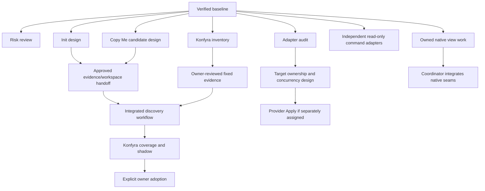

# Workstream assignments

**Preparation only; no workstream is started by this map.** Read the [documentation map](../README.md), [constitution](../engineering-constitution.md), [shared contracts](../development/shared-contracts.md), [parallel-work guide](../development/parallel-work.md) and your package. Each assignment records the full verified [baseline commit](../development/baseline.md), exact owned paths and exit criteria. Implementers cannot approve their own shared semantic changes.

| Workstream | Class | Can start after dispatch | Must wait for |
|---|---|---|---|
| [Risk triage](risk-triage.md) | C review | Evidence/tests review | Reproducer and bounded assignment before Core repair |
| [Existing-project init](init-existing-project.md) | B | Scope/preview design, current-init investigation | Approved evidence/workspace handoff before durable new contracts |
| [Copy Me](copy-me.md) | B | Candidate interpretation and decision design | Same handoff for integration; owner review for adoption |
| [Adapter contract](adapter-contract.md) | C contract, A audit | Current protocol fixtures, ownership audit | Reviewed decision before new SPI/remote write semantics |
| [.NET](adapter-dotnet.md) | A external | Existing read-only adapter work | New analysis must establish expanded evidence claims separately |
| [Docs](adapter-docs.md) | A goal, shared native seam | Owned view work and new isolated tests | Coordinator edits of shared renderer/ownership |
| [Codex](adapter-codex.md) | A goal, shared native seam | Owned projection work and new tests | Same native seam coordination |
| [Claude](adapter-claude.md) | A goal, shared native seam | Owned projection work and new tests | Same native seam coordination |
| [GitHub](adapter-github.md) | A external | Purpose/mapping and read-only adapter design | Credentials/scope/target/concurrency decisions before Apply |
| [Azure DevOps](adapter-azure-devops.md) | A external | Purpose/mapping and read-only adapter design | Same remote mutation decisions |
| [Konfyra](konfyra-adoption.md) | B consumer | Owner-scoped inventory in its own checkout | Reviewed evidence/handoff for discovery; coverage/shadow and owner cutover for adoption |

## Hard and soft dependencies

Arrows are hard integration/authority gates. They do not require Init implementation to finish before Copy Me research. Soft dependencies: inventory informs scope questions; candidate feedback informs Init UX; adopter gaps prioritize adapters. Risk review, interpretation design and command adapter tests can proceed independently. Native internals may use assigned disjoint new files/tests, while shared switch/ownership edits are serialized. No future Core primitive is assumed.

## Recommended wave and integration

First wave: risk review, Init handoff design, Copy Me candidate design, Konfyra inventory and adapter contract/target audit. Existing .NET and provider read-only experiments may start on the frozen command protocol after purpose/scope selection. Do not grant Docs/Codex/Claude agents unrestricted concurrent ownership of `internal/render`.

Integrate required shared handoff/ownership decisions first, independent consumer slices with their own checks next, shared CLI/native wiring under coordinator ownership, then adopter shadow/coverage evidence and explicit owner adoption. Unrelated adapters have no artificial total order. Core, package meaning and releases stay outside implementer-local authority.
