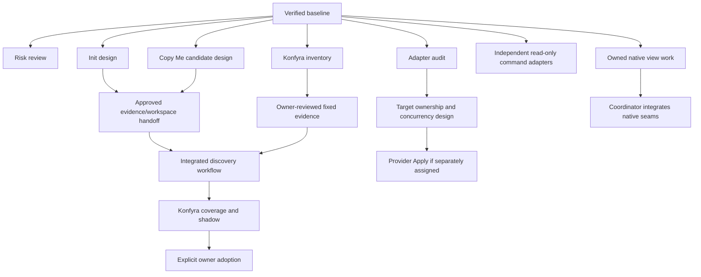

# Preserved workstream specifications

**Preserved preparation specifications; this map does not dispatch work by itself.** The [first-wave record](../validation/parallel-development-wave-1.md) owns the original narrower assignments and their integration status. Read the [documentation map](../README.md), [constitution](../engineering-constitution.md), relevant [shared contracts](../development/shared-contracts.md) and [parallel-work guide](../development/parallel-work.md) before using a specification. The [historical baseline](../development/baseline.md) belongs to that wave; a new assignment records its own full verified current base, exact owned paths and exit criteria. Implementers cannot approve their own shared semantic changes.

| Workstream | Class | Can start after dispatch | Must wait for |
|---|---|---|---|
| [Risk triage](risk-triage.md) | C review | Evidence/tests review | Reproducer and bounded assignment before Core repair |
| [Existing-project init](init-existing-project.md) | B | Exact selection/preparation against the shared handoff | Reviewed shared changes; owner scope before content acquisition |
| [Copy Me](copy-me.md) | B | Interpretation/validation of supplied handoff evidence | Owner review and separate project change for adoption |
| [Adapter contract](adapter-contract.md) | C contract, A audit | Current protocol fixtures, ownership audit | Reviewed decision before new SPI/remote write semantics |
| [.NET](adapter-dotnet.md) | A external | Existing read-only adapter work | New analysis must establish expanded evidence claims separately |
| [Docs](adapter-docs.md) | A goal, shared native seam | Owned view work and new isolated tests | Coordinator edits of shared renderer/ownership |
| [Codex](adapter-codex.md) | A goal, shared native seam | Owned projection work and new tests | Same native seam coordination |
| [Claude](adapter-claude.md) | A goal, shared native seam | Owned projection work and new tests | Same native seam coordination |
| [GitHub](adapter-github.md) | A external | Purpose/mapping and read-only adapter design | Credentials/scope/target/concurrency decisions before Apply |
| [Azure DevOps](adapter-azure-devops.md) | A external | Purpose/mapping and read-only adapter design | Same remote mutation decisions |
| [Konfyra](konfyra-adoption.md) | B consumer | Owner-scoped inventory in its own checkout | Reviewed evidence/handoff for discovery; coverage/shadow and owner cutover for adoption |

## Original alignment with the product vision

Every assignment should identify the human activity it aims to reduce, the intent owner it preserves, its remaining agent freedom and the evidence needed to test the effect. The canonical [vision](../vision.md) owns the thesis; [Measurement](../measurement.md#human-attention-and-delegated-work) owns evaluation. The relationships below are purposes and hypotheses, not measured savings or new implementation authority.

| Workstream or mechanism | Intended contribution | Current limit / evidence needed |
|---|---|---|
| Existing-project Init | Reduce manual preparation of reviewed, fixed evidence so owners can focus on scope and intent. | Greenfield Init remains minimal; source `prepare` now provides selective capture and the shared handoff. Adoption cost and owner review still require validation. |
| Copy Me | Let agents organize observations, counterexamples and candidate policies while humans decide adoption. | Shipped guidance is not autonomous discovery. Interpretation and adoption effort, accidental/legacy conventions and uncertainty need measured review. |
| Context | Make applicable engineering decisions available without repeated architectural rediscovery. | Closure and selection are explicit, not inferred relevance. Missing rules and broad inputs in prior runs remain findings. |
| Impact | Support architecture-level consequence review and explain changed policy subjects. | Conservative impact is not an exact implementation cohort; noise, misses and reviewer effort require independent assessment. |
| Domains, packages, policies and exceptions | Encode chosen boundaries and deliberate evolution once for their declared consumers. | Finite modeled conformance is not source correctness; authoring, version/exception maintenance and real verification cost remain visible. |
| Docs, Codex and Claude projections | Derive owned representations from canonical intent instead of hand-copying it across providers. | Local independence/ownership tests do not establish that agents obey guidance or that a manual step was eliminated. Shared native seams still require coordination. |
| Adapter contract, .NET, GitHub and Azure DevOps | Automate explicitly scoped implementation/external evidence comparisons without technology meaning entering Core. | .NET is literal captured XML; GitHub/Azure are offline captures. Expand only for a recurring real check with measurable benefit, honest evidence limits and reviewed authority. |
| Reconciliation | Align owned projections or configured targets through repeatable input-bound operations. | Convergence is per adapter/target. Observe/Plan stay read-only, Apply explicit; automation is not permission to mutate. |
| Konfyra adoption | Test whether a mature project's real coordination work can be reduced. | Inventory proves neither migration nor benefit; its existing owner/mirror/check setup is a credible simpler baseline. Any study needs owner-approved scope and privacy. |
| Risk triage and parallel development | Preserve the product's deterministic/authority boundaries while implementers work independently. | Technical confidence and subsystem independence support delivery; they are not direct adopter benefit measurements. |

No named bounded stream is rejected solely by this alignment review. Deprioritize expansions without a recurring human task to replace: additional projections/adapters for their own sake, automatic discovery/adoption, a scheduler or background operator, interface proliferation, and speculative Core expressiveness. A broader goal does not remove existing hard dependencies or feature gates.

## Original hard and soft dependencies

Arrows are hard integration/authority gates. They do not require Init implementation to finish before Copy Me research. Soft dependencies: inventory informs scope questions; candidate feedback informs Init UX; adopter gaps prioritize adapters. Risk review, interpretation design and command adapter tests can proceed independently. Native internals may use assigned disjoint new files/tests, while shared switch/ownership edits are serialized. No future Core primitive is assumed.

## Original wave and integration proposal

First wave: risk review, Init handoff design, Copy Me candidate design, Konfyra inventory and adapter contract/target audit. Existing .NET and provider read-only experiments may start on the frozen command protocol after purpose/scope selection. Do not grant Docs/Codex/Claude agents unrestricted concurrent ownership of `internal/render`.

Integrate required shared handoff/ownership decisions first, independent consumer slices with their own checks next, shared CLI/native wiring under coordinator ownership, then adopter shadow/coverage evidence and explicit owner adoption. Unrelated adapters have no artificial total order. Core, package meaning and releases stay outside implementer-local authority.
